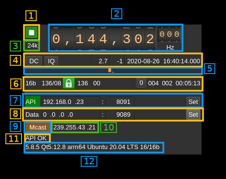
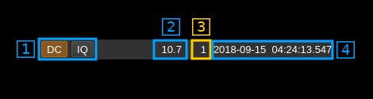
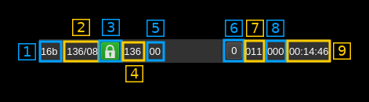
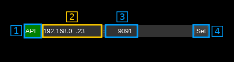

<h1>Remote input plugin</h1>

<h2>Introduction</h2>

This input sample source plugin gets its samples over the network from a SDRangel instance's Remote channel sink using UDP connection.

Forward Error Correction with a Cauchy MDS block erasure codec is used to prevent block loss. This can make the UDP transmission more robust particularly over WiFi links.

Please note that there is no provision for handling out of sync UDP blocks. It is assumed that frames and block numbers always increase with possible blocks missing. Such out of sync situation has never been encountered in practice.

The remote SDRangel instance that sends the data stream is controlled via its REST API using a separate control software for example [SDRangelcli](https://github.com/f4exb/sdrangelcli)

A sample size conversion takes place if the stream sample size sent by the remote instance and the Rx sample size of the local instance do not match (i.e. 8, 16 to 24 bits or 8, 24 to 16 bits). Best performance is obtained when the stream sample size matches the instance sample size.

<h2>Build</h2>

The plugin will be built only if the [CM256cc library](https://github.com/f4exb/cm256cc) is installed in your system. For CM256cc library you will have to specify the include and library paths on the cmake command line. Say if you install cm256cc in `/opt/install/cm256cc` you will have to add `-DCM256CC_DIR=/opt/install/cm256cc` to the cmake commands.

<h2>Interface</h2>

The top and bottom bars of the device window are described [here](../../../sdrgui/device/readme.md)

<h3>1: Start/Stop</h3>

Device start / stop button.

  - Blue triangle icon: device is ready and can be started
  - Green square icon: device is running and can be stopped

<h3>2: Frequency</h3>

This is the center frequency in Hz sent in the meta data from the remote SDRangel instance and corresponds to the center frequency of reception.

<h3>3: Stream sample rate</h3>

Stream I/Q sample rate in kS/s

<h3>4: Set remote device center frequency</h3>

Uses the API at the address and port specified in (12) to control the remote device center frequency (kHz)

<h3>5: Remote sink channel decimation factor</h3>

The remote device baseband can be decimated in the remote sink channel and its center can be selected with (8). The resulting sample rate of the I/Q stream sent over the network is the remote device baseband sample rate divided by this value. The value is displayed in (3).

It uses the API at the address and port specified in (12) to control the remote sink channel.

<h3>6: Remote sink half band filters chain sequence</h3>

This string represents the sequence of half-band filters used in the decimation from device baseband to resulting I/Q stream. Each character represents a filter type:

  - **L**: lower half-band
  - **H**: higher half-band
  - **C**: centered

<h3>7: Remote sink center frequency shift</h3>

This is the shift of the remote sink channel center frequency from the remote device center frequency. Its value is driven by the remote device sample rate, the decimation (5) and the filter chain sequence (8).

<h3>8: Remote sink half-band filter chain sequence</h3>

The slider moves the remote sink channel center frequency roughly from the lower to the higher frequency in the remote device baseband. The number on the right represents the filter sequence as the decimal value of a base 3 number. Each base 3 digit represents the filter type and its sequence from MSB to LSB in the filter chain:

  - **0**: lower half-band
  - **1**: centered
  - **2**: higher half-band

It uses the API at the address and port specified in (12) to control the remote sink channel.

<h3>9: Auto correction options and stream status</h3>

<h4>9.1: Auto correction options</h4>

These buttons control the local DSP auto correction options:

  - **DC**: auto remove DC component
  - **IQ**: auto make I/Q balance

<h4>9.2: Receive buffer length</h4>

This is the main buffer (writes from UDP / reads from DSP engine) length in units of time (seconds). As read and write pointers are normally about half the buffer apart the nominal delay introduced by the buffer is the half of this value.

<h4>9.3: Main buffer R/W pointers positions</h4>

Read and write pointers should always be a half buffer distance buffer apart. This is the difference in percent of the main buffer size from this ideal position.

  - When positive it means that the read pointer is leading
  - When negative it means that the write pointer is leading (read is lagging)

This corresponds to the value shown in the gauges above (9)

<h4>9.4: Date/time</h4>

This is the current timestamp of the block of data sent from the receiver. It is refreshed about every second. The plugin tries to take into account the buffer that is used between the data received from the network and the data effectively used by the system however this may not be extremely accurate. It is based on the timestamps sent from the Remote sink channel at the other hand that does not take into account its own buffers.

<h3>10: Main buffer R/W pointers gauge</h3>

There are two gauges separated by a dot in the center. Ideally these gauges should not display any value thus read and write pointers are always half a buffer apart. However due to the fact that a whole frame is reconstructed at once up to ~10% variation is normal and should appear on the left gauge (write leads).

  - The left gauge is the negative gauge. It is the value in percent of buffer size from the write pointer position to the read pointer position when this difference is less than half of a buffer distance. It means that the writes are leading or reads are lagging.
  - The right gauge is the positive gauge. It is the value in percent of buffer size of the difference from the read pointer position to the write pointer position when this difference is less than half of a buffer distance. It means that the writes are lagging or reads are leading.

The system tries to compensate read / write unbalance however at start or when a large stream disruption has occurred a delay of a few tens of seconds is necessary before read / write reaches equilibrium.

<h3>11: Data stream status</h3>

<h4>11.1: Sample size</h4>

This is the size in bits of a I or Q sample sent in the stream by the remote server.

<h4>11.2: Total number of frames and number of FEC blocks</h4>

This is the total number of frames and number of FEC blocks separated by a slash '/' as sent in the meta data block thus acknowledged by the remote server. When you set the number of FEC blocks with (4.1) the effect may not be immediate and this information can be used to monitor when it gets effectively set in the remote server.

A frame consists of 128 data blocks (1 meta data block followed by 127 I/Q data blocks) and a variable number of FEC blocks used to protect the UDP transmission with a Cauchy MDS block erasure correction.

Using the Cauchy MDS block erasure correction ensures that if at least the number of data blocks (128) is received per complete frame then all lost blocks in any position can be restored. For example if 8 FEC blocks are used then 136 blocks are transmitted per frame. If only 130 blocks (128 or greater) are received then data can be recovered. If only 127 blocks (or less) are received then none of the lost blocks can be recovered.

<h4>11.3: Stream status</h4>

The color of the icon indicates stream status:

  - Green: all original blocks have been received for all frames during the last polling timeframe (ex: 136)
  - No color: some original blocks were reconstructed from FEC blocks for some frames during the last polling timeframe (ex: between 128 and 135)
  - Red: some original blocks were definitely lost for some frames during the last polling timeframe (ex: less than 128)

<h4>11.4: Minimum total number of blocks per frame</h4>

This is the minimum total number of blocks per frame during the last polling period. If all blocks were received for all frames then this number is the nominal number of original blocks plus FEC blocks (Green lock icon). In our example this is 128+8 = 136.

If this number falls below 128 then some blocks are definitely lost and the lock lights in red.

<h4>11.5: Maximum number of FEC blocks used by frame</h4>

Maximum number of FEC blocks used for original blocks recovery during the last polling timeframe. Ideally this should be 0 when no blocks are lost but the system is able to correct lost blocks up to the nominal number of FEC blocks (Neutral lock icon).

<h4>11.6: Reset events counters</h4>

This push button can be used to reset the events counters (9.7 and 9.8) and reset the event counts timer (9.9)

<h4>11.7: Unrecoverable error events counter</h4>

This counter counts the unrecoverable error conditions found (i.e. 9.4 lower than 128) since the last counters reset.

<h4>11.8: Recoverable error events counter</h4>

This counter counts the unrecoverable error conditions found (i.e. 9.4 between 128 and 128 plus the number of FEC blocks) since the last counters reset.

<h4>11.9: events counters timer</h4>

This HH:mm:ss time display shows the time since the reset events counters button (9.6) was pushed.

<h3>12: Remote server test</h3>

Test remote connection with its API.

<h4>12.1: Remote connection indicator</h4>

The "Remote" label is lit in green when the connection is successful

<h4>12.2: API IP address</h4>

IP address of the remote SDRangel instance REST API

<h4>12.3: API port</h4>

Port of the remote SDRangel instance REST API

<h4>12.4: Get information button</h4>

When the return key is hit within the address (10.2) or port (10.3) the changes are effective immediately. You can also use this button to set again these values. Clicking on this button will send a request to the API to get the remote SDRangel instance information that is displayed in the API message box (13)

<h3>13: Local network interface address and port for data reception</h3>

<h4>13.1: Interface IP address</h4>

IP address of the local network interface the remote SDRangel instance sends the data to. Effective when the validation button (13.3) is pressed.

<h4>13.2: Interface port</h4>

Local port the remote SDRangel instance sends the data to.  Effective when the validation button (13.3) is pressed.

<h4>13.3: Validation button</h4>

When the return key is hit within the interface address (13.2), port (13.3), multicast group address (15) and multicast group join/leave (14) the changes of parameters for data reception are ready for commit and this button turns green. You then push this button to commit the changes.

<h3>14: Join or leave multicast group</h3>

Use this toggle button to join or leave the multicast group which address is specified next (15). Effective when the validation button (13.3) is pressed.

<h3>15: Multicast group address</h3>

This is the address of the multicast group. Effective when the validation button (13.3) is pressed.

<h3>16: Status message</h3>

The API status is displayed in this box. It shows "API OK" when the connection is successful and reply is OK

<h3>17: Remote information</h3>

This is the information returned by the remote when connection with its API is successful
