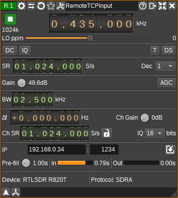

<h1>Remote TCP input plugin</h1>

<h2>Introduction</h2>

This input sample source plugin gets its I/Q samples over the network via a TCP/IP connection from a server such as
rtl_tcp, rsp_tcp, Spy Server or SDRangel's [Remote TCP Channel Sink](../../channelrx/remotetcpsink/readme.md) plugin.

<h2>Interface</h2>

<h3>1: Start/Stop</h3>

Device start / stop button.

  - Blue triangle icon: device is ready and can be started
  - Green square icon: device is running and can be stopped
  - Red square icon: an error has occurred with the connection to the remote device. The plugin will continually try to reconnect.

<h3>2: Center frequency</h3>

This is the center frequency in kHz of the remote device.

<h3>3: Stream sample rate</h3>

Network I/Q sample rate in kS/s.

<h3>4: Local oscillator correction</h3>

This is the correction to be applied to the remote device's local oscillator in ppm.

<h3>5: DC offset correction</h3>

Check this button to enable DC offset correction.

<h3>6: IQ imbalance correction</h3>

Check this button to enable IQ imbalance correction.

<h3>7: Bias tee</h3>

Check this button to enable a bias tee on the remote device, if it supports it.

<h3>8: Direct sampling mode</h3>

Use this button to activate RTL-SDR's direct sampling mode. This can be used to tune to HF frequencies.

<h3>9: Sample rate</h3>

Specify the remote device's sample rate in samples per second (S/s). This is the sample rate between the remote device and remote server.
This field allows an arbitrary rate to be entered. However, some devices are limited in the rates they support, so you should be careful
only to enter a supported value, otherwise there may be a mismatch between the displayed rate and the actual rate.

<h3>10: Decimation</h3>

Decimation in powers of two from 1 (no decimation) to 64 between the remote device and the remote server, which determines the remote baseband sample rate. This is only supported when the remote server is SDRangel.

<h3>11: Gain</h3>

Specify gain in dB applied in various stages of the remote device. Available gains will depend upon the type of remote device.

<h3>12: AGC</h3>

Check to enable automatic gain control in the remote device. How AGC works is device dependent.

<h3>13: RF Bandwidth</h3>

Specifies the bandwidth in kHz of the analog filter in the remote device. Available bandwidths are dependent upon the remote device.

<h3>14: Remote sink frequency shift from center frequency of reception</h3>

This is the shift of the remote sink channel center frequency from the device center frequency.
This is used to select the desired part of the signal when the remote channel sample rate is lower than the baseband sample rate.
This is only supported when the remote server is SDRangel.

<h3>15: Remote sink gain</h3>

Sets a gain figure in dB that is applied to I/Q samples before transmission via TCP/IP.
This option may be useful for amplifying very small signals from SDRs with high-dynamic range (E.g. 24-bits), when the network sample bit-depth is 8-bits.
This is only supported when the remote server is SDRangel.

<h3>16: Remote sink channel sample rate</h3>

Specifies the channel and network sample rate in samples per second. If this is different from the remote baseband sample rate, the baseband signal will be decimated to the specified rate.
Unless the remote server is SDRangel, the channel sample rate should be the same as the device sample rate.

<h3>17: Local channel sample rate to baseband sample rate</h3>

When checked, the channel sample rate setting is locked to the remote baseband sample rate.
When unchecked, the channel sample rate can be set to any value.

<h3>18: Sample bit depth</h3>

Specifies number of bits per I/Q sample transmitted via TCP/IP.

When the protocol is RTL0, only 8-bits are supported. SDRangel and Spy Server protocol supports 8, 16, 24 and 32-bit samples.

<h3>19: Server IP address</h3>

IP address or hostname of the server that is running SDRangel's Remote TCP Sink plugin, rtl_tcp or rsp_tcp.

<h3>20: Server TCP Port</h3>

TCP port on the server to connect to.

<h3>21: Protocol</h3>

Selects protocol to use. Set to SDRangel for rtl_tcp, rsp_tcp or SDRangel's own protocol. 
Set to SDRangel wss to use SDRangel's protocol over WebSocket Secure.
Alternatively, Spy Server can be selected to connect to Spy Servers.

<h3>23: Connection settings</h3>

Determines which settings are used when connecting.

When checked, settings in the RemoteTCPInput GUI are written to the remote device upon connection.
When unchecked, if the remote server is using the SDRangel protocol, the RemoteTCPInput GUI will be updated with the current settings from the remote device.
If the remote server is using the RTL0 protocol, the GUI will not be updated, which may mean the two are inconsistent.

<h3>24: Pre-fill</h3>

Determines how many seconds of I/Q samples are buffered locally from the remote device, before being processed in SDRangel.
More buffering can handle more network congestion and other network problems, without gaps in the output, but increases the latency in changes to remote device settings.

<h3>25: Input buffer gauge</h3>

Shows how much data is in the input buffer. Typically this will be just under the pre-fill setting.
If it becomes empty, the plugin will pause outputting of data until the buffer is refilled to the pre-fill level.
If the buffer repeatedly runs empty, this suggests you do not have enough network bandwidth for the current combination
of channel sample rate and sample bit depth. Reducing these to lower values may be required for uninterrupted data.

<h3>26: Output buffer gauge</h3>

Shows how much data is in the output buffer. This should typically be empty. If not empty, this suggests your CPU can't keep up with the amount of data being received.

<h3>27: Device status</h3>

Shows the type of remote device that has been connected to.

<h3>28: Protocol status</h3>

Shows the protocol being used by the remote server. This will be RTL0, SDRA or Spy Server.

rtl_tcp and rsp_tcp always use the RTL0 protocol.
SDRangel's Remote TCP Sink plugin can use RTL0 or SDRA.

RTL0 is limited to sending 8-bit data, doesn't support decimation and does not send the current device settings on connection.
Spy Server supports decimation and gain, but no other settings.
