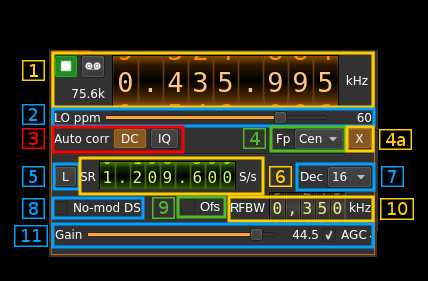
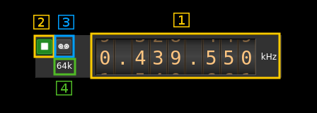
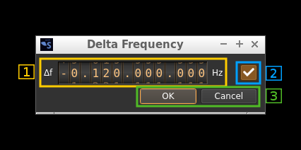

<h1>RTLSDR input plugin</h1>

<h2>Introduction</h2>

This input sample source plugin gets its samples from a [RTLSDR device](http://www.rtl-sdr.com/). 

<h2>Build</h2>

The plugin will be built only if the [RTLSDR host library](https://github.com/f4exb/librtlsdr) is installed in your system. If you build it from source and install it in a custom location say: `/opt/install/librtlsdr` you will have to add `-DLIBRTLSDR_INCLUDE_DIR=/opt/install/librtlsdr/include -DLIBRTLSDR_LIBRARIES=/opt/install/librtlsdr/lib/librtlsdr.so` to the cmake command line.

If you want to benefit from the direct sampling you will have to compile and install this library else the RTLSDR library is also provided by many Linux distributions. The SDRangel binary releases are compiled with the direct sampling option.

<h2>Interface</h2>

<h3>1: Common stream parameters</h3>

<h4>1.1: Frequency</h4>

This is the center frequency of reception in kHz.

<h4>1.2: Start/Stop</h4>

Device start / stop button. 

  - Blue triangle icon: device is ready and can be started
  - Green square icon: device is running and can be stopped
  - Magenta (or pink) square icon: an error occured. In the case the device was accidentally disconnected you may click on the icon, plug back in and start again.
  
<h4>1.3: Record</h4>

Record baseband I/Q stream toggle button

<h4>1.4: Stream sample rate</h4>

Baseband I/Q sample rate in kS/s. This is the device sample rate (4) divided by the decimation factor (6). 

<h3>2: Local Oscillator correction</h3>

This is the correction to be applied to the local oscillator in ppm.

<h3>3: Auto correction options</h3>

These buttons control the local DSP auto correction options:

  - **DC**: auto remove DC component
  - **IQ**: auto make I/Q balance
  
<h3>4: Baseband center frequency position relative the the BladeRF Rx center frequency</h3>

Possible values are:

  - **Cen**: the decimation operation takes place around the BladeRF Rx center frequency
  - **Inf**: the decimation operation takes place around the center of the lower half of the BladeRF Rx passband. 
  - **Sup**: the decimation operation takes place around the center of the upper half of the BladeRF Rx passband. 

<h3>4a: Transverter mode open dialog</h3>

This button opens a dialog to set the transverter mode frequency translation options:

Note that if you mouse over the button a tooltip appears that displays the translating frequency and if translation is enabled or disabled. When the frequency translation is enabled the button is lit.

<h4>4a.1: Translating frequency</h4>

You can set the translating frequency in Hz with this dial. Use the wheels to adjust the sample rate. Left click on a digit sets the cursor position at this digit. Right click on a digit sets all digits on the right to zero. This effectively floors value at the digit position. Wheels are moved with the mousewheel while pointing at the wheel or by selecting the wheel with the left mouse click and using the keyboard arroews. Pressing shift simultanoeusly moves digit by 5 and pressing control moves it by 2.

The frequency set in the device is the frequency on the main dial (1) minus this frequency. Thus it is positive for down converters and negative for up converters. 

For example with the DX Patrol that has a mixer at 120 MHz for HF operation you would set the value to -120,000,000 Hz so that if the main dial frequency is set at 7,130 kHz the RTLSDR of the DX Patrol will be set to 127.130 MHz.

If you use a down converter to receive the 6 cm band narrowband center frequency of 5670 MHz at 432 MHz you would set the translating frequency to 5760 - 432 = 5328 MHz thus dial +5,328,000,000 Hz.

For bands even higher in the frequency spectrum the GHz digits are not really significant so you can have them set at 1 GHz. Thus to receive the 10368 MHz frequency at 432 MHz you would set the translating frequency to 1368 - 432 = 936 MHz. Note that in this case the frequency of the LO used in the mixer of the transverter is set at 9936 MHz.

The Hz precision allows a fine tuning of the transverter LO offset

<h4>4a.2: Translating frequency enable/disable</h4>

Use this toggle button to activate or deactivate the frequency translation

<h4>4a.3: Confirmation buttons</h4>

Use these buttons to confirm ("OK") or dismiss ("Cancel") your changes. 

<h3>5: Toggle low/high sample rate range</h3>

When button is on the sample rate can vary from 230 kS/s to 300 kS/s
When button is off the sample rate can vary from 950 kS/s to 2400 kS/s

<h3>6: Device sample rate</h3>

This is the device sample rate in samples per second (S/s).

Use the wheels to adjust the sample rate. Left click on a digit sets the cursor position at this digit. Right click on a digit sets all digits on the right to zero. This effectively floors value at the digit position. Wheels are moved with the mousewheel while pointing at the wheel or by selecting the wheel with the left mouse click and using the keyboard arroews. Pressing shift simultanoeusly moves digit by 5 and pressing control moves it by 2.

<h3>7: Decimation factor</h3>

The I/Q stream from the RTLSDR ADC is doensampled by a power of two before being sent to the passband. Possible values are increasing powers of two: 1 (no decimation), 2, 4, 8, 16, 32.

<h3>8: Direct sampling mode</h3>

Use this checkbox to activate the special RTLSDR direct sampling. This can be used to tune to HF frequencies.

<h3>9: RF gain and AGC</h2>

The slider sets RF gain in dB. The values are defined in the RTLSDR device and generally are: 0.0, 0.9, 1.4, 2.7, 3.7, 7.7, 8.7, 12.5, 14.4, 15.7, 16.6, 19.7, 20.7, 22.9, 25.4, 28.0, 29.7, 32.8, 33.8, 36.4, 37.2, 38.6, 40.2, 42.1, 43.4, 43.9, 44.5, 48.0, 49.6

The AGC checkbox can be used to switch on or off the RTL2838 AGC. This is independent of the gain setting as this AGC acts after the gain block. 