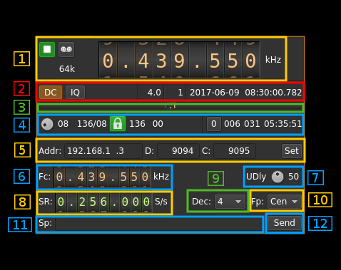
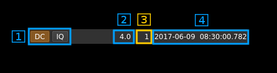
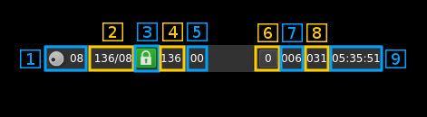
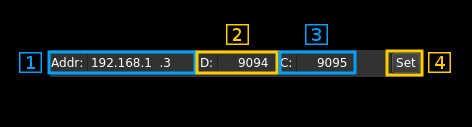

<h1>SDRdaemon source plugin</h1>

<h2>Introduction</h2>

This input sample source plugin gets its samples over tbe network from a SDRdaemon receiver server using UDP connection. SDRdaemon refers to the SDRdaemon utility `sdrdaemonrx`found in [this](https://github.com/f4exb/sdrdaemon) Github repository.

Forward Error Correction with a Cauchy MDS block erasure codec is used to prevent block loss. This can make the UDP transmission more robust particularly over WiFi links.

Please note that there is no provision for handling out of sync UDP blocks. It is assumed that frames and block numbers always increase with possible blocks missing. Such out of sync situation has never been encountered in practice.

<h2>Build</h2>

The plugin will be built only if `libnanomsg` and the [CM256cc library](https://github.com/f4exb/cm256cc) is installed in your system. `libnanomasg` is present in most distributions and the dev version can be installed using the package manager. For CM256cc library you will have to specify the include and library paths on the cmake command line. Say if you install cm256cc in `/opt/install/cm256cc` you will have to add `-DCM256CC_INCLUDE_DIR=/opt/install/cm256cc/include/cm256cc -DCM256CC_LIBRARIES=/opt/install/cm256cc/lib/libcm256cc.so` to the cmake commands.

<h2>Interface</h2>

<h3>1: Common stream parameters</h3>

<h4>1.1: Frequency</h4>

This is the center frequency in kHz sent in the meta data from the distant SDRdaemon instance and corresponds to the center frequency of reception.

<h4>1.2: Start/Stop</h4>

Device start / stop button. 

  - Blue triangle icon: device is ready and can be started
  - Green square icon: device is running and can be stopped
  
<h4>1.3: Record</h4>

Record I/Q stream toggle button

<h4>1.4: Stream sample rate</h4>

Stream I/Q sample rate in kS/s 

<h3>2: Auto correction options and stream status</h3>

<h4>2.1: Auto correction options</h4>

These buttons control the local DSP auto correction options:

  - **DC**: auto remove DC component
  - **IQ**: auto make I/Q balance
  
<h4>2.2: Receive buffer length</h4>

This is the main buffer (writes from UDP / reads from DSP engine) length in units of time (seconds). As read and write pointers are normally about half the buffer apart the nominal delay introduced by the buffer is the half of this value.

<h4>2.3: Main buffer R/W pointers positions</h4>

Read and write pointers should always be a half buffer distance buffer apart. This is the difference in percent of the main buffer size from this ideal position.

  - When positive it means that the read pointer is leading
  - When negative it means that the write pointer is leading (read is lagging)
  
This corresponds to the value shown in the gauges above (9)
  
<h4>2.4: Date/time</h4>

This is the current timestamp of the block of data sent from the receiver. It is refreshed about every second. The plugin tries to take into account the buffer that is used between the data received from the network and the data effectively used by the system however this may not be extremely accurate. It is based on the timestamps sent from the SDRdaemon utility at the other hand that does not take into account its own buffers.

<h3>3: Main buffer R/W pointers gauge</h3>

There are two gauges separated by a dot in the center. Ideally these gauges should not display any value thus read and write pointers are always half a buffer apart. However due to the fact that a whole frame is reconstructed at once up to ~10% variation is normal and should appear on the left gauge (write leads).

  - The left gauge is the negative gauge. It is the value in percent of buffer size from the write pointer position to the read pointer position when this difference is less than half of a buffer distance. It means that the writes are leading or reads are lagging.
  - The right gauge is the positive gauge. It is the value in percent of buffer size of the difference from the read pointer position to the write pointer position when this difference is less than half of a buffer distance. It menas that the writes are lagging or reads are leading.
  
The system tries to compensate read / write unbalance however at start or when a large stream disruption has occurred a delay of a few tens of seconds is necessary before read / write reaches equilibrium.

<h3>4: Forward Error Correction setting and status</h3>

<h4>4.1: Desired number of FEC blocks per frame</h4>

This is the number of FEC blocks per frame set by the user. A frame consists of 128 data blocks (1 meta data block followed by 127 I/Q data blocks) and a variable number of FEC blocks used to protect the UDP transmission with a Cauchy MDS block erasure correction.

Using the Cauchy MDS block erasure correction ensures that if at least the number of data blocks (128) is received per complete frame then all lost blocks in any position can be restored. For example if 8 FEC blocks are used then 136 blocks are transmitted per frame. If only 130 blocks (128 or greater) are received then data can be recovered. If only 127 blocks (or less) are received then none of the lost blocks can be recovered.

<h4>4.2: Total number of frames and number of FEC blocks</h4>

This is the total number of frames and number of FEC blocks separated by a slash '/' as sent in the meta data block thus acknowledged by the distant server. When you set the number of FEC blocks with (4.1) the effect may not be immediate and this information can be used to monitor when it gets effectively set in the distant server.

<h4>4.3: Stream status</h4>

The color of the icon indicates stream status:

  - Green: all original blocks have been received for all frames during the last polling timeframe (ex: 136)
  - No color: some original blocks were reconstructed from FEC blocks for some frames during the last polling timeframe (ex: between 128 and 135)
  - Red: some original blocks were definitely lost for some frames during the last polling timeframe (ex: less than 128)

<h4>4.4: Minimum total number of blocks per frame</h4>

This is the minimum total number of blocks per frame during the last polling period. If all blocks were received for all frames then this number is the nominal number of original blocks plus FEC blocks (Green lock icon). In our example this is 128+8 = 136.

If this number falls below 128 then some blocks are definitely lost and the lock lights in red.

<h4>4.5: Maximum number of FEC blocks used by frame</h4>

Maximum number of FEC blocks used for original blocks recovery during the last polling timeframe. Ideally this should be 0 when no blocks are lost but the system is able to correct lost blocks up to the nominal number of FEC blocks (Neutral lock icon).

<h4>4.6: Reset events counters</h4>

This push button can be used to reset the events counters (4.7 and 4.8) and reset the event counts timer (4.9)

<h4>4.7: Unrecoverable error events counter</h4>

This counter counts the unrecoverable error conditions found (i.e. 4.4 lower than 128) since the last counters reset.

<h4>4.8: Recoverable error events counter</h4>

This counter counts the unrecoverable error conditions found (i.e. 4.4 between 128 and 128 plus the number of FEC blocks) since the last counters reset.

<h4>4.9: events counters timer</h4>

This HH:mm:ss time display shows the time since the reset events counters button (4.6) was pushed.

<h3>5: Network parameters</h3>

<h4>5.1: Local interface IP address</h4>

Address of the network interface on the local (your) machine to which the SDRdaemon Rx server sends samples to.

<h4>5.2: Local data port</h4>

UDP port on the local (your) machine to which the SDRdaemon Rx server sends samples to.

<h4>5.3 Distant configuration port</h4>

TCP port on the distant machine hosting the SDRdaemon Rx instance to send control messages to. The IP address of the host where the SDRdaemon instance runs is guessed from the address sending the data blocks hence the distant address does not need to be specified.

<h4>5.4: Validation button</h4>

When the return key is hit within the address (5.1), data port (5.2) or configuration port (5.3) boxes the changes are effective immediately. You can also use this button to set again these values.

<h3>6: Desired center frequency</h3>

This is the center frequency sent to the distant device. This becomes reflected in the main frequency dial (1.1) only when it gets acknowledged by the distant server and this frequency is sent back in the frames meta data.

Use the wheels to adjust the frequency. Left click on a digit sets the cursor position at this digit. Right click on a digit sets all digits on the right to zero. This effectively floors value at the digit position. The minimum value is 0 Hz and the maximum value is 9.9 GHz. Wheels are moved with the mousewheel while pointing at the wheel or by selecting the wheel with the left mouse click and using the keyboard arrows. Pressing shift simultaneously moves digit by 5 and pressing control moves it by 2.

<h3>7: Delay between UDP blocks transmission</h3>

This sets the minimum delay between transmission of an UDP block (send datagram) and the next. This allows throttling of the UDP transmission that is otherwise uncontrolled and causes network congestion.

The value is a percentage of the nominal time it takes to process a block of samples corresponding to one UDP block (512 bytes). This is calculated as follows:

  - Sample rate on the network: _SR_
  - Delay percentage: _d_
  - Number of FEC blocks: _F_
  - There are 127 blocks of I/Q data per frame (1 meta block for 128 blocks) and each I/Q data block of 512 bytes (128 samples) has a 4 bytes header (1 sample) thus there are 127 samples remaining effectively. This gives the constant 127*127 = 16219 samples per frame in the formula
  
Formula: ((127 &#x2715; 127 &#x2715; _d_) / _SR_) / (128 + _F_)   

<h3>8: Desired distant device sample rate</h3>

This is the device sample rate sent to the distant device. It will be divided in the distant server by the decimation factor set with (9) to give the actual sample rate over the network. This becomes effective and displayed in (1.4) only when it gets acknowledged by the distant server and this sample rate is sent back in the frames meta data.

Use the wheels to adjust the sample rate. Left click on a digit sets the cursor position at this digit. Right click on a digit sets all digits on the right to zero. This effectively floors value at the digit position. The minimum value is 32 kS/s and the maximum value is 9.9 MS/s. Wheels are moved with the mousewheel while pointing at the wheel or by selecting the wheel with the left mouse click and using the keyboard arrows. Pressing shift simultaneously moves digit by 5 and pressing control moves it by 2.

<h3>9: Desired distant decimation factor</h3>

This is the decimation factor to be set in the distant server downsampler. The hardware device sample rate is divided by this factor before the I/Q blocks are sent over the network. The actual network sample rate becomes effective and displayed in (1.4) only when it gets acknowledged by the distant server and this sample rate is sent back in the frames meta data.

<h3>10: Center frequency position</h3>

The center frequency in the passband will be set either:

  - below the local oscillator (NCO) or infradyne. Actually -1/4th the bandwidth.
  - above the local oscillator (NCO) or supradyne. Actually +1/4th the bandwidth.
  - centered on the local oscillator or zero IF.
  
<h4>11: Other parameters hardware specific</h4>

These are the parameters that are specific to the hardware attached to the distant SDRdaemon instance. You have to know which device is attached to send the proper parameters. Please refer to the SDRdaemon documentation or its line help to get information on these parameters. 

<h4>12: Send data to the distant SDRdaemon Rx instance</h4>

When any of the parameters change they get immediately transmitted to the distant server over the TCP link. You can however use this button to send again the complete configuration. This is handy if for some reason you are unsure of the parameters set in the distant server.
