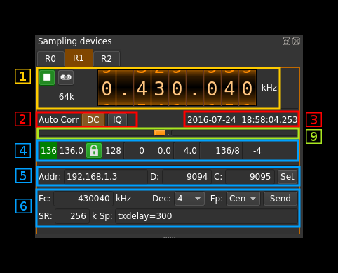
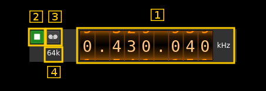
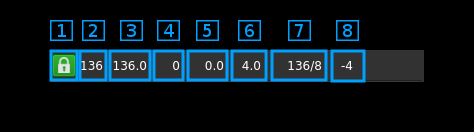
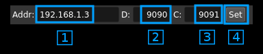
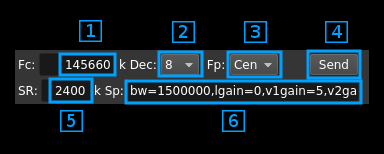

<h1>SDRdaemon source plugin</h1>

<h2>Introduction</h2>

This input sample source plugin gets its samples over tbe network from a SDRdaemon server using UDP connection. SDRdaemon refers to the SDRdaemon utility found in [this](https://github.com/f4exb/sdrdaemon) Github repostory. This plugin is specialized in the version of SDRdaemon that sends data with FEC (Forward Erasure Correction). When FEC is used the format of the data is completely different from what it is without FEC.

The addition of FEC blocks and the sequence tagging of frames and blocks make the transmission more robust. While it is unlikely to be beneficial with copper or fiber links it can improve links over WiFi particularly on distant links.

Please note that there is no provision for handling out of sync UDP blocks. It is assumed that frames and block numbers always increase with possible blocks missing.

<h2>Build</h2>

The plugin will be built only if the [CM256cc library](https://github.com/f4exb/cm256cc) is installed in your system. You will then have to specify the include and library paths on the cmake command line. Say if you install cm256cc in `/opt/install/cm256cc` you will have to add `-DCM256CC_INCLUDE_DIR=/opt/install/cm256cc/include/cm256cc -DCM256CC_LIBRARIES=/opt/install/cm256cc/lib/libcm256cc.so` to the cmake commands.

<h2>Interface</h2>

<h3>1: Common stream parameters</h3>

<h4>1.1: Frequency</h4>

This is the center frequency in kHz sent in the meta data from the distant SDRdaemon instance and corresponds to the center frequency of reception.

<h4>1.2: Start/Stop</h4>

Device start / stop button. 

  - Blue triangle icon: device is ready and can be started
  - Green square icon: device is running and can be stopped
  
<h4>1.3: Record</h4>

Record I/Q stresm toggle button

<h4>1.4: Stream sample rate</h4>

Stream I/Q sample rate in kS/s 

<h3>2: Auto correction options</h3>

These buttons control the local DSP auto correction options:

  - **DC**: auto remove DC component
  - **IQ**: auto make I/Q balance
  
<h3>3: Date/time</h3>

This is the current timestamp of the block of data sent from the receiver. It is refreshed about every second. The plugin tries to take into account the buffer that is used between the data received from the network and the data effectively used by the system however this may not be extremely accurate. It is based on the timestamps sent from the SDRdaemon utility at the other hand that does not take into account its own buffers.

<h3>9: Main buffer R/W pointers gauge</h3>

There are two gauges separated by a dot in the center. Ideally these gauges should not display any value thus read and write pointers are always half a buffer apart. However due to the fact that a whole frame is reconstructed at once up to ~10% variation is normal and should appear on the left gauge (write leads).

  - The left gauge is the negative gauge. It is the value in percent of buffer size from the write pointer position to the read pointer position when this difference is less than half of a buffer distance. It means that the writes are leading or reads are lagging.
  - The right gauge is the positive gauge. It is the value in percent of buffer size of the difference from the read pointer position to the write pointer position when this difference is less than half of a buffer distance. It menas that the writes are lagging or reads are leading.
  
The system tries to compensate read / write unbalance however at start or when a large stream distruption has occured a delay of a few tens of seconds is necessary before read / write reaches equilibrium.

<h3>4: Stream status and sizes</h3>

<h4>4.1: Minimum total number of blocks per frame</h4>

This is the minimum total number of blocks per frame during the last polling period. If all blocks were received for all frames then this number is the nominal number of original blocks plus FEC blocks and the background lits in green.

<h4>4.2: Average total number of blocks received by frame</h4>

Moving average over the last 10 frames of the total number of blocks received per frame.

<h4>4.3: Stream status</h4>

The color of the icon indicates stream status:

  - Green: all original blocks have been received for all frames during the last polling timeframe
  - Pink: some original blocks were reconstructed from FEC blocks for some frames during the last polling timeframe
  - No color: some original blocks were definitely lost for some frames during the last polling timeframe

<h4>4.4: Minimum number of original blocks received by frame</h4>

Minimum number of original blocks received by frame during the last polling timeframe. Ideally this should match the nominal number of original blocks per frame which is 128 (green lock icon). Anything below the nominal number of original blocks minus FEC blocks means data loss (lock icon off). In betweem FEC is used to recover lost blocks (pink lock icon)

<h4>4.5: Maximum number of FEC blocks used by frame</h4>

Maximum number of FEC blocks used for original blocks recovery during the last polling timeframe. Ideally this should be 0 when no blocks are lost but the system is able to correct lost blocks up to the nominal number of FEC blocks (Pink lock icon).

<h4>4.6: Average number of FEC blocks used for original blocks recovery by frame</h4>

Moving average over the last 10 frames of the number of FEC blocks used for original blocks recovery per frame.

<h4>4.7: Receive buffer length</h4>

This is the main buffer (writes from UDP / reads from DSP engine) length in units of time (seconds). As read and write pointers are normally about half the buffer apart the nominal delay introduced by the buffer is the half of this value.

<h4>4.8: FEC nominal values</h4>

This is the nominal (Tx side) total number of blocks sent by frame (original blocks plus FEC blocks) and the nominal number of FEC blocks sent by frame separated by a slash (/)

<h4>4.9: Main buffer R/W pointers positions</h4>

Read and write pointers should always be a half buffer distance buffer apart. This is the difference in percent of the main buffer size from this ideal position.

  - When positive it means that the read pointer is leading
  - When negative it means that the write pointer is leading (read is lagging)
  
This corresponds to the value shown in the gauges above (9)

<h3>5: Network parameters</h3>

<h4>5.1: Local interface IP address</h4>

Address of the network interface on the local (your) machine to which the SDRdaemon server sends samples to.

<h4>5.2: Local data port</h4>

UDP port on the local (your) machine to which the SDRdaemon server sends samples to.

<h4>5.3 Distant configuration port</h4>

TCP port on the distant machine hosting the SDRdaemon instance to send control messages to. The IP address of the host where the SDRdaemon instance runs is guessed from the address sending the data blocks hence it does not need to be specified.

<h4>5.4: Validation button</h4>

Whenever the address (6.1), data port (6.2) or configuration port (6.3) change this button is enabled to validate the new values.

<h3>6: Configuration parameters</h3>

<h4>6.1: Center frequency in kHz</h4>

This is the center frequency in kHz to which the hardware attached to the SDRdaemon instance will get tuned to.

<h4>6.2: Decimation factor</h4>

These are successive powers of two from 0 (1) to 6 (64). The SDRdaemon instance will decimate the samples coming from the attached hardware by this value. Thus the sample rate (see 7.5) will be decimated by the same value before it is sent over through the network.

<h4>6.3: Center frequency position</h4>

The center frequency in the passband wil be set either:

  - below the local oscillator (NCO) or infradyne. Actually -1/4th the bandwidth.
  - above the local oscillator (NCO) or supradyne. Actually +1/4th the bandwidth.
  - centered on the local oscillator or zero IF.
  
<h4>6.4: Send data to the distant SDRdaemon instance</h4>

Whenever any of the parameters change this button gets enabled. When clicked a message is sent on the configuration port of the distant machine to which the SDRdaemon listens for instructions. Leave time for the buffering system to stabilize to get the samples flow through normally.

<h4>6.5: Sample rate in kS/s</h4>

The sample rate of the hardware device attached to the SDRdaemon instance will be set to this value in kS/s.

<h4>6.6: Other parameters hardware specific</h4>

These are the parameters that are specific to the hardware attached to the distant SDRdaemon instance. You have to know which device is attached to send the proper parameters. Please refer to the SDRdaemon documentation or its line help to get information on these parameters. 

In addition you can specify the inter-block transmission delay (txdelay) and number of FEC blocks per frame (fecblk).