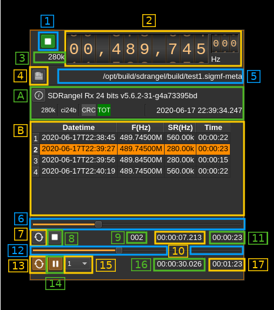
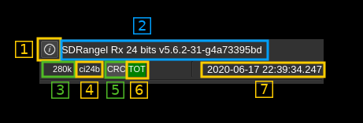
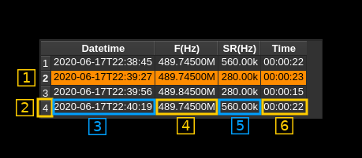

<h1>SigMF file input plugin</h1>

<h2>Introduction</h2>

This plugin reads a file of samples in [SigMF](https://github.com/gnuradio/SigMF/blob/master/sigmf-spec.md) format. SDRangel [SigMF file sink plugin](../../channelrx/sigmffilesink/readme.md) can save I/Q data in SigMF format. When files are recorded with SDRangel the SDRangel specific SigMF standard extensions are available among which variable sample rate.

This plugin supports single stream files having one `.sigmf-meta` file and only one `.sigmf-data` file. Thus it does not implement the `multirecordings` extension.

It adds a dependency to the [libsigmf library](https://github.com/f4exb/libsigmf) more specifically the `f4exb` fork that supports `multirecordings` and `sdrangel` extensions.

Note: this plugin is officially supported since version 6.

<h2>Interface</h2>

The top and bottom bars of the device window are described [here](../../../sdrgui/device/readme.md)

<h3>1: Start/Stop</h3>

Device start / stop button.

  - Blue triangle icon: ready to be started
  - Green square icon: currently running and can be stopped
  - Magenta (or pink) square icon: an error occurred. The file may not be found or there can be a CRC (SHA512) error or the file size is inconsistent (TOT label appears in red). You may stop and choose another file.

<h3>2: Frequency</h3>

This is the center frequency of reception in Hz of the track (or capture) being played currently. The 3 lower digits appear smaller above the "Hz" unit label.

<h3>3: Track sample rate</h3>

This is the sample rate in S/s of the track being  played currently. It is possibly suffixed by a thousands multiplier ('k' for kHz, 'M' for MHz). Recording SigMF files in SDRangel offers the possibility to change sample rate within the same record creating a new track.

<h3>4: Open file</h3>

Opens a file dialog to select the input file. It expects a default extension of `.sigmf-meta` which points to the meta data file. It expects a file with the `sigmf-data` extension and the same base name for the data file. This button is disabled when the stream is running. You need to pause (button 11) to make it active and thus be able to select another file.

<h3>5: File path</h3>

Absolute path of the meta file being read.

<h3>A: Global meta data</h3>

This section shows the meta data pertaining to the whole record. It is detailed as follows.

<h4>1: Recording detailed information</h4>

Opens a pop-up display with the complete global information contained in the meta file.

<h4>2: Recoding summary information</h4>

If the recoding was made with SDRangel it will show information about the instance that created the file.

  - GUI (`SDRangel`) or server (`SDRangelSrv`) instance
  - Number of sample bits (`16` or `24`)
  - Version

It the recording was not made with SDRangel it will just display `Not recorded with SDRangel`

<h4>3: Sample rate</h4>

This is the sample rate of the track currently being played or the global sample rate if the recording was not made by SDRangel.

<h4>4: Sample format</h4>

This is the sample format of the recording

  - Complex (`c`) or real (`r`). Note that real samples are completed with an imaginary part of zero resulting in aliasing (no Hilbert transform).
  - Sample type:
    - `i`: signed integer
    - `u`: unsigned integer
    - `f`: floating point (4 bytes or single precision)
  - Sample size in bits followed by `b`. This is the actual range of samples in bits. When record is made with 24 bit samples version of SDRangel it shows `24` although the sample size in the file is actually 32 bits.

<h4>5: CRC indicator</h4>

Indicates if the CRC check (SHA512) has succeeded (green) or failed (red) or is not available in meta data (grey).

<h4>6: Total number of samples check</h4>

Compares the size of the data file with the size data stored in the meta file. If they match the label shows in green else it shows in red. You can still read a file with a failing total samples check however it may be inconsistent and stop before the predicted end or not play all samples.

<h4>7: Current timestamp</h4>

This is the timestamp of the current pointer in the file based on the track start time, number of samples read from the start of the track and the track sample rate.

<h3>B: Tracks (or captures) data</h3>

This section shows tracks information and is detailed as follows

<h4>1: Current track</h4>

The track being played currently is highlighted. When the playing is paused you can click on the track you want to move to.

<h4>2: Track number</h4>

Track sequence number starting at `1`.

<h4>3: Track start date and time</h4>

Shows the date and time of the start of the track in ISO format.

<h4>4: Track center frequency</h4>

Shows the center frequency of the track in Hz. It is possibly suffixed with a thousands multiplier (`k` for kHz, `M` for MHz, `G` for GHz).

<h4>5: Track sample rate</h4>

If the file was recorded by SDRangel the sample rate can vary between tracks else it is global for the whole record and will show this value for all tracks. Sample rate is in S/s possibly suffixed with a thousands multiplier (`k` for kHz, `M` for MHz).

<h4>6: Track duration time</h4>

This is the track duration in `HH:MM:ss` format

<h3>6: Current track pointer gauge</h3>

This represents the position of the current pointer position in the track being played. It can be used in paused mode to position the current pointer by moving the slider.

<h3>7: Track loop</h3>

Use this button to read current track in a loop or read it only once

<h3>8: Track play/pause</h3>

This is the play/pause button for the current track. In pause mode you may switch to full record play by clicking on the record play/pause button (14).

<h3>9: Track number</h3>

This is the track number of the track currently being played.

<h3>10: Relative track time</h3>

This is the time in `HH:MM:ss.zzz` format of the current pointer since the beginning of the track.

<h3>11: Track duration</h3>

This is the current track duration in `HH:MM:ss` format.

<h3>12: Current record pointer gauge</h3>

This represents the position of the current pointer position in the complete recording. It can be used in paused mode to position the current pointer by moving the slider.

<h3>13: Record loop</h3>

Use this button to read the full record in a loop or read it only once

<h3>14: Record play/pause</h3>

This is the play/pause button for the whole record. In pause mode you may switch to current track record play by clicking on the track play/pause button (8).

<h3>15: Playback acceleration</h3>

Use this combo to select play back acceleration to values of 1 (no acceleration), 2, 5, 10, 20, 50, 100, 200, 500, 1k (1000) times. This is useful on long recordings used in conjunction with the spectrum "Max" averaging mode in order to see the waterfall over a long period. Thus the waterfall will be filled much faster.

&#9758; Note that this control is enabled only in paused mode.

&#9888; The result when using channel plugins with acceleration is unpredictable. Use this tool to locate your signal of interest then play at normal speed to get proper demodulation or decoding.

<h3>16: Relative timestamp and record length</h3>

Relative timestamp of the current pointer from the start of the record in `HH:MM:ss.zzz` format.

<h3>17: Record length</h3>

Total record time in `HH:MM:ss` format.
