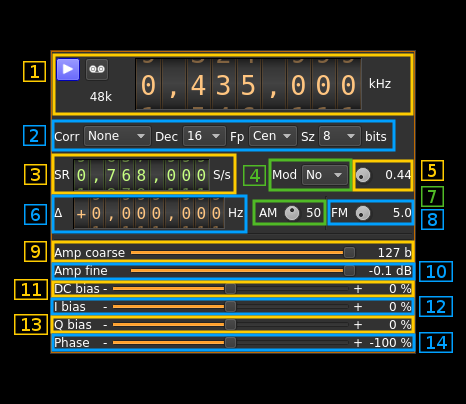

<h1>Test source input plugin</h1>

<h2>Introduction</h2>

This input sample source plugin is an internal continuous wave generator that can be used to carry out test of software internals. 

<h2>Build</h2>

The plugin is present in the core of the software and thus is always present in the list of sources.

<h2>Interface</h2>

<h3>1: Common stream parameters</h3>

<h4>1.1: Frequency</h4>

This is the center frequency of reception in kHz.

<h4>1.2: Start/Stop</h4>

Device start / stop button. 

  - Blue triangle icon: device is ready and can be started
  - Green square icon: device is running and can be stopped
  - Magenta (or pink) square icon: an error occured. In the case the device was accidentally disconnected you may click on the icon, plug back in and start again.
  
<h4>1.3: Record</h4>

Record baseband I/Q stream toggle button

<h4>1.4: Stream sample rate</h4>

Baseband I/Q sample rate in kS/s. This is the device to host sample rate (3) divided by the decimation factor (4). 

<h3>2: Auto correction options</h3>

These buttons control the local DSP auto correction options:

  - **DC**: auto remove DC component
  - **IQ**: auto make I/Q balance

<h3>3: Carrier shift from center frequency</h3>

Use this control to set the offset of the carrier from the center frequency of reception.

<h3>4: Decimation factor</h3>

The I/Q stream from the generator is doensampled by a power of two before being sent to the passband. Possible values are increasing powers of two: 1 (no decimation), 2, 4, 8, 16, 32. This exercises the decimation chain.

<h3>5: Baseband center frequency position relative the center frequency</h3>

Possible values are:

  - **Cen**: the decimation operation takes place around the BladeRF Rx center frequency
  - **Inf**: the decimation operation takes place around the center of the lower half of the BladeRF Rx passband. 
  - **Sup**: the decimation operation takes place around the center of the upper half of the BladeRF Rx passband. 

This exercises the decimation chain.

<h3>6: Sample rate</h3>

This controls the generator sample rate in samples per second.

<h3>7: Sample size</h3>

This is the sample size in number of bits. It corresponds to the actual sample size used by the devices supported:

  - **8**: RTL-SDR, HackRF
  - **12**: Airspy, BladeRF, LimeSDR, PlutoSDR, SDRplay
  - **16**: Airspy HF+, FCD Pro, FCD Pro+
  
<h3>8: Amplitude coarse control</h3>

This slider controls the number of amplitude bits by steps of 100 bits.
  
<h3>9: Number of amplitude bits</h3>

This is the signal peak amplitude in number of bits
  
<h3>10: Amplitude fine control</h3>

This slider controls the number of amplitude bits by steps of 1 bit.
  
<h3>11: Signal power</h3>

This is the signal power in dB relative to the maximum power (full bit range).

<h3>12: DC bias</h3>

Use this slider to give a DC component in percentage of maximum amplitude.

<h3>13: I bias</h3>

Use this slider to give an in-phase (I) bias in percentage of maximum amplitude.

<h3>14: Q bias</h3>

Use this slider to give an quadrature-phase (Q) bias in percentage of maximum amplitude.