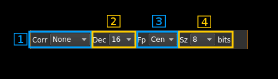

<h1>Test source input plugin</h1>

<h2>Introduction</h2>

This input sample source plugin is an internal continuous wave generator that can be used to carry out test of software internals. 

<h2>Build</h2>

The plugin is present in the core of the software and thus is always present in the list of sources.

<h2>Interface</h2>

<h3>1: Common stream parameters</h3>

<h4>1.1: Frequency</h4>

This is the center frequency of reception in kHz.

<h4>1.2: Start/Stop</h4>

Device start / stop button. 

  - Blue triangle icon: device is ready and can be started
  - Green square icon: device is running and can be stopped
  - Magenta (or pink) square icon: an error occurred. In the case the device was accidentally disconnected you may click on the icon, plug back in and start again.
  
<h4>1.3: Record</h4>

Record baseband I/Q stream toggle button

<h4>1.4: Stream sample rate</h4>

Baseband I/Q sample rate in kS/s. This is the device to host sample rate (3) divided by the decimation factor (4). 

<h3>2: Various options</h3>

<h4>2.1: Auto corrections</h4>

This combo box control the local DSP auto correction options:

  - **None**: no correction
  - **DC**: auto remove DC component
  - **DC+IQ**: auto remove DC component and correct I/Q balance.

<h4>2.2: Decimation factor</h4>

The I/Q stream from the generator is downsampled by a power of two before being sent to the passband. Possible values are increasing powers of two: 1 (no decimation), 2, 4, 8, 16, 32. This exercises the decimation chain.

This exercises the decimation chain.

<h4>2.3: Baseband center frequency position relative the center frequency</h4>

  - **Cen**: the decimation operation takes place around the center frequency Fs
  - **Inf**: the decimation operation takes place around Fs - Fc. 
  - **Sup**: the decimation operation takes place around Fs + Fc.
  
With SR as the sample rate before decimation Fc is calculated as: 

  - if decimation n is 4 or lower:  Fc = SR/2^(log2(n)-1). The device center frequency is on the side of the baseband. You need a RF filter bandwidth at least twice the baseband.
  - if decimation n is 8 or higher: Fc = SR/n. The device center frequency is half the baseband away from the side of the baseband. You need a RF filter bandwidth at least 3 times the baseband.

<h3>2.4: Sample size</h3>

This is the sample size in number of bits. It corresponds to the actual sample size used by the devices supported:

  - **8**: RTL-SDR, HackRF
  - **12**: Airspy, BladeRF, LimeSDR, PlutoSDR, SDRplay
  - **16**: Airspy HF+, FCD Pro, FCD Pro+

<h3>3: Sample rate</h3>

This controls the generator sample rate in samples per second.

<h3>4: Modulation</h4>

  - **No**: No modulation
  - **AM**: Amplitude modulation (AM)
  - **FM**: Frequency modulation (FM)
  
<h3>5: Modulating tone frequency</h3>

This controls the modulating tone frequency in kHz in 10 Hz steps.

<h3>6: Carrier shift from center frequency</h3>

Use this control to set the offset of the carrier from the center frequency of reception.
  
<h3>7: AM modulation factor</h3>

This controls the AM modulation factor from 0 to 99%

<h3>8: FM deviation</h3>

This controls the frequency modulation deviation in kHz in 100 Hz steps. It cannot exceed the sample rate.  
  
<h3>9: Amplitude coarse control</h3>

This slider controls the number of amplitude bits by steps of 100 bits. The total number of amplitude bits appear on the right.
  
<h3>10: Amplitude fine control</h3>

This slider controls the number of amplitude bits by steps of 1 bit. The signal power in dB relative to the maximum power (full bit range) appear on the right.
  
<h3>11: DC bias</h3>

Use this slider to give a DC component in percentage of maximum amplitude.

<h3>12: I bias</h3>

Use this slider to give an in-phase (I) bias in percentage of maximum amplitude.

<h3>13: Q bias</h3>

Use this slider to give an quadrature-phase (Q) bias in percentage of maximum amplitude.

<h3>14: Phase imbalance</h3>

Use this slider to introduce a phase imbalance in percentage of full period (continuous wave) or percentage of I signal injected in Q (AM, FM).
