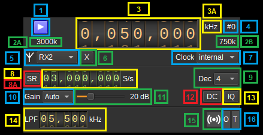

<h1>USRP input plugin</h1>

<h2>Introduction</h2>

This input sample source plugin gets its samples from a [USRP device](https://www.ettus.com/product-categories/usrp-bus-series/).

When using a USRP device over a network, you have to create a non discoverable device reference in the [user arguments dialog](https://github.com/f4exb/sdrangel/blob/master/sdrgui/deviceuserargs.md) from the main window Preferences > Devices menu. You must use the USRP hardware ID then specify the device address with an addr parameter in the user arguments for example: addr=192.168.1.10. Note that this will become effective once SDRangel is restarted.

<h2>Interface</h2>

The top and bottom bars of the device window are described [here](../../../sdrgui/device/readme.md)

<h3>1: Start/Stop</h3>

Device start / stop button.

  - Blue triangle icon: device is ready and can be started
  - Green square icon: device is running and can be stopped
  - Magenta (or pink) square icon: an error occurred. In the case the device was accidentally disconnected you may click on the icon to stop, plug back in, check the source on the sampling devices control panel and start again.

<h3>2A: Sample rate</h3>

This is the sample rate at which IQ samples are transferred the device to SDRangel, in kS/s (k) or MS/s (M).

<h3>2B: Stream sample rate</h3>

In host to device sample rate input mode (8A) this is the baseband I/Q sample rate in kS/s. This is the host to device sample rate (10) divided by the software interpolation factor (9).

In baseband sample rate input mode (8A) this is the host to device sample rate in kS/s. This is the baseband sample rate (10) multiplied by the software interpolation factor (9)

<h3>3: Center frequency</h3>

This is the center frequency of reception in kHz.

<h3>3A: Center frequency units</h3>

This is the center frequency units thus kHz (fixed)

<h3>4: Channel number</h3>

USRP can support 2x2 MIMO device so it has two receiving channels. This shows the corresponding Rx channel index (0 or 1).

<h3>5: Antenna selection</h3>

Select the antenna to use. The supported antennas will depend upon the USRP device, but may include "TX/RX" and "RX2".

<h3>6: Transverter mode open dialog</h3>

This button opens a dialog to set the transverter mode frequency translation options:

Note that if you mouse over the button a tooltip appears that displays the translating frequency and if translation is enabled or disabled. When the frequency translation is enabled the button is lit.

<h4>7.1: Translating frequency</h4>

You can set the translating frequency in Hz with this dial. Use the wheels to adjust the sample rate. Left click on a digit sets the cursor position at this digit. Right click on a digit sets all digits on the right to zero. This effectively floors value at the digit position. Wheels are moved with the mousewheel while pointing at the wheel or by selecting the wheel with the left mouse click and using the keyboard arrows. Pressing shift simultaneously moves digit by 5 and pressing control moves it by 2.

The frequency set in the device is the frequency on the main dial (1) minus this frequency. Thus it is positive for down converters and negative for up converters.

For example a mixer at 120 MHz for HF operation you would set the value to -120,000,000 Hz so that if the main dial frequency is set at 7,130 kHz the PlutoSDR will be set to 127.130 MHz.

If you use a down converter to receive the 6 cm band narrowband center frequency of 5670 MHz at 432 MHz you would set the translating frequency to 5760 - 432 = 5328 MHz thus dial +5,328,000,000 Hz.

For bands even higher in the frequency spectrum the GHz digits are not really significant so you can have them set at 1 GHz. Thus to receive the 10368 MHz frequency at 432 MHz you would set the translating frequency to 1368 - 432 = 936 MHz. Note that in this case the frequency of the LO used in the mixer of the transverter is set at 9936 MHz.

The Hz precision allows a fine tuning of the transverter LO offset

<h4>7.2: Translating frequency enable/disable</h4>

Use this toggle button to activate or deactivate the frequency translation

<h4>7.3: Confirmation buttons</h4>

Use these buttons to confirm ("OK") or dismiss ("Cancel") your changes.

<h3>7: Clock source</h3>

Use this combo box to select the clock source for the device, such as "internal", "external" or "gpsdo". The available choices will depend upon the USRP device. If a selected clock is not detected, it will be reset back to "internal".

<h3>8: Sample rate</h3>

This is the device to/from host stream sample rate or baseband sample rate in samples per second (S/s). The control (8A) is used to switch between the two input modes. The device to/from host stream sample rate is the same for the Rx and Tx systems.

The limits are adjusted automatically. In baseband input mode the limits are driven by the software interpolation factor (9). You may need to increase this interpolation factor to be able to reach lower values.

This is the device to/from host stream sample rate in S/s. It is the same for the Rx and Tx systems.

Use the wheels to adjust the sample rate. Pressing shift simultaneously moves digit by 5 and pressing control moves it by 2. Left click on a digit sets the cursor position at this digit. Right click on a digit sets all digits on the right to zero. This effectively floors value at the digit position. Wheels are moved with the mousewheel while pointing at the wheel or by selecting the wheel with the left mouse click and using the keyboard arrows.

<h3>8A: Host to device sample rate / Baseband sample rate input toggle</h3>

Use this toggle button to switch the sample rate input next (8) between host to device sample rate and baseband sample rate input. The button shows the current mode:

  - **SR**: device to host sample rate input mode. The baseband sample rate (2B) is the device to host sample rate (10) divided by the software interpolation factor (9).
  - **BB**: baseband sample rate input mode. The device to host sample rate (2A) is the baseband sample rate (10) multiplied by the software interpolation factor (9).

<h3>9: Software decimation factor</h3>

The I/Q stream from the USRP device can be decimated by a power of two by software inside the plugin before being sent to the baseband. Possible values are increasing powers of two: 1 (no decimation), 2, 4, 8, 16, 32.

<h3>10: Gain Mode</h2>

Choose between automatic or manual gain control.

<h3>11: Gain</h2>

Use this slider to adjust the global gain of the Rx chain. The allowable values of gain depend upon the USRP device. The value in dB appears at the right of the slider.

<h3>12: DC offset correction</h2>

Check this button to enable DC offset correction.

<h3>13: IQ imbalance correction</h2>

Check this button to enable IQ imbalance correction.

<h3>14: Rx hardware filter bandwidth</h3>

This is the Rx hardware IF filter bandwidth in kHz for the given channel. Use the wheels to adjust the value. Pressing shift simultaneously moves digit by 5 and pressing control moves it by 2.

<h3>Rx LO offset</h3>

This adjusts the Rx local oscillator (LO) frequency from the centre frequency by the given amount in kHz, and the NCOs are used to digitally shift the signal to compensate. The shift should be less than half of the sample rate.

<h3>15: Stream status indicator</h3>

This label turns green when data is being received from the device.

<h3>16: Stream warning indicators</h3>

  - **O**: turns red if stream experiences overruns
  - **T**: turns red if stream experiences timeouts

The stream warning indicators are reset when the acquisition is started.

<h2>Dependendices</h2>

On Ubuntu 20, the libuhd-dev package should be installed. The FPGA images then need to be downloaded with:

sudo /usr/lib/uhd/utils/uhd_images_downloader.py

