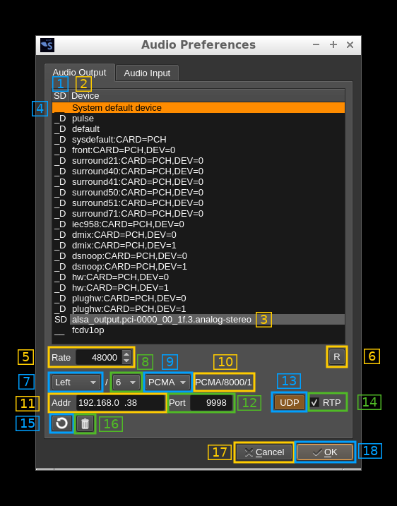
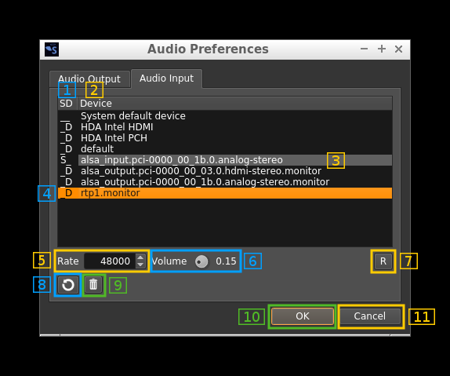
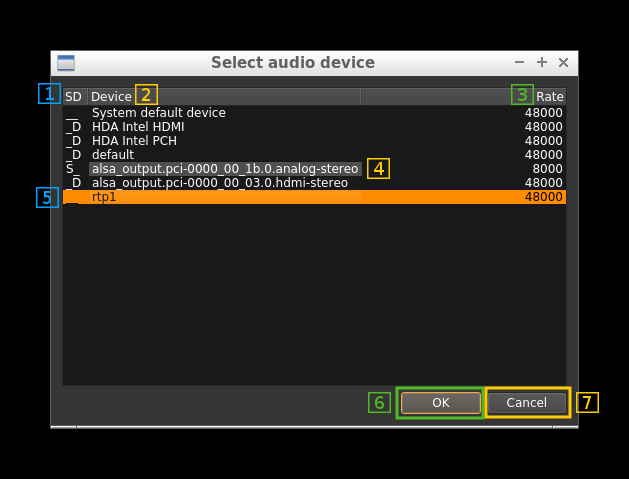

<h1>Audio management</h1>

Audio devices can be controlled with two dialogs:
  - The Audio preferences dialog: set audio device parameters. The dialog shows one tab for output and another tab for input devices
  - The Audio selection dialog: each channel plugin having audio output or input can show this dialog to select which device to use to direct output or input streams. This dialog opens by right clicking on a button that depends on the plugin (see plugin documentation).

<h2>1. Audio output preferences</h2>

This dialog lets you set preferences for the audio output devices attached to the system. These devices may refer to actual physical devices or be virtual devices defined with Pulseaudio (Linux).

Each device is represented by a row in the list. Move the cursor with the mouse or the arrow keys to select the device you want to configure.



<h3>1.1 Indicators column</h3>

In this column there are two indicators:

  - `S`: for system default device. This is the device that is defined as system default. You may configure it directly or via the ` System default device` entry. <br/>&#9758; Note that (at least in Linux) you may affect different parameters to one or the other.
  - `D`: the device is unregistered so if you associate an output stream to it it will be registered with default values. Default values are:
    - Sample rate: 48000 S/s
    - UDP address: 127.0.0.1
    - UDP port: 9998
    - Copy audio to UDP: unchecked (false)
    - UDP copy channel mode: mono left channel (Left)
    - Use RTP protocol: unchecked (false)
    
A unset indicator is marked with an underscore character: `_`
    
<h3>1.2 Device name</h3>

This is the device name defined in the system. In Linux when you define virtual devices (null sinks) with Pulseaudio this is the name you have given when defining the device.

<h3>1.3 System default device</h3>

The device that is configured as system default is marked with a grey background behind its name

<h3>1.4 Selected device</h3>

The device currently selected is marked in the selection color (orange). The parameters below are updated with its corresponding values

<h3>1.5 Sample rate</h3>

This is the device sample rate in samples per second (S/s). 

<h3>1.6 Reset values to defaults</h3>

By pushing this button the values are reset to the defaults (see 1.1 for actual default values)

<h3>1.7 UDP address</h3>

This is the destination address of the UDP stream

<h3>1.8 UDP port</h3>

This is the destination port of the UDP stream

<h3>1.9 Copy audio to UDP stream toggle</h3>

Use this button to activate or de-activate the copy of the audio stream to UDP stream

<h3>1.10 UDP copy channel mode</h3>

  - `Left`: UDP stream is mono (1 channel) and the left audio channel is copied
  - `Right`: UDP stream is mono (1 channel) and the right audio channel is copied 
  - `Mixed`: UDP stream is mono (1 channel) and the mix of left and right audio channels is copied
  - `Stereo`:  UDP stream is stereo (2 channels) and audio channels are copied to their UDP channel counterparts respectively
  
<h3>1.11 Use RTP protocol over UDP</h3>

Check this box to activate the RTP protocol over UDP. RTP parameters are as follows:

  - Payload type: 96
  - Sample rate: the sample rate of the corresponding audio device
  - Sample format: 16 bit integer signed (S16LE)
  - Channels: 1 for mono (Left, Right and Mixed copy channels mode); 2 for stereo (Stereo copy channels mode)
  - Address and port: destination address and port (local on the client machine)
  
You may read the RTP stream using a SDP file (extension `.sdp`) that can be read with any program supporting SDP files (VLC, MX player, ffmpeg, ...). For a mono 48000 S/s stream at address `192.168.0.34:9998` the contents of the file would be as follows:

```
c=IN IP4 192.168.0.34
m=audio 9998 RTP/AVP 96 
a=rtpmap:96 L16/48000/1
```

&#9758; Note that on Android clients VLC has trouble working with the RTP stream (choppy audio, hanging unexpectedly...) therefore [MX player](https://play.google.com/store/apps/details?id=com.mxtech.videoplayer.ad&hl=en) is recommended.

<h3>1.12 Cleanup registrations not in the list</h3>

Use this button to keep only the visible devices in the devices registrations. The devices registrations with custom parameters are kept in the preferences using the device names. This button makes some tidying up when devices are permanently removed.

<h3>1.14 Unregister device</h3>

Use this button to remove the device from the devices registrations returning it to the unregistered state. Therefore when associated to an output stream or selected it will initially take default values and appear with the `D` indicator in the list.

<h3>1.15 OK button</h3>

Use this button to confirm your changes and close dialog. Note that you can change parameters of only one device at a time.

<h3>1.16 Cancel button</h3>

Use this button to dismiss your changes and close dialog.


<h2>2. Audio input preferences</h2>

This dialog lets you set preferences for the audio input devices attached to the system. These devices may refer to actual physical devices or be virtual devices defined with Pulseaudio (Linux).

Each device is represented by a row in the list. Move the cursor with the mouse or the arrow keys to select the device you want to configure.



<h3>2.1 Indicators column</h3>

In this column there are two indicators:

  - `S`: for system default device. This is the device that is defined as system default. You may configure it directly or via the ` System default device` entry. <br/>&#9758; Note that (at least in Linux) you may affect different parameters to one or the other.
  - `D`: the device is unregistered so if you associate an input stream to it it will be registered with default values. Default values are:
    - Sample rate: 48000 S/s
    - Volume: 0.15
    
A unset indicator is marked with an underscore character: `_`
    
<h3>2.2 Device name</h3>

This is the device name defined in the system. In Linux when you define virtual devices (null sinks) with Pulseaudio an input device is automatically created with the `.monitor` extension.

<h3>2.3 System default device</h3>

The device that is configured as system default is marked with a grey background behind its name

<h3>2.4 Selected device</h3>

The device currently selected is marked in the selection color (orange). The parameters below are updated with its corresponding values

<h3>2.5 Sample rate</h3>

This is the device sample rate in samples per second (S/s). 

<h3>2.6 Input volume</h3>

This factor in the range [0.01 .. 1.00] is applied to the input before modulation.

<h3>2.7 Reset values to defaults</h3>

By pushing this button the values are reset to the defaults (see 2.1 for actual default values)

<h3>2.8 Cleanup registrations not in the list</h3>

Use this button to keep only the visible devices in the devices registrations. The devices registrations with custom parameters are kept in the preferences using the device names. This button makes some tidying up when devices are permanently removed.

<h3>2.9 Unregister device</h3>

Use this button to remove the device from the devices registrations returning it to the unregistered state. Therefore when associated to an output stream or selected it will initially take default values and appear with the `D` indicator in the list.

<h3>2.10 OK button</h3>

Use this button to confirm your changes and close dialog. Note that you can change parameters of only one device at a time.

<h3>2.11 Cancel button</h3>

Use this button to dismiss your changes and close dialog.

<h2>3 Audio device selection</h2>

In plugins having audio input or output this dialog can be opened to select the input or output device for the audio stream. The exact button that opens the dialog by right clicking on it depends on the plugin. Generally this will be the audio in selection (microphone icon) for input plugins and the audio mute (loudspeaker icon) for output plugins. You may check the plugin documentation for confirmation.

The dialog for input or output is similar. The screenshot below is taken from an output selection.




<h3>3.1 Indicators column</h3>

In this column there are two indicators:

  - `S`: for system default device. This is the device that is defined as system default. You may configure it directly or via the ` System default device` entry. <br/>&#9758; Note that (at least in Linux) you may affect different parameters to one or the other.
  - `D`: the device is unregistered so if you associate an input stream to it it will be registered with default values. Default values depend on the input or output nature and are listed in the 2.1 and 1.1 sections respectively.
    
A unset indicator is marked with an underscore character: `_`
    
<h3>3.2 Device name</h3>

This is the device name defined in the system.

<h3>3.3 Device sample rate</h3>

This is the device sample rate in samples per seconds. Please note that the baseband sample rate should not be lower than this rate for correct audio operation of AM, NFM and SSB plugins.

&#9758; Using devices with sample rates lower than 48000 S/s may allow baseband sample rates lower than 48 kS/s with AM, NFM and SSB plugins. This is not true for wideband plugins (BFM, WFM) that use baseband rates in accordance with the RF bandwidth required nor for DSD plugin that uses internally a fixed channel rate of 48 kS/s to be able to decode symbols properly.

&#9758; The DSD demodulator plugin accepts only audio sample rates of 48000 or 8000 S/s to process audio properly.

<h3>3.4 System default device</h3>

The device that is configured as system default is marked with a grey background behind its name

<h3>3.5 Selected device</h3>

The device currently selected is marked in the selection color (orange). Use the mouse or the arrow keys to change selection.

<h3>3.6 OK button</h3>

Use this button to confirm your selection and close dialog.

<h3>3.7 Cancel button</h3>

Use this button to dismiss your selection and close dialog.


 

