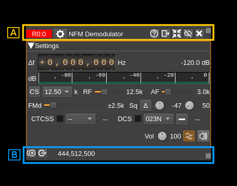
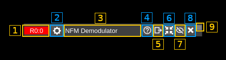
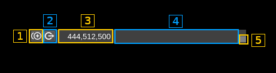

<h1>Channel common controls</h1>

The channel windows have common top and bottom bars



<h2>A: Top bar</h2>



<h3>A.1: Index</h3>

The format is:

  - Device reference to which the channel is attached. This is the device type and its index. See [device window documentation](../device/readme.md)
  - Semicolon separator
  - Channel index in device set

Additionally when the channel is a single stream channel and attached to a MIMO device:

  - Dot separator
  - Stream index

The tooltip shows the device type to which the channel is attached, its sequence number and serial number of the device if it exists. It also displays the channel type separated by a slash. For example: `HackRF[0] 88869dc3878a51 / SSB Demodulator`

You may click on this area and drag the window with the mouse.

<h3>A.2: Common channel settings</h3>

Opens a dialog to update the common channel settings


<h4>A.2.1: Window title</h4>

Changes the channel window title

<h4>A.2.2: Reset title to default</h4>

Resets the title to the channel type name.

<h4>A.2.3: Channel color</h4>

Changes the color of the window title bar and spectrum overlay. To change the color click on the color square to open a color chooser dialog. The hex rgb value is displayed next to the color square.

<h4>A.2.4: Frequency scale display type</h4>

When the mouse is over the channel window or over the central line in the spectrum a channel parameter is displayed on the frequency scale. This parameter can be:

  - Freq: channel absolute center frequency
  - Title: channel window title
  - AdSnd: UDP address and send port
  - AdRcv: UDP address and receive port

<h4>A.2.5: Device stream assignment</h4>

If the device is a MIMO device and the channel is single stream based i.e. not MIMO as well this sets the MIMO stream the channel will take its I/Q input from. It is disabled in other cases.

<h4>A.2.6: Toggle reverse API feature</h4>

Use this checkbox to toggle on/off the reverse API feature. With reverse API engaged the changes in the channel settings are forwarded to an API endpoint given by address (A.2.7), port (A.2.8), device index (A.2.9) and channel index (A.2.10) in the same format as the SDRangel REST API channel settings endpoint. With the values of the screenshot the API URL is: `http://127.0.0.1:8888/sdrangel/deviceset/0/channel/0/settings` The JSON payload follows the same format as the SDRangel REST API channel settings. Using the same example this would be:

```
{
  "SSBDemodSettings": {
    "agc": 0,
    "agcClamping": 0,
    "agcPowerThreshold": -40,
    "agcThresholdGate": 4,
    "agcTimeLog2": 7,
    "audioBinaural": 0,
    "audioDeviceName": "System default device",
    "audioFlipChannels": 0,
    "audioMute": 0,
    "dsb": 0,
    "inputFrequencyOffset": 0,
    "lowCutoff": 300,
    "rfBandwidth": 3000,
    "rgbColor": -16711936,
    "spanLog2": 3,
    "title": "SSB Demodulator",
    "volume": 3
  },
  "channelType": "SSBDemod",
  "tx": 0
}
```
Note that the PATCH method is used. The full set of parameters is sent only when the reverse API is toggled on or a full settings update is done.

More details on this feature can be found on the corresponding Wiki page.

<h4>A.2.7: API address</h4>

This is the IP address of the API endpoint

<h4>A.2.8: API port</h4>

This is the IP port of the API endpoint

<h4>A.2.9: Device index</h4>

This is the targeted device index

<h4>A.2.10: Channel index</h4>

This is the targeted channel index

<h4>A.2.11: Cancel changes and exit dialog</h4>

Do not make any changes and exit dialog

<h4>A.2.12: Validate and exit dialog</h4>

Validates the data (saves it in the channel marker object) and exits the dialog

<h3>A.3: Title</h3>

This is the default channel title or as set with (A.2.1).

You may click on this area and drag the window with the mouse.

<h3>A.4: Help</h3>

Clicking on this button opens the documentation about the channel controls in github in the browser.

<h3>A.5: Move to another workspace</h3>

Opens a dialog to choose a destination workspace to move the channel window to. Nothing happens if the same workspace is selected.

<h3>A.6: Shrink window</h3>

Click this button to reduce the window to its minimum size

<h3>A.7: Hide window</h3>

Click this button to hide the channel window

<h3>A.8: Close window</h3>

Click this button to close the window and removes the channel from the device set.

<h2>B: Bottom bar</h2>



<h3>B.1: Duplicate channel</h3>

Creates a new channel with the same settings

<h3>B.2: Attach channel to another device</h3>

Opens a dialog to select the destination device. Nothing happens if the destination device is the same as the current device.

<h3>B.3: Absolute channel center frequency</h3>

This is the absolute frequency in Hz of the channel center. It is the sum of the device center frequency and the channel shift.

You may click on this area and drag the window with the mouse.

<h3>B.4: Status message</h3>

The status messages appear here if any.

You may click on this area and drag the window with the mouse.

