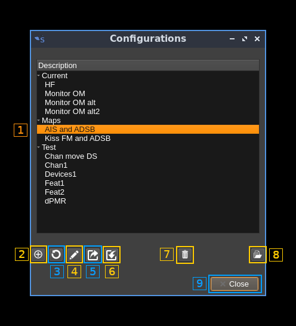

<h1>Configurations dialog</h1>

Configurations stores the complete setup of a SDRangel instance:

  - Workspaces
  - Device sets
  - Features

It also stores the geometry of all windows and workspaces so that the entire aspect of a configuration of the instance can be saved and retrieved. A default configuration is saved at program exit and retrieved at the next program start. Use the `--scratch` command line option to skip the retrieval of the default configuration and start with an empty setup.

<h3>1: Configuration selection</h3>

Move the cursor to select a configuration. Features can be organized into groups at the top level (here "Test"). When selecting a group only Edit and Delete group are available

<h3>2: Add new configuration</h3>

Save the current setup in a new configuration.

<h3>3: Update selected configuration</h3>

Update the selected configuration with the current setup

<h3>4: Edit configuration</h3>

Change configuration name or the configuration group to which this configuration belongs. If selection is a group the group name can be changed.

<h3>5: Export configuration</h3>
Export selected configuration in a file that can be imported on another machine possibly with a different O/S. The configuration binary data (BLOB) is saved in Base-64 format.

<h3>6: Import preset</h3>
This is the opposite of the previous operation. This will create a new configuration in the selected group or the same group as the configuration being selected.

<h3>7: Delete configuration</h3>

Delete selected configuration or selected group

<h3>8: Load configuration</h3>

Load configuration in the current instance. All components and workspaces are deleted first.

<h3>9: Close dialog</h3>

This button dismisses the dialog.
