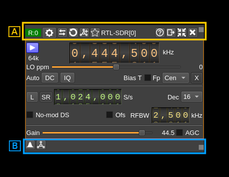
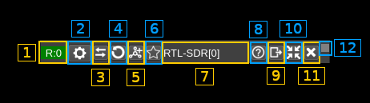
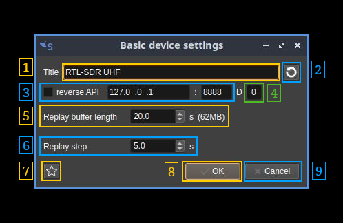
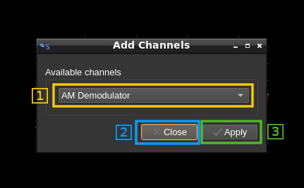
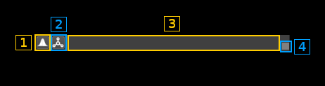

<h1>Device common controls</h1>

The device windows have common top and bottom bars



<h2>A: Top bar</h2>



<h3>A.1 Device type and index</h3>

The format is:
  - Device type:
    - R: receiver
    - T: transmitter
    - M: MIMO
  - Semicolon separator
  - Device set index. A "device set" is the set of a device and its corresponding channels

The tooltip shows the device type, sequence number and serial number of the device if it exists.

You may click on this area and drag the window with the mouse.

<h3>A.2: Device common settings</h3>

All device types have common settings. Clicking on the button opens a dialog to update them



<h4>A.2.1: Toggle reverse API feature</h4>

Use this checkbox to toggle on/off the reverse API feature. With reverse API engaged the changes in the device settings are forwarded to an API endpoint given by address (A.2.2), port (A.2.3) and device index A.2.4) in the same format as the SDRangel REST API device settings endpoint. With the values of the screenshot the API URL is: `http://127.0.0.1:8888/sdrangel/deviceset/0/device/settings` The JSON payload follows the same format as the SDRangel REST API device settings. For example with HachRF Rx this would be something like:

```
{
  "deviceHwType": "HackRF",
  "hackRFInputSettings": {
    "LOppmTenths": 0,
    "bandwidth": 1750000,
    "biasT": 0,
    "centerFrequency": 435000000,
    "dcBlock": 0,
    "devSampleRate": 2400000,
    "fcPos": 2,
    "iqCorrection": 0,
    "linkTxFrequency": 0,
    "lnaExt": 0,
    "lnaGain": 16,
    "log2Decim": 0,
    "vgaGain": 16
  },
  "tx": 0
}
```
Note that the PATCH method is used. The full set of parameters is sent only when the reverse API is toggled on or a full settings update is done.

The start and stop actions are also forwarded with the `/sdrangel/deviceset/{deviceSetIndex}/device/run` API endpoint using POST (start) or DELETE (stop) methods.

More details on this feature can be found on the corresponding Wiki page.

<h4>A.2.2: API address</h4>

This is the IP address of the API endpoint

<h4>A.2.3: API port</h4>

This is the IP port of the API endpoint

<h4>A.2.4: Device index</h4>

This is the targeted device index

<h4>A.2.5: Cancel changes and exit dialog</h4>

Do not make any changes and exit dialog

<h4>A.2.6: Validate and exit dialog</h4>

Validates the data (saves it in the channel marker object) and exits the dialog


<h3>A.3: Change device</h3>

Opens a dialog that lets you choose a different device


<h4>A.3.1: Device selection combo</h4>

Use this combo box to select the device. Only available devices will appear in the list. For devices having more than one channel (ex: LimeSDR) the channel number will appear next to the device sequence number inside the brackets. Ex: `LimeSDR[0:1] 0009060B00473419` designates the second Rx (Rx #1) of the first encountered LimeSDR which serial number is 0009060B00473419.

<h4>A.3.2: Device selection confirmation</h4>

Use the `OK` button to confirm your choice and exit the dialog

<h4>A.3.3: Device selection cancellation</h4>

Use the `Cancel` button to exit the dialog without any change

<h3>A.4: Reload device</h3>

This button activates a close/open sequence to recycle the device. It may be useful when the device is not streaming anymore or in an attempt to clear possible errors. Make sure the streaming is stopped first.

<h3>A.5: Device set presets</h3>

Opens a dialog to manage device set presets. Device set presets store configurations related to a single device set


<h4>A.5.1: Preset selection</h4>
You select a preset or a preset group by clicking on its line in the tree view. All actions (6) will be done relative to this preset or preset group.

<h4>A.5.2: Group</h4>
You can organize your presets into groups. Groups can be collapsed or expanded by using the caret icon on the left.

<h4>A.5.3: Center frequency</h4>
The center frequency used in this preset is displayed here.

<h4>A.5.4: Rx/Tx indicator</h4>
"R" is displayed for a Rx device set and "T" for a Tx device set

<h4>A.5.5: Preset name</h4>
You can give a name to your preset. Names need not to be unique.

<h4>A.5.6: Preset control or actions</h4>


<h5>A.5.6.1: New preset</h5>
Click on this icon to create a new preset with the current values in the selected sample device tab (Main window: 2).

<h5>A.5.6.2: Update preset</h5>
Click on this icon to create a update the selected preset with the current values in the selected sample device tab (Main window: 2). Please note that this does not save the preset immediately on disk to save presets immediately you need to use the save button (4).

<h5>A.5.6.3: Edit preset</h5>
Opens a new window where you can change the group name and description.

  - for group items you can rename the group or merge all group presets into an existing group by selecting this existing group

  - for preset items you can:
    - move the preset to another existing group by selecting this existing group
    - assign this preset to a new group by typing in this new group
    - change the description

<h5>A.5.6.4: Export preset</h5>
Using the previous icon presets are saved globally in a system dependent place. Using this icon you can export a specific preset in a single file that can be imported on another machine possibly with a different O/S. The preset binary data (BLOB) is saved in Base-64 format.

<h5>A.5.6.5: Import preset</h5>
This is the opposite of the previous operation. This will create a new preset in the selected group or the same group as the preset being selected.

<h5>A.5.6.6: Delete preset</h5>
on a preset item: deletes the selected preset.
on a preset group: deletes the group and all its presets.

<h5>A.5.6.7: Load preset</h5>
Applies the selected preset to the current device set (source and channel plugins).

<h3>A.6: Add channels</h3>

Opens a dialog to add one or more channels connected to the device.



<h4>A.6.1: Channel selection</h4>

Use this combo to select which channel type to add

<h4>A.6.2: Close dialog</h4>

Use this button to dismiss the dialog

<h4>A.6.3: Add channel</h4>

Add a new channel by clicking on the `Apply` button. You may click it several times to add more channels. The dialog can be dismissed with the `Close` button or the closing window icon `X` on the top bar.

<h3>A.7: Title</h3>

The window title shows the device type and a sequence number.

You may click on this area and drag the window with the mouse.

<h3>A.8: Help</h3>

Clicking on this button opens the documentation about the device controls in github in the browser.

<h3>A.9: Move to another workspace</h3>

Opens a dialog to choose a destination workspace to move the device window to. Nothing happens if the same workspace is selected.

<h3>A.10: Shrink window</h3>

Click this button to reduce the window to its minimum size

<h3>A.11: Close window</h3>

Click this button to close the window and removes the device set i.e. the device and all its channels.

<h2>B: Bottom bar</h2>



<h3>B.1: Show spectrum</h3>

When the main spectrum window of this device is hidden this will show it. It has no effect if the main spectrum window is displayed.

<h3>B.2: Show all channels</h3>

This will show all hidden channel windows if any. It has no effects on channel windows already displayed.

<h3>B.3: Status text</h3>

The status messages appear here if any.

You may click on this area and drag the window with the mouse.
