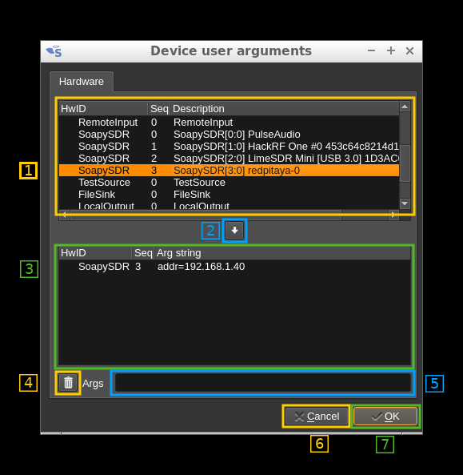

<h1>Devices user arguments management</h1>

The user can give arguments in the form of a string related to a specific device that appears in the list of enumerated device. At the moment these arguments are related to a specific hardware and its sequence in enumeration. For example `LimeSDR,0` for the first Lime SDR, `LimeSDR,1` for the second Lime SDR ...

THe corresponding plugin can make use of this user string in any way it finds useful. At present this is used only by the SoapySDR input/output plugins to override the `kwargs` (keyword arguments) at device open time (the `driver` argument is preserved as defined in the enumeration)

The following dialog is used to specify these arguments:

<h2>1 Available devices list</h2>

This is the list of available devices reported by the initial enumeration. There are 3 columns:

  - **HwID**: This is the "hardware ID". It represents a type of device like `HackRF` or `TestSource`
  - **Seq**: The device sequence in enumeration starting at 0. You may have more that one device of the same type in the system
  - **Description**: A descriptive string stored by the enumeration process to help identify which device is which

<h2>2 Import device button</h2>

Use this button to import the selected device in the panel above (1) to the panel below (3) that lists the user arguments by device and sequence. You can only import a device which hardware ID and sequence is not already in the panel below.

<h2>3 User arguments</h2>

This is the list of arguments given by the user and attached to a specific device given its hardware ID and sequence. There are 3 columns:

  - **HwID**: This is the "hardware ID". It represents a type of device like `HackRF` or `TestSource`
  - **Seq**: The device sequence in enumeration starting at 0. You may have more that one device of the same type in the system
  - **Arg string**: The user argument string. It can be of any form and not necessarily in the `key1=value1, key2=value2` form. It is up to the corresponding plugin to interpret the string and to make use of its information.

<h2>4 Delete button</h2>

Use this button to delete the arguments currently selected in the above panel (3)

<h2>5 Edit arguments</h2>

Use this line editor to change the arguments currently selected in the above panel (3). The text will be committed when the focus is lost.

<h2>6 Cancel button</h2>

The changes made to the argument list are temporary. You can use this button to dismiss the changes and close the dialog.

<h2>7 OK (confirmation) button</h2>

The changes made to the argument list are only temporary. You can use this button to commit the changes and close the dialog.
