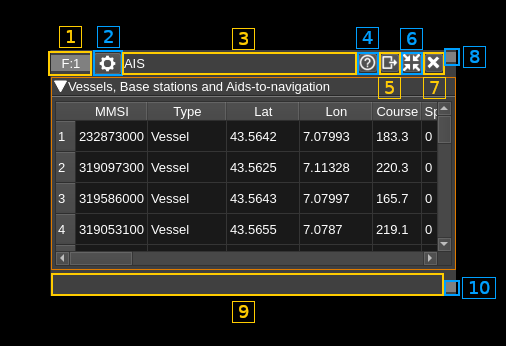
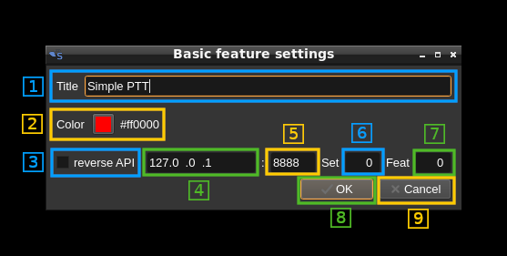

<h1>Feature common controls</h1>

The feature windows have common top and bottom bars



<h2>Top bar</h2>

<h3>1: Feature index</h3>

Displays the index of the feature in the list of features as "F" followed by semicolon and index number.

The tooltip displays the feature type name.

You may click on this area and drag the window with the mouse.

<h3>2: Common feature settings</h3>

Opens a dialog to update the common feature settings



<h4>2.1: Window title</h4>

Changes the feature window title

<h4>2.2: Reset title to default</h4>

Resets the title to the feature type name.

<h4>2.3: Toggle reverse API feature</h4>

Use this checkbox to toggle on/off the reverse API feature. With reverse API engaged the changes in the feature settings are forwarded to an API endpoint given by address (8.2.4), port (8.2.5), feature set index (8.2.6) and feature index (8.2.7) in the same format as the SDRangel REST API feature settings endpoint. With the values of the screenshot the API URL is: `http://127.0.0.1:8888/sdrangel/featureeset/0/feature/0/settings` The JSON payload follows the same format as the SDRangel REST API feature settings. Using the same example this would be:

```
{
  "SimplePTTSettings": {
    "reverseAPIAddress": "127.0.0.1",
    "reverseAPIChannelIndex": 0,
    "reverseAPIDeviceIndex": 0,
    "reverseAPIPort": 8888,
    "rgbColor": -65536,
    "rx2TxDelayMs": 200,
    "rxDeviceSetIndex": 0,
    "title": "Simple PTT",
    "tx2RxDelayMs": 200,
    "txDeviceSetIndex": 1,
    "useReverseAPI": 0
  },
  "featureType": "SimplePTT"
}
```
Note that the PATCH method is used. The full set of parameters is sent with the PUT method only when the reverse API is toggled on or a full settings update is done.

<h4>2.4: API address</h4>

This is the IP address of the API endpoint

<h4>2.5: API port</h4>

This is the IP port of the API endpoint

<h4>2.6: Feature set index</h4>

This is the targeted feature set index

<h4>2.7: Feature index</h4>

This is the targeted feature index

<h4>2.8: Cancel changes and exit dialog</h4>

Do not make any changes and exit dialog

<h4>2.9: Validate and exit dialog</h4>

Validates the data and exits the dialog

<h3>3: Title</h3>

This is the default feature title or as set with (2.1).

You may click on this area and drag the window with the mouse.

<h3>4: Help</h3>

Clicking on this button opens the documentation about the feature controls in github in the browser.

<h3>5: Move to another workspace</h3>

Opens a dialog to choose a destination workspace to move the feature window to. Nothing happens if the same workspace is selected.

<h3>6: Shrink window</h3>

Click this button to reduce the window to its minimum size

<h3>7: Close window</h3>

Closes the window and deletes the feature

<h3>8: Status</h3>

Status messages if any appear here.

You may click on this area and drag the window with the mouse.

