<h1>Spectrum component</h1>

This page details the spectrum component that takes part of the main spectrum display and is also used in some channel and feature plugins.

For example:
  - Channel Analyzer
  - Demod Analyzer
  - Interferometer
  - Broadcast FM demodulator
  - ChirpChat (LoRa) demodulator
  - File sink
  - FreeDV demodulator and modulator
  - Frequency tracker
  - SigMF file sink
  - SSB demodulator and modulator
  - UDP source and sink

It comprises the spectrum display itself and the controls generally placed at the bottom of the spectrum display

<h2>A. Spectrum display</h2>

<h3>Status line</h3>

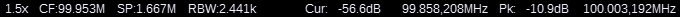

A status line is displayed at the left of the top margin. It displays the following items from left to right:

  - if frequency zooming is active the zooming factor
  - `CF:` followed by the Center Frequency of the displayed spectrum possibly with multiplier suffix (G, M, k)
  - `SP:` followed by the frequency SPan of the displayed spectrum possibly with multiplier suffix (M, k)

<h3>Spectrum markers</h3>

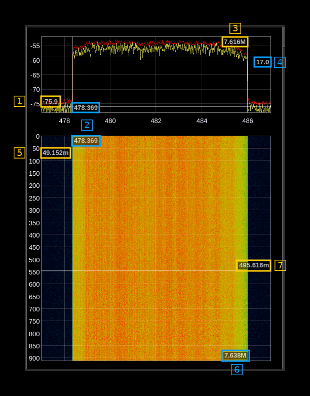

Note that spectrum markers appear only when spectrum display is active (shows data)

The spectrum markers can be set either with the mouse as explained next or with the [spectrum markers dialog](spectrummarkers.md) that can be opened with the markers button (B.4.3).

Use Shift and mouse left click to set a new marker. There is a maximum of two markers with a different status:
  - The first marker will display frequency (2) and power (1) or time (5) on the scale side of the view. Frequency units are the same as displayed in the frequency scale.
  - The second marker will display frequency difference (3 or 6) and power difference (4) or time difference (7) from the first marker on the opposite side of the scales. Difference values may be suffixed with a multiplier character.

Base units are Hz for frequency difference and seconds for time. Power is expressed either in dB or plain value depending on the linear or log setting for the spectrum display.

Values may be suffixed by a multiplier character:
  - **p**: pico (times 1e-12)
  - **n**: nano (times 1e-9)
  - **u**: micro (times 1e-6)
  - **m**: milli (times 1e-3)
  - no character: no change (times one)
  - **k**: kilo (times 1e3)
  - **M**: mega (times 1e6)
  - **G**: giga (times 1e9)

Use mouse right click anywhere in the view to remove the last entered marker. Use shift and mouse right click to remove all markers.

<h3>Spectrum measurements</h3>

When activated in the spectrum measurements dialog (B.6.5) the measured values are displayed along with the spectrum. The measurements table can be displayed on the left, right, top or bottom of the spectrum view. You can use the splitter handle to arrange the partition between table and spectrum view. Details on the available measurements are discussed in the [Spectrum measurement control dialog](spectrummeasurements.md) documentation.

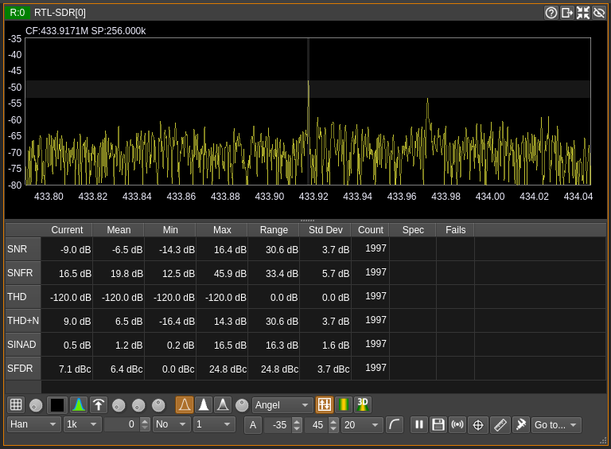

<h3>Mouse scroll wheel</h3>

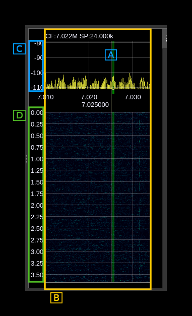

<h4>A: Channel moving</h4>

When the mouse is over the center line of a channel:

  - scrolling will move the channel by +/- 10 Hz at each scroll up/down respectively
  - combined with Ctrl it will move the channel by +/- 100 Hz
  - combined with Shift it will move the channel by +/- 1 kHz

<h4>B: Frequency zooming</h4>

When the mouse is in the spectrum or waterfall area but not over the center line of a channel it will zoom in/out along X (frequency) axis by a 0.5 step at each scroll up/down respectively between 1x (no zoom) and 10x. Note that in order to zoom on the center line of a channel you may move the mouse pointer in the top margin (center line moving is not active there but zooming is).

When frequency zooming is active use Alt + left click to move the center frequency to the clicked point.

<h4>C: Power zooming</h4>

When the mouse is inside the power scale (spectrum) the power range is decreased by 2 (zoom in) or increased by 2 (zoom in) at each wheel step forward or backward respectively. The behavior of the reference level depends on where in the scale is the mouse pointer:

  - in the top third: the reference level is maintained thus the reference level at the top stays the same
  - in the middle third: the reference level is decreased by 1 (zoom in) or increased by 1 (zoom out) at each wheel step forward or backward thus the level in the middle stays the same
  - in the bottom third: the reference level is decreased by 2 (zoom in) or increased by 2 (zoom out) at each wheel step forward or backward thus the level at the bottom stays the same

<h4>D: Time zooming</h4>

When the mouse is inside the time scale (waterfall) the overlap is increased by 1 (zoom in) or decreased by 1 (zoom out) at each wheel step forward or backward respectively. Overlap is bounded by 0 and half of the FFT size minus one.

<h2>B. Spectrum controls</h2>

Controls are organized in 6 blocks arranged in a flow layout so that the size of the control area can adapt to the width of the spectrum arranging the blocks from 4 to 1 line as the spectrum widens. The buttons and various controls in each block remain at the same place.

Narrow (4 lines):

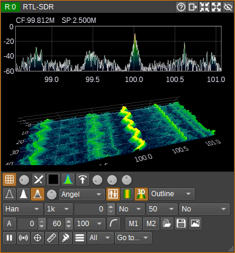

Wide (1 line):

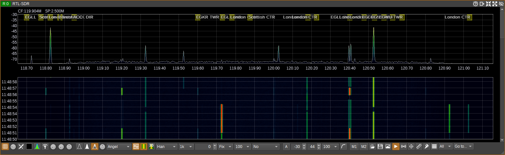

The 6 blocks are detailed next:

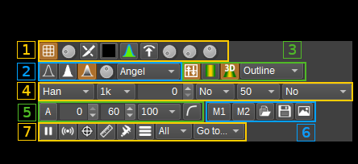

<h3>B.1: Grid phosphor and max controls (histogram) - block #1</h3>

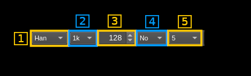

<h4>B.1.1: Grid</h4>

Toggles the grid display

<h4>B.1.2: Grid intensity</h4>

Controls the intensity of the grid display

<h4>B.1.3: Truncate frequency scale upper digits</h4>

If possible truncate the non significant upper digits on frequency scale. This is useful when the bandwidth is much smaller than the center frequency. For example if center frequency is 1.00001 GHz and bandwidth is 15.625 kHz this results in 3 ticks being displayed with "1.0000" prefixing all values:

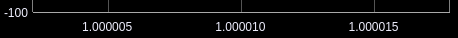

When truncation is engaged 1 GHz will be subtracted from all values resulting in a more readable scale with more definition:

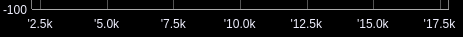

A leading tick marks the fact that upper digits have been truncated and values are suffixed with the multiplier character (k, M, G) for better readability.

Note that resolution depends on which boundaries are crossed within the bandwidth and sometimes truncation is not possible (in the example if 1 GHz falls within range) resulting in no change in scale display.

<h4>B.1.4: Reset spectrum histogram</h4>

This resets the maximum spectrum trace and phosphor remanence

<h4>B.1.5: Phosphor display</h4>

Toggles the phosphor display on the spectrum

<h4>B.1.6: Maximum hold trace</h4>

Toggles the maximum hold trace display (red trace) on the spectrum

<h4>B.1.7: Phosphor display stroke and max hold decay</h4>

This controls the decay rate of the stroke when phosphor display is engaged (B.1.5). The histogram pixel value is diminished by this value each time a new FFT is produced. A value of zero means no decay and thus phosphor history and max hold (red line) will be kept until the clear button (B.1.4) is pressed.

<h4>B.1.8: Phosphor display stroke and max hold decay divisor</h4>

When phosphor display is engaged (B.1.5) and stroke decay is 1 (B.1.7) this divides the unit decay by this value by diminishing histogram pixel value by one each time a number of FFTs equal to this number have been produced. Thus the actual decay rate is 1 over this value. This allow setting a slower decay rate than one unit for each new FFT.

<h4>B.1.9: Phosphor display stroke strength</h4>

This controls the stroke strength when phosphor display is engaged (B.1.5). The histogram value is incremented by this value at each new FFT until the maximum (red) is reached.

<h3>B.2: Spectrum display controls - block #2</h3>

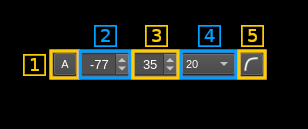

<h4>B.2.1: Current trace with line style</h4>

Toggles the current trace display as a yellow line on the spectrum

<h4>B.2.2: Current trace with fill style</h4>

Toggles the current trace display as a yellow line on the spectrum with the surface below the line filled with yellow color

<h4>B.2.3: Current trace with gradient style</h4>

Toggles the current trace display as a white line on the spectrum with the surface below the line filled with a gradient of colors corresponding to the color map (B.2.5)

<h4>B.2.4: Trace intensity</h4>

This controls the intensity of the maximum (B.1.5) and current (B.2.1-3) spectrum lines

<h4>B.2.5: Color Map</h4>

This dropdown allows the selection of a number of pre-defined color maps that are used for rendering the gradient filling of spectrum, the 2D waterfall and the 3D Spectrogram. 'Angel' is the default SDRangel color map that was the unique color map until v7.4.

<h3>B.3: Waterfall and 3D spectrogram controls - block #3</h3>

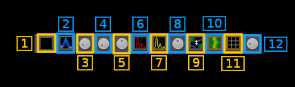

<h4>B.3.1: Waterfall/spectrum placement</h4>

Toggles the spectrum on bottom (off) or on top (on) versus waterfall/spectrogram. It changes the direction of flow of the waterfall or spectrogram so that it always goes from the spectrum side to the opposite side.

<h4>B.3.2: Waterfall (2D)</h4>

Toggles the waterfall display

<h4>B.3.3: 3D Spectrogram</h4>

Toggles the 3D spectrogram display. Controls inside the spectrogram window are described at the bottom of this page

<h4>B.3.4: 3D spectrogram style</h4>

This control is only visible when the 3D Spectrogram is being displayed.

This dropdown determines how the 3D Spectrogram data is rendered.

  - **Points**: The data are rendered as points.
  - **Lines**: The data points are connected by lines.
  - **Solid**: The data are rendered as a solid surface with constant illumination.
  - **Outline**: The data are rendered as a solid surface with outlines of the polygons highlighted.
  - **Shaded**: The data are rendered as a solid surface with a combination of ambient and diffuse lighting. This requires OpenGL 3.3 or greater.

<h3>B.4: Spectrum FFT controls - block #4</h3>

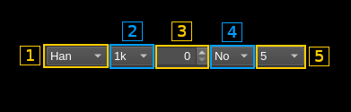

<h4>B.4.1. FFT window selector</h4>

Use this combo box to select which window is applied to the FFT:
  - **Bart**: Bartlett
  - **B-H**: 4 term Blackman-Harris
  - **FT**: Flat top
  - **Ham**: Hamming
  - **Han**: Hanning (default)
  - **Rec**: Rectangular (no window)
  - **Kai**: Kaiser with alpha = 2.15 (beta = 6.76) gives sidelobes &lt; -70dB
  - **Blackman**: Blackman (3 term)
  - **B-H7**: 7 term Blackman-Harris

<h4>B.4.2. FFT size</h4>

Select the size of the FFT window among these values:
  - 128
  - 256
  - 512
  - 1k = 1024 (default)
  - 2k = 2048
  - 4k = 4096

<h4>B.4.3: FFT Overlap</h4>

FFT Overlap in number of samples over half of the FFT size. The percentage of overlap appears in the tooltip. Ranges from 0 (no overlap) to half the FFT size minus one (maximum overlap).

Example with a FFT of 1k (1024) and an overlap of 128 the overlap percentage is 128 &divide; 512 = 25%

<h4>B.4.4: Averaging mode</h4>

Use this combo to select which averaging mode is applied:
  - **No**: no averaging. Disables averaging regardless of the number of averaged samples (B.2.5). This is the default option
  - **Mov**: moving average. This is a sliding average over the amount of samples specified next (B.2.5). There is one complete FFT line produced at every FFT sampling period
  - **Fix**: fixed average. Average is done over the amount of samples specified next (B.2.5) and a result is produced at the end of the corresponding period then the next block of averaged samples is processed. There is one complete FFT line produced every FFT sampling period multiplied by the number of averaged samples (4.6). The time scale on the waterfall display is updated accordingly.
  - **Max**: this is not an averaging but a max hold. It will retain the maximum value over the amount of samples specified next (B.2.5). Similarly to the fixed average a result is produced at the end of the corresponding period which results in slowing down the waterfall display. The point of this mode is to make outlying short bursts within the "averaging" period stand out. With averaging they would only cause a modest increase and could be missed out.

<h4>B.4.5: Number of averaged samples</h4>

Each FFT bin (squared magnitude) is averaged or max'ed over a number of samples. This combo allows selecting the number of samples between these values: 1 (no averaging), 2, 5, 10, 20, 50, 100, 200, 500, 1k (1000) for all modes and in addition 2k, 5k, 10k, 20k, 50k, 1e5 (100000), 2e5, 5e5, 1M (1000000) for "fixed" and "max" modes. Averaging reduces the noise variance and can be used to better detect weak continuous signals. The fixed averaging mode allows long time monitoring on the waterfall. The max mode helps showing short bursts that may appear during the "averaging" period.

The resulting spectrum refresh period appears in the tooltip taking sample rate, FFT size (B.2.2), average size (B.2.5) and overlap (B.2.3) into consideration. Averaging size adjustment is valid for fixed average and max modes only:

Period = ((((FFT_size &divide; 2) - overlap) &times; 2) &divide; sample_rate) &times; averaging_size

<h3>B.5: Spectrum display controls - block #5</h3>

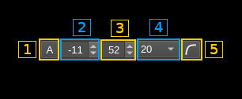

<h4>B.5.1: Autoscale</h4>

Scales spectrum by setting reference level and range automatically based on maximum and minimum levels. Takes the average of FFT size &divide; 32 minima for the minimum and 10 dB over maximum for the maximum.

<h4>B.5.2: Reference level</h4>

This is the level in dB at the top of the display range. You can select values between 0 and -110 in 1 dB steps

<h4>B.5.3: Range</h4>

This is the range of display in dB. You can select values between 1 and 100 in 1 dB steps

<h4>B.5.4: FPS capping</h4>

The refresh rate of the spectrum is capped by this value in FPS i.e the refresh period in seconds is 1 &divide; FPS. The default value is 20 and corresponds to general usage. You may use a lower value to limit GPU usage and power consumption. You may also use a higher value for an even more reactive display. "NL" corresponds to "No Limit". With "No Limit" the spectrum update will be triggered immediately when a new FFT is calculated. Note that actual refresh rate will be limited by other factors related to hardware and graphics drivers.

The refresh period is limited anyway by the FFT period which is the FFT size divided by the baseband sampling rate and multiplied by the fixed average or max size (3A.5) in case these features are engaged (3A.4). Setting a resulting FFT refresh time above the refresh rate will make sure that a short burst is not missed particularly when using the max mode.

Example with a FFT size of 1k (1024) and no overlap, a baseband rate of 48 kS/s and an averaging size of 5 the refresh period is:

(1024 &divide; 48000) &times; 5 &approx; 107 ms

Thus if the FPS capping is 20 (50 ms) the refresh period will be in fact 107 ms (&approx; 9 FPS) anyway.

<h4>B.5.5: Logarithmic/linear scale</h4>

Use this toggle button to switch between spectrum logarithmic and linear scale display. The face of the button will change to represent either a logarithmic or linear curve.

When in linear mode the range control (B.3.3) has no effect because the actual range is between 0 and the reference level. The reference level in dB (B.3.2) still applies but is translated to a linear value e.g -40 dB is 1e-4. In linear mode the scale numbers are formatted using scientific notation so that they always occupy the same space.

<h3>B.6: Spectrum miscellaneous controls - block #6</h3>

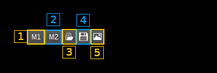

<h4>B.6.1: Play/Pause spectrum</h4>

Use this button to freeze the spectrum update. Useful when making measurements with the markers.

<h4>B.6.2: Save spectrum to CSV file</h4>

<h4>B.6.3: Spectrum server control</h4>

A websockets based server can be used to send spectrum data to clients. An example of such client can be found in the [SDRangelSpectrum](https://github.com/f4exb/sdrangelspectrum) project.

  - Left button: toggles server on/off
  - Right button: opens a secondary dialog that lets you choose the server listening (local) address and port.

The server only sends data. Control including FFT details is done via the REST API. FFT frames are formatted as follows (in bytes):

<table>
    <tr>
        <th>Offset</th>
        <th>Length</th>
        <th>Value</th>
    </tr>
    <tr>
        <td>0</td>
        <td>8</td>
        <td>Center frequency in Hz as 64 bit integer</td>
    </tr>
    <tr>
        <td>8</td>
        <td>8</td>
        <td>Effective FFT time in milliseconds as 64 bit integer</td>
    </tr>
    <tr>
        <td>16</td>
        <td>8</td>
        <td>Unix timestamp in milliseconds as 64 bit integer</td>
    </tr>
    <tr>
        <td>24</td>
        <td>4</td>
        <td>FFT size as 32 bit integer</td>
    </tr>
    <tr>
        <td>28</td>
        <td>4</td>
        <td>FFT bandwidth in Hz as 32 bit integer</td>
    </tr>
    <tr>
        <td>32</td>
        <td>4</td>
        <td>
            Indicators as 32 bit integer LSB to MSB:
            <ul>
                <li>bit 0: Linear (1) / log (0) spectrum indicator</li>
                <li>bit 1: SSB (1) / DSB (0) spectrum indicator</li>
                <li>bit 2: USB (1) / LSB (0) spectrum indicator</li>
            </ul>
        </td>
    </tr>
    <tr>
        <td>36</td>
        <td>N*4</td>
        <td>Vector of N = FFT size 32 bit floating point spectrum power values either log (dB) or linear</td>
    </tr>

</table>

<h4>B.6.4: Spectrum markers dialog</h4>

Opens the [spectrum markers dialog](spectrummarkers.md)

<h4>B.6.5: Spectrum measurements dialog</h4>

Opens the [Spectrum measurement control dialog](spectrummeasurements.md) Check this link for details on the available measurements.

<h4>B.6.6: Spectrum calibration</h4>

Use the toggle button to switch between relative and calibrated power readings.

Right click to open the [calibration management dialog](spectrumcalibration.md)

<h4>B.6.7: Go to annotation marker</h4>

This combo only appears if the spectrum display is the spectrum of a device (i.e. main spectrum) and if there are visible annotation markers. It allows to set the device center frequency to the frequency of the selected annotation marker.

<h2>3D Spectrogram Controls</h2>

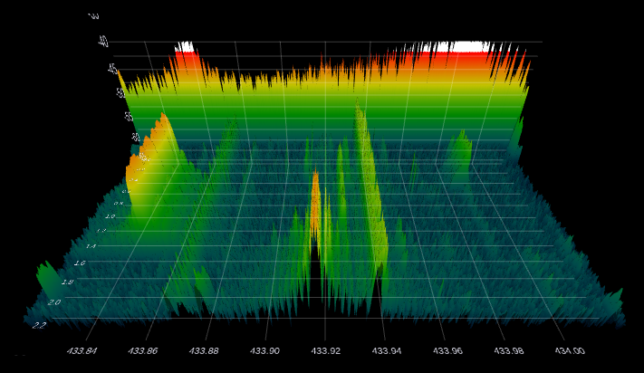

The 3D Spectrogram view can be controlled by mouse/trackpad:

  - Left button: Rotate
  - Middle button: Pan
  - Right button: Scale Z axis (power)
  - Wheel/pinch: Zoom

Or keyboard:

  - Arrow: Rotate
  - CTRL Arrow: Pan
  - '+'/'-': Zoom
  - CTRL '+'/'-': Scale Z axis (power)
  - 'r': Reset view to default
  - 'f': Flat view (top down)
