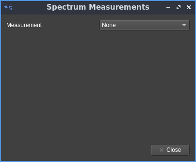
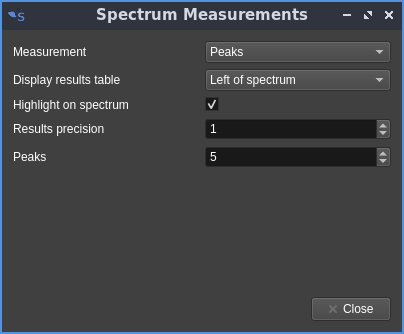
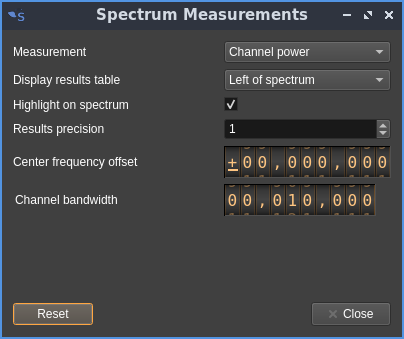
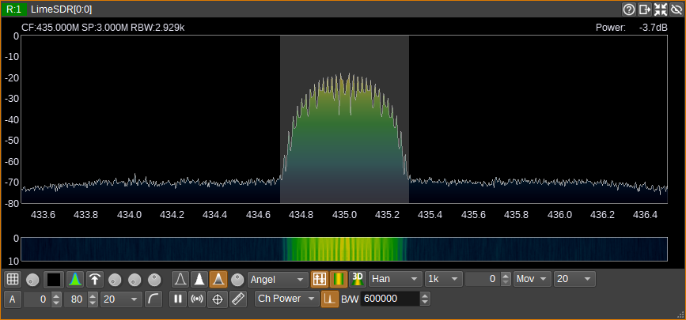
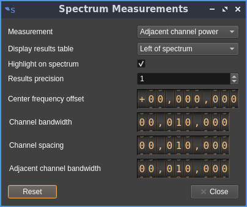
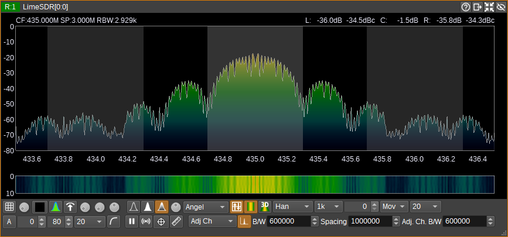
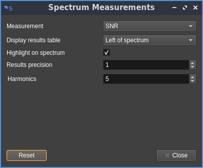
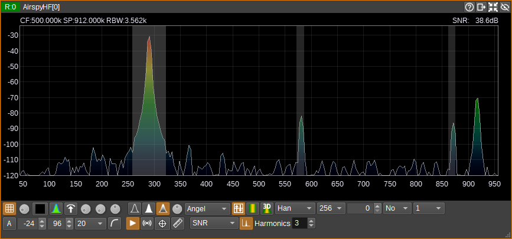
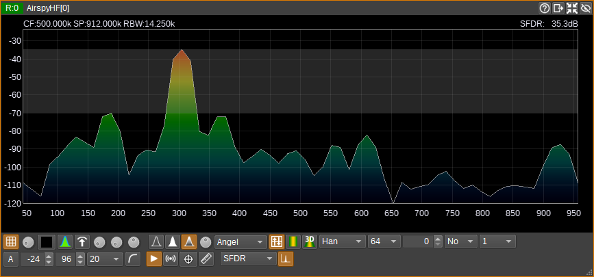

<h1>Spectrum measurements controls</h1>

This dialog controls which measurements are carried out on the spectrum and what is displayed on the spectrum window.

<h2>No measurements</h2>

The spectrum is displayed the usual way without the measurements table

<h2>Peaks</h2>

Shows the n largest peaks in magnitude

  - **Display results table**: lets you choose whether the table is displayed at the left, right, top or bottom of the spectrum view. This control is common to all measurement types
  - **Highlight on spectrum**: controls whether the artifacts are displayed or not on the spectrum view. This control is common to all measurement types having artifacts
  - **Results precision**: controls the number of decimal places displayed on the power readings in dB. This control is common to all measurement types
  - **Peaks**: controls the number of peaks

<h2>Channel Power</h2>

Channel power measures the total power within a user-defined bandwidth. Channel shift is adjustable with the dialog.

  - **Results precision**: controls the number of decimal places displayed on the power readings in dB
  - **Center frequency offset**: channel offset from the center in Hz
  - **Channel bandwidth**: bandwidth of the channel in Hz

Spectrum display with the highlight artifact on:

<h2>Adjacent channel power</h2>

The adjacent channel power measurement measures the power in a channel of user-defined bandwidth and compares it to the power in the left and right adjacent channels. Channel shift and adjacent channels width and separation are also adjustable with the dialog.

  - **Center frequency offset**: channels offset from the center in Hz
  - **Channel bandwidth**: bandwidth of the in-channel in Hz
  - **Channel spacing**: In-channel to adjacent channel centers spacing in Hz
  - **Adjacent channel bandwidth**: Adjacent channels bandwidth in Hz

Spectrum display with the highlight artifact on:

<h2>SNR</h2>

 - **Harmonics**: controls the number of harmonics for THD, THD+N or SINAD measurements (see next)

<h3>SNR: Signal to Noise Ratio</h3>

The SNR measurement estimates a signal-to-noise ratio. The fundamental signal is the largest peak (i.e. FFT bin with highest magnitude). The bandwidth of the signal is assumed to be the width of the largest peak, which includes adjacent bins with a monotonically decreasing magnitude. Noise is summed over the full bandwidth (i.e all FFT bins), with the fundamental and user-specified number of harmonics being replaced with the noise median from outside of these regions. The noise median is also subtracted from the signal, before the SNR is calculated.

<h3>SFNR: Signal to Noise Floor Ratio</h3>

The SNFR measurement estimates a signal-to-noise-floor ratio. This is similar to the SNR, except that the noise used in the ratio, is only the median noise value calculated from the noise outside of the fundamental and harmonics, summed over the bandwidth of the signal. One way to think of this, is that it is the SNR if all noise outside of the signal's bandwidth was filtered.

<h3>THD: Total Harmonic Distortion</h3>

THD is measured as per SNR, but the result is the ratio of the total power of the harmonics to the fundamental.

<h3>THD+N: Total Harmonic Distortion Plus Noise</h3>

THD+N is measured as per SNR, but the result is the ratio of the total power of the harmonics and noise to the fundamental.

<h3>SINAD: Signal to Noise and Distortion Ratio</h3>

SINAD is measured as per SNR, but the result is the ratio of the fundamental to the total power of the harmonics and noise.

<h3>SFDR: Spurious Free Dynamic Range</h3>

SFDR is a measurement of the difference in power from the largest peak (the fundamental) to the second largest peak (the strongest spurious signal).

