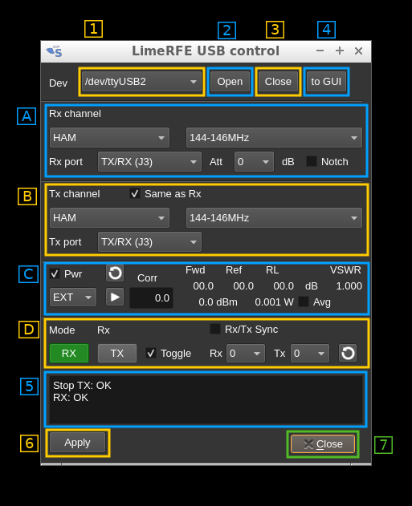
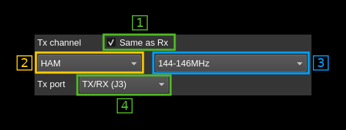
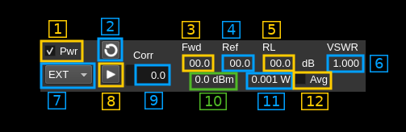

<h1>LimeRFE USB control</h1>

The LimeRFE or Lime RF Front End is a power amplifier and LNA board designed to augment the capabilities of the LimeSDR in order to build an operational radio solution. The usage is not limited to LimeSDR any Rx or Tx device can be connected to it. The LimeRFE can be controlled directly via its USB port independently of a LimeSDR device. This interface allows exactly that from the SDRangel GUI.

To open the LimeRFE USB dialog open the Preferences sub-menu from the top bar and click on the `LimeRFE` item. This item is available only when the code is compiled with the `LimeRFE` branch of LimeSuite.

The dialog is non-modal so that it can be left open and keep the control on LimeRFE while other functions can be used.

Whenever a change requires the LimeRFE configuration to be changed to become effective the "Apply" button (6) becomes green to suggest it should be activated.

&#9888; Disclaimer: please use this interface and the LimeRFE sensibly by making sure you are licensed to operate it on the selected frequencies. If you are a licensed amateur radio you should make sure you operate on the bands allocated in your region as some bands are exclusive to a specific region or country.

<h2>1. USB serial devices list</h2>

This combo lists all USB serial devices list available in the system regardless if they are LimeRFE or other devices. You must specify the device corresponding to a LimeRFE device to be able to open it successfully with (2)

<h2>2. Open device</h2>

Click on this button to open the serial device selected by (1). You need to open the device successfully prior to any operation. The open status is displayed in the status window (5).

<h2>3. Close device</h2>

If you have more than one LimeRFE connected to your system you have to close one before opening another by using this button.

<h2>4. Pull device configuration to GUI</h2>

Use this button to retrieve the LimeRFE device current configuration and populate the GUI with its data.

<h2>A. Rx channel control</h2>

<h3>A.1. Rx channel group</h3>

Select the channel group using this combo. Groups are:

  - **Wideband**: covers all frequency ranges in two sub-bands
  - **HAM**: covers amateur radio bands
  - **Cellular**: covers cellular phone bands

<h3>A.2 Rx band selection</h3>

Depending on the channel group selected in (A.1) use this combo to select the band.

<h4>Wideband channels</h4>

  - **1-1000MHz**: 1 MHz to 1 GHz
  - **1-4GHz**: 1 GHz to 4 GHz

<h4>HAM channels</h4>

  - **<30MHz**: HF bands i.e. low-pass up to 30 MHz
  - **50-70MHz**: covers the 6m and 4m bands
  - **144-146MHz**: covers the 2m band
  - **220-225MHz**: covers the 1.25m band (region 2)
  - **430-440MHz**: covers the 70cm band
  - **902-928MHz**: covers the 33cm band (region 2)
  - **1240-1325MHz**: covers the 23cm band
  - **2300-2450MHz**: covers the 13cm band
  - **3300-3500MHz**: covers the 9cm band (not available in all countries)

  <h4>Cellular channels</h4>

  - **Band 1**: 2110-2170 MHz
  - **Band 2**: 1930-2000 MHz
  - **Band 7**: 2620-2700 MHz
  - **Band 38**: 1800-1880 MHz

<h3>A.3 Rx port</h3>

Select which port to connect the Rx to:

  - **Tx/Rx (J3)**: this is the J3 port combining Rx and Tx. When cellular bands are selected this is connected to a duplexer internally
  - **Tx/Rx 30M (J5)**: HF port only available when wide band channels are selected

<h3>A.4 Attenuator</h3>

Select attenuator value from 0 to 14 dB in 2 dB steps.

<h3>A.5 AM/FM notch</h3>

Toggle AM/FM broadcast bands notch filter.

<h2>B. Tx channel control</h2>

<h3>B.1 Copy Rx band settings</h3>

When selected the Rx channel group (A.1) and Rx band (A.2) is copied to the Tx channel group (B.2) and Tx band (B.3) respectively.

<h3>B.2 Tx channel group</h3>

Select the channel group using this combo. This is identical to the Rx side (A.1).

<h3>B.3 Tx band selection</h3>

Use this combo to select the band. This is identical to the Rx side (A.2).

<h3>A.3 Tx port</h3>

Select which port to connect the Rx to:

  - **Tx/Rx (J3)**: this is the J3 port combining Rx and Tx. When cellular bands are selected this is connected to a duplexer internally
  - **Tx (J4)**: Tx connected port only. Can be used to split Rx and Tx to drive a higher power P.A. for example

<h2>C. Power and SWR</h2>

<h3>C.1 Activate power measurement</h3>

Check this box to enable power measurements.

<h3>C.2 Refresh measurements</h3>

Use this button to refresh the power measurements.

<h3>C.3 Forward power (relative)</h3>

This is the relative forward direction power in dB.

<h3>C.4 Reflected power (relative)</h3>

This is the relative reverse direction power in dB.

<h3>C.5 Return loss</h3>

This is the return loss in dB and is exactly (C.3) minus (C.4).

<h3>C.6 Voltage Standing Wave Ratio</h3>

This is the VSWR computed from the return loss in (C.5)

<h3>C.7 Power measurement source</h3>

Use this combo to select the power measurement source:

  - **EXT**: External: select this when a dual directional coupler is connected to `Ref` (J17) and `Fwd` (J18) ports
  - **CEL**: Cellular: select this to use the internal coupler when cellular bands are engaged

<h3>C.8 Monitor power continuously</h3>

Use this switch to activate the continuous monitoring. A measurement will be taken every 500ms.

<h3>C.9 Power correction</h3>

Use a power meter and apply this correction to obtain the real delivered power in dBm. There is one correction factor by band. The values are saved in the persistent settings.

<h3>C.10 Corrected power</h3>

This is the corrected power in dBm and is exactly (C.3) plus (C.9).

<h3>C.11 Corrected power in Watts</h3>

This is the corrected power in Watts.

<h3>C.12 Corrected power averaging</h3>

Use this switch to activate the averaging of corrected power. This is a moving average over 10 measurements thus over a 5s period.

<h2>D. Rx/Tx mode selection</h2>

<h3>D.1 Rx mode</h3>

Use this button to switch on Rx. This has no effect when Cellular channels are engaged.

<h3>D.2 Tx mode</h3>

Use this button to switch on Tx. This has no effect when Cellular channels are engaged.

<h3>D.3 Rx/Tx toggle</h3>

Use this switch to activate Rx/Tx toggle. When Rx is switched on Tx is switched off automatically and vice versa.

<h3>D.4 Rx/Tx device synchronization</h3>

When switched on this connects the Rx (D.1) and Tx (D.2) switches to a Rx and Tx device set selected by (D.5) and (D.6) respectively in order to start or stop devices accordingly.

<h3>D.5 Rx device set index</h3>

Select the Rx device set index with which you want to synchronize the Rx switch (D.1).

<h3>D.6 Tx device set index</h3>

Select the Tx device set index with which you want to synchronize the Tx switch (D.2).

<h3>D.7 Refresh device sets indexes</h3>

When the configuration of device sets changes you can use this button to refresh the device set indexes in (D.5) and (D.6).

<h2>5. Status window</h2>

This is where status messages are displayed.

<h2>6. Apply changes</h2>

Use this button to apply configuration changes. You must press this button to make any of your changes active. Whenever a change requires the LimeRFE configuration to be changed to become effective this button becomes green to suggest it should be activated.

<h2>7. Close dialog</h2>

This dismisses the dialog.
