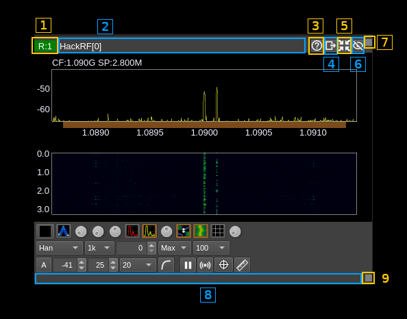

<h1>Main spectrum window</h1>

This page details the top and bottom bars of the window and not the spectrum nor the spectrum controls. Documentation on the spectrum display and controls can be found [here](../gui/spectrum.md)

<h2>Top bar</h2>

<h3>1: Device index</h3>

Index of the device for which the spectrum is displayed.  It is the same as in the corresponding device window.

The format is the same as in the device window:
  - Device type:
    - R: receiver
    - T: transmitter
    - M: MIMO
  - Semicolon separator
  - Device set index. A "device set" is the set of a device and its corresponding channels

The tooltip shows the device type, sequence number and serial number of the device if it exists.

You may click on this area and drag the window with the mouse.

<h3>3: Title</h3>

The window title shows the device type and a sequence number for which the spectrum is displayed. It is the same as in the corresponding device window.

You may click on this area and drag the window with the mouse.

<h3>3: Help</h3>

Displays this page in a browser.

<h3>4: Move to another workspace</h3>

Opens a dialog to choose a destination workspace to move the device window to. Nothing happens if the same workspace is selected.

<h3>5: Shrink window</h3>

Click this button to reduce the window to its minimum size.

<h3>6: Hide window</h3>

Click this button to hide the main spectrum window

<h3>7. Window drag area</h3>

You may click on this area and drag the window with the mouse.
