<h1>Main Window interface</h1>

<h2>Multi device support</h2>

Starting with version 2 SDRangel supports running several sampling devices simultaneously. Each concurrent device is associated to a slot with a set of tabbed windows in the UI. These tabs are marked R0, R1, R2... 

The slots are arranged in a stacked fashion so that when a new device is added with the Acquisition -> Add device set menu a new slot is allocated in the last position and when a devcie is removed with the Acquisition -> Remove last device set menu the slot in the last position is deleted. Slot 0 (R0) receiver slot is created at initialization and cannot be deleted with the menu. The letter "R" in the tab names indicates that the slot is for a receiver (source) device while "T" designates a tramsmitter (sink) device.

The tabbed windows are:

  - Sampling devices (1)
  - Sampling devices control (2)
  - Spectrum display control (3)
  - Channels (4)
  - Spectrum from device (5)

The combination of a sampling device and its associated channels is called a "device set".

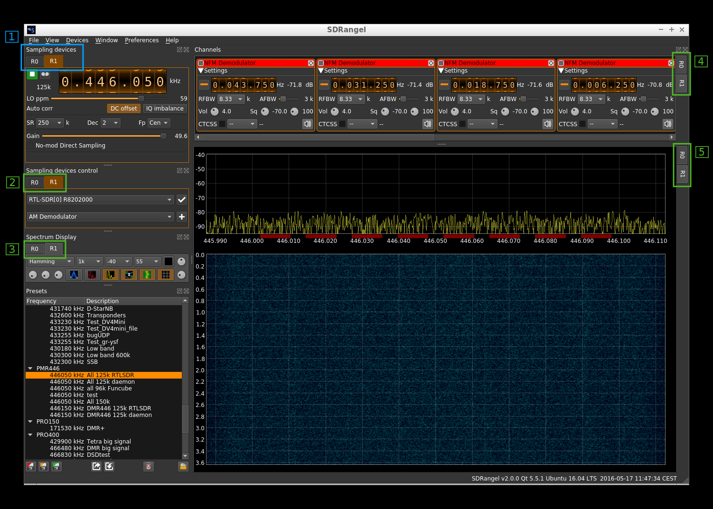

The sampling devices tab (1) acts as a master and when one of its tabs is selected all other tabs are selected accordingly i.e. all R0s, all R1s, etc... in tabs (2), (3), (4) and (5)

In each slave tab group (2), (3), (4) and (5) an individual tab corresponding to one device can be selected without affecting the selection of the other tabs. This way you can sneak peek into another spectrum or channel goup without affecting the display of other tabbed windows.

<h2>Interface details</h2>

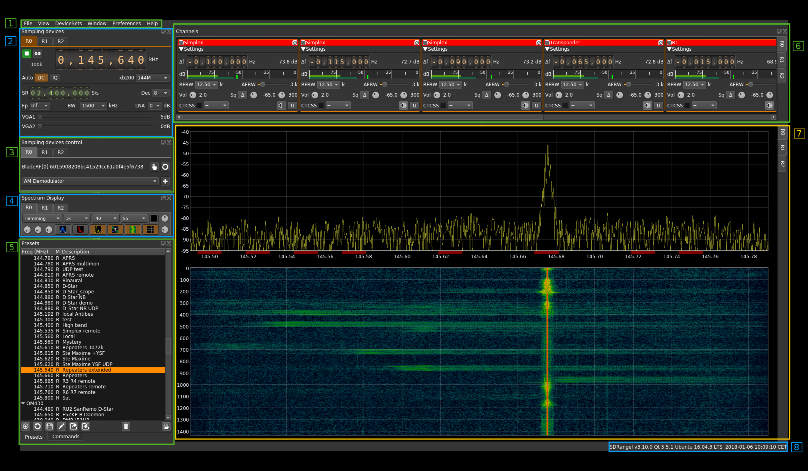

<h3>1. Main menu</h3>

The following items are presented hierarchically from left to right:

  - File:
    - _Exit_ (shortcut Ctl-Q): Exit the program
  - View:
    - _Fullscreen_ (Shortcut F11): Toggle full screen mode
  - Device sets:
    - _Add source device set_: adds a new source (receiver) type device set to the device set stack (last position)
    - _Add sink device set_: adds a new sink (transmitter) type device set to the device set stack (last position)
    - _Remove last device set_: removes the last device set from the device set stack
  - Window: presents the list of dockable windows. Check to make it visible. Uncheck to hide. These windows are:
    - _Sampling devices control_: control of which sampling devices is used and add channels
    - _Sampling devices_: the sampling devices UIs
    - _Spectrum display_: the main spectrum displays (output from the sampling devices)
    - _Presets_: the saved presets
    - _Commands_: the defined commands
    - _Channels_: the channels active for each device
  - Preferences:
    - _Audio_: opens a dialog to choose the audio output device (see 1.1 below for details)
    - _Logging_: opens a dialog to choose logging options (see 1.2 below for details)
    - _DV Serial_: if you have one or more AMBE3000 serial devices for AMBE digital voice check to connect them. If unchecked DV decoding will resort to mbelib if available else no audio will be produced for AMBE digital voice
    - _My Position_: opens a dialog to enter your station ("My Position") coordinates in decimal degrees with north latitudes positive and east longitudes positive. This is used whenever positional data is to be displayed (APRS, DPRS, ...). For it now only works with D-Star $$CRC frames. See [DSD demod plugin](../plugins/channel/demoddsd/readme.md) for details on how to decode Digital Voice modes.
  - Help:
    - _Loaded Plugins_: shows details about the loaded plugins (see 1.3 below for details)
    - _About_: current version and blah blah.    

<h4>1.1. Preferences - Audio</h4>

Audio output preferences:

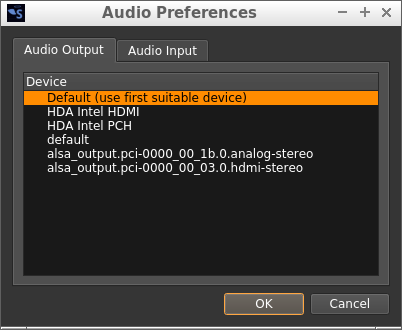

In the "Audio Output" tab of the audio preferences dialog you can choose which device is used for audio output. This choice is global for the application and is persistent. If the device is not available anymore at a later stage it reverts to the default devuce (first row).

Audio input preferences:

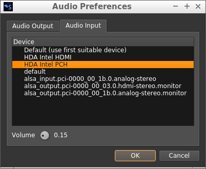

In the "Audio Input" tab of the dialog you can choose the device used for audio input in a similar way as you do for the output device.

In addition you can adjust the global volume using the dial knob at the bottom. Audio input behaves slightly differently than audio output and when the audio engine is started the volume is forced to a value that by default is maximum (1.0). This is not always desirable and using this control you can set it at a lower level (0.00 to 1.00 in 0.01 steps). 

Eventually select "OK" to confirm the settings or "Cancel" to dismiss without change.

<h4>1.2. Logging preferences</h4>

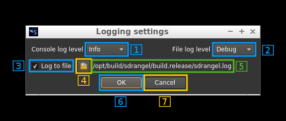

Log message will appear as follows:

```
12.11.2017 15:03:37.864 (D) DownChannelizer::applyConfiguration in= 300000 , req= 375000 , out= 300000 , fc= 0
----------------------- --- ----------------------------------------------------------------------------------
(1)                     (2) (3)
```

  - 1: Timestamp in `dd.MM.yyyy hh:mm:ss.zzz` format
  - 2: Message level: `(D)`: debug, `(I)`: info, `(W)`: warning, `(C)`: critical, `(F)`: fatal
  - 3: Message text

<h5>1.2.1. Console log minimum message level</h5>

This sets the minimum message level for a message do be displayed on the console:

  - Debug: all messages with QtDebug level and above
  - Info: all messages with QtInfo level and above
  - Warning: all messages with QtWarning level and above
  - Error: all messages with QtCritical level and above. Includes QtFatal.

<h5>1.2.2. File log minimum message level</h5>

This sets the minimum message level for a message do be logged to file:

  - Debug: all messages with QtDebug level and above
  - Info: all messages with QtInfo level and above
  - Warning: all messages with QtWarning level and above
  - Error: all messages with QtCritical level and above. Includes QtFatal.

<h5>1.2.3. File log enable</h5>

Use the checkbox to enable (check) or disable (uncheck) the dual logging to file

<h5>1.2.4. Log file selection</h5>

Use this button to open a file dialog to choose or create a new log file. There is a 2s delay before a file change is effective.

<h5>1.2.5. Log file name</h5>

The full path of the log file appears here

<h5>1.2.6. Confirm changes</h5>

Use the "OK" button to validate all changes

<h5>1.2.7. Dismiss changes</h5>

Use the "Cancel" button to dismiss all changes


<h4>1.3. Loaded plugins display</h4>

When clicking on Help -> Loaded Plugins from the main menu bar a dialog box appears that shows information about the plugins loaded in SDRangel:

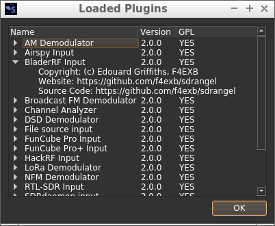

<h5>Name</h5>

Plugin display name. Tells briefly what this plugin is about.

<h5>Version</h5>

Starting with SDRangel version 2.0.0 this is the SDRangel version when the plugin was last updated.

<h5>GPL</h5>

Tells if the plugin is under GPL license.

<h5>Expansion</h5>

The plugin entry can be expanded or collapsed using the caret on the left. When expanded it shows more information about the copyright of the author and locations on the web where the plugin can be found. In all cases this is just here.

<h5>OK button</h5>

Click here when done to dismiss the dialog.

<h3>2. Sampling devices</h3>

This is where the plugin GUI specific to the device is displayed. Control of one device is done from here. The common controls are:

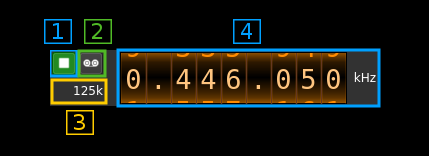

<h4>2.1. Start or stop acquisition</h4>

  - When a play icon (&#9654;) is displayed with a grey background the device is not operational
  - When a play icon (&#9654;) is displayed with a blue background the device is ready to start
  - When a stop icon (&#9632;) is displayed with a green background the device is currently running
  - When a play icon (&#9654;) is displayed with a red background there is an error and a popup displays the error message. An Error typically occurs when you try to start the same device in more than one tab.
  
<h4>2.2. Record I/Q</h4>

This is the I/Q from device record toggle. When a red background is displayed the recording is currently active. The name of the file created is `test_n.sdriq` where `n` is the slot number.

The format is S16LE I/Q samples. Thus there are 4 bytes per sample. I and Q values are 16 bit signed integers. The file starts with a context header containing information about center frequency, sample rate and timestamp of the start of the recording. This header has a length which is a multiple of a sample size (normally 24 bytes thus 6 samples). Thus this file can be used as a raw I/Q file with S16LE samples tolerating a glitch at the start corresponding to the 6 "random" samples. 

You can also zap the 24 bytes header with this Linux command: `tail -c +25 myfile.sdriq > myfile.raw`

To convert in another format you may use the sox utility. For example to convert to 32 bit (float) complex samples do:
`sox -r 48k −b 16 −e signed-integer -c 2 myfile.raw -e float -c 2 myfilec.raw`

Note that you have to specify the sampling rate and use `.raw` for the file extensions.

<h4>2.3. Device sampling rate</h4>

This is the sampling rate in kS/s of the I/Q stream extracted from the device after possible decimation. The main spectrum display corresponds to this sampling rate.

<h4>2.4. Center frequency</h4>

This is the current center frequency in kHz with dot separated thousands (MHz, GHz). On devices for which frequency can be directly controlled (i.e. all except File Source and SDRdaemon) you can use the thumbwheels to set the frequency. Thumwheels move with the mouse wheel when hovering over a digit. 

When left clicking on a digit a cursor is set on it and you can also use the arrows to move the corresponding thumbwheel.

When right clicking on a digit the digits on the right are all set to zero. This effectively does a ceil rounding at the current position.

<h4>Additional inputs</h4>

Most devices will also present an interface to control automatic DC removal and I/Q imbalance and also a control of the LO correction in ppm.

  - Example1: 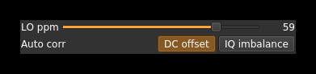
  - Example2: 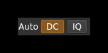

<h3>3. Sampling devices control</h3>

This is where the sampling device for one device set is selected and the channel plugins are instantiated.

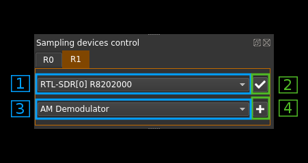

<h4>3.1. Currently sampling device name</h4>

This label shows the human readable sampling device name

<h4>3.2. Open sampling device change dialog</h4>

Use this push button to open the device selection dialog to change the sampling device. This dialog will open:

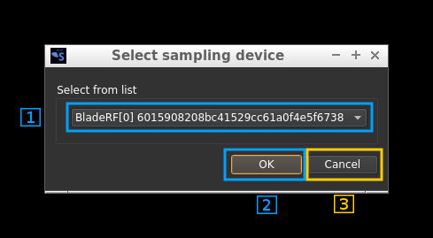

<h5>3.2.1. Device selection combo</h5>

Use this combo box to select the device. Only available devices will appear in the list. For devices having more than one channel (ex: LimeSDR) the channel number will appear next to the device sequence number inside the brackets. Ex: `LimeSDR[0:1] 0009060B00473419` designates the second Rx (Rx #1) of the first encountered LimeSDR which serial number is 0009060B00473419.

<h5>3.2.2. Device selection confirmation</h5>

Use the `OK` button to confirm your choice and exit the dialog

<h5>3.2.3. Device selection cancellation</h5>

Use the `Cancel` button to exit the dialog without any change

<h4>3.3. Reload currently selected device</h4>

This button activates a close/open sequence to recycle the device. It may be useful when the device is not streaming anymore or in an attempt to clear possible errors. Make sure the streaming is stopeed first.

<h4>3.4. Channel selector</h4>

Use this combo box to select a channel plugin to create a new channel

<h4>3.5. Add a new channel</h4>

Use this push button to add a new channel with the selected plugin

<h3>4. Spectrum display control</h3>

These are the controls of the main spectrum display in (7). Please refer to the spectrum display documentation (TBD) for details.

<h3>5. Presets and commands</h3>

The presets and commands tree view are by default stacked in tabbs. The following sections describe the presets section 5A) and commands (section 5B) views successively 

<h3>5A. Presets</h3>

This is a tree view of the saved presets. Presets record the channels setup and a copy of the settings of each sample source that has been used when saving this preset. Thus you can use the same channel arrangement with various devices having their particular setup.

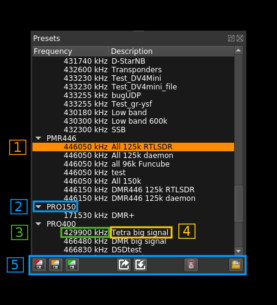

<h4>5A.1. Preset selection</h4>

You select a preset or a preset group by clicking on its line in the tree view. All actions (6) will be done relative to this preset or preset group.

<h4>5A.2. Group</h4>

You can organize your presets into groups. Groups can be collapsed or expanded by using the caret icon on the left.

<h4>5A.3. Center frequency</h4>

The center frequency used in this preset is displayed here.

<h4>5A.4. Rx/Tx indicator</h4>

"R" is displayed for a Rx device set and "T" for a Tx device set

<h4>5A.5. Preset name</h4>

You can give a name to your preset. Names need not to be unique.

<h4>5A.6. Preset control or actions</h4>

The controls are located as icons at the bottom of the window: 

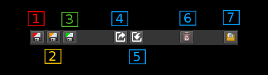

<h5>5A.6.1. New preset</h5>

Click on this icon to create a new preset with the current values in the selected sample device tab (Main window: 2).

<h5>5A.6.2. Update preset</h5>

Click on this icon to create a update the selected preset with the current values in the selected sample device tab (Main window: 2). Please note that this does not save the preset immediately on disk to save presets immediately you need to use the save button (4).

<h5>5A.6.3. Edit preset</h5>

Opens a new window where you can change the group name and description. 

  - for group items you can rename the group or merge all group presets into an existing group by selecting this existing group
  - for preset items you can:
    - move the preset to another existing group by selecting this existing group
    - assign this preset to a new group by typing in this new group
    - change the description

<h5>5A.6.4. Save presets</h5>

Presets are saved to disk automatically at exit time you can however request to save them immediately using this icon.

<h5>5A.6.5. Export preset</h5>

Using the previous icon presets are saved globally in a system dependent place. Using this icon you can export a specific preset in a single file that can be imported on another machine possibly with a different O/S. The preset binary data (BLOB) is saved in Base-64 format.

<h5>5A.6.6. Import preset</h5>

This is the opposite of the previous operation. This will create a new preset in the selected group or the same group as the preset being selected.

<h5>5A.6.7. Delete preset</h5>

  - on a preset item: deletes the selected preset. 
  - on a preset group: deletes the group and all its presets.

<h5>5A.6.8. Load preset</h5>

Applies the selected preset to the current device set (source and channel plugins).  

<h3>5B. Commands</h3>

This is a tree view of the saved commands. Commands describe the path to an executable file, its arguments a possible link to a keystroke event that triggers the execution. Similarly to presets commands can be arranged into groups and have a description short text.

Typically an "executable file" is a script (Python, shell, whatever...) or can be a compiled program (c, c++, java, whatever...) that interacts with SDRangel using its web REST API. When called from within SDRangel they can act as "macros" allowing to perform actions automatically.

Of course any binary that resides in your system can be used that way like `/bin/ls` or `/bin/date` although these two are of anedoctical interest...

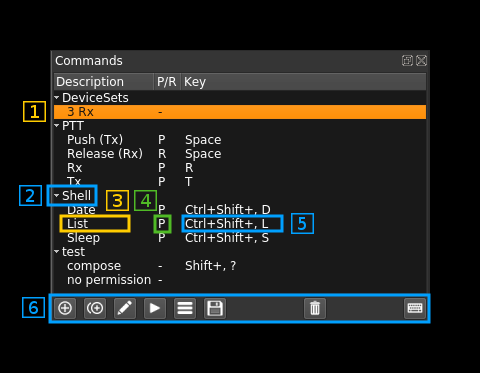

<h4>5B.1. Command selection</h4>

You select a command or a command group by clicking on its line in the tree view. All actions (6) will be done relative to this command or command group.

<h4>5B.2. Group</h4>

You can organize your commands into groups. Groups can be collapsed or expanded by using the caret icon on the left.

<h4>5B.3. Description</h4>

Short description of a command.

<h4>5B.4. Key binding indicator</h4>

  - `-`: no key binding
  - `P`: key press binding
  - `R`: key release binding

<h4>5B.5. Key binding sequence</h4>

This is a descriptive text of the key sequence that is used for the key binding.

<h4>5B.6. Command control or actions</h4>

The controls are located as icons at the bottom of the window: 

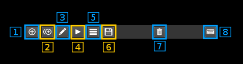

<h5>5B.6.1. Create new command</h5>

Click on this icon to create a new command. This opens an edit dialog see the edit section (5B.6.3) for the details of the edit dialog.

<h5>5B.6.2. Duplicate command</h5>

Click on this icon to duplicate the currently selected command (inactive on groups). Later you can edit the details of the copy with the edit dialog (see 5B.6.3 next)

<h5>5B.6.3. Edit command or command group</h5>

<b>Command groups</b>

With this dialog you can rename a group using the text box or if you select an existing group with the combo this will merge the contents of the group with the existing group

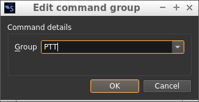

<b>Commands</b>

You can edit the details of the command with this dialog.

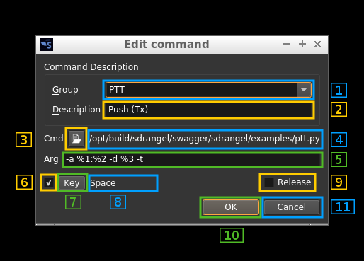

<h6>5B.6.3.1. Edit group </h6>

You can select an existing group with the combo or create a new one for this command using the text edit box

<h6>5B.6.3.2. Edit description </h6>

You can edit the description using this text box. The description will appear in the tree view.

<h6>5B.6.3.3. Executable file selection </h6>

Clicking on this button wil open a file dialog to select the executable file that will be run with this command. The file selection dialog has predefined file pattern selections:

  - `*` for All files
  - `*.py` for Pyhon files
  - `*.sh` or `*.bat` for shell or batch files
  - `*.bin` or `*.exe` for binary files

<h6>5B.6.3.4. Executable file path </h6>

This is the full path of the selected executable file.

<h6>5B.6.3.5. Command line arguments</h6>

Use the text box to edit the arguments given to the executable file as in `program arguments`.

You can use special codes to insert information specific to the application context:

  - `%1`: the address of the web REST API
  - `%2`: the port of the web REST API
  - `%3`: the currently selected device set index
  
<h6>5B.6.3.6. Key binding</h6>

Use this checkbox to enable or disable the command execution binding to a key or combination of keys press or release event

<h6>5B.6.3.7. Key binding capture</h6>

Use this button to capture the key or key combination that will be used for the key binding. After pushing this button just type in the key or key combination.

<h6>5B.6.3.8. Key binding display</h6>

This shows the key or combination of keys used for the key binding.

<h6>5B.6.3.9. Release key binding</h6>

Use this checkbox to bind the key or combination of keys to the key release event. If unchecked the binding will be associated to the key press event.

<h6>5B.6.3.10. Confirm changes</h6>

Use the "OK" button to confirm the changes.

<h6>5B.6.3.11. Cancel changes</h6>

Use the "Cancel" button to cancel the changes.

<h5>5B.6.4. Run command or groups of commands</h5>

This will run the currently selected command. If the selection is a group it will run all commands of the group starting them in the displayed order. Please note that commands are run in independant processes and therefore all launched commands in the group will run concurrently.

<h5>5B.6.5. View last command run details</h5>

This dialog will show the results of the last run including the output (merged stdout and stderr).

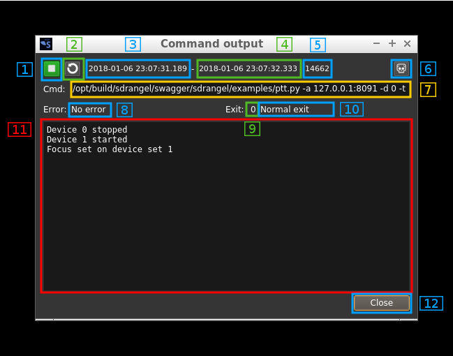

<h6>5B.6.5.1. Process status</h6>

When the process is not running the stop icon (&#9632;) is displayed. The backgroumd color indicate different states:

  - no color (same as backround): the process has never run during this session
  - red: the process ended with error
  - green: the process ended successfully. This does not mean that there was no programmatic error.
  
When the process is running the play icon (&#9654;) is displayed with an orange background.

<h6>5B.6.5.2. Refresh data</h6>

Pushing this button will update the data displayed with the latest status. Please note that the log is displayed only when the process is terminated.

<h6>5B.6.5.3. Start time</h6>

This is the timestamp of process start. It is filled with dots `...` if the process has never started during this session.

<h6>5B.6.5.4. End time</h6>

This is the timestamp of process end. It is filled with dots `...` if the process has never terminated during this session.

<h6>5B.6.5.3. PID</h6>

This is the process PID. It is 0 if the process has never run during this session.

<h6>5B.6.5.6. Process kill</h6>

Use this button to kill (send SIGKILL) the running process. It has no effect if the process is not runing.

<h6>5B.6.5.7. Command line</h6>

This shows the actual command line that was used to start the process

<h6>5B.6.5.8. Error status</h6>

This is the translation of `QProcess::ProcessError`. Possible values are:

  - `...`: the process has never run during this session
  - `Failed to start`: the process could not start. For example the executable file has no execution rights actually
  - `Crashed`: the process ended with crash. This is the status when you killed the process
  - `Timed out`: the last waitFor...() function timed out.
  - `Write error`: an error occurred when attempting to write to the process. For example, the process may not be running, or it may have closed its input channel.
  - `Read error`: an error occurred when attempting to read from the process. For example, the process may not be running.
  - `Unknown error`: an unknown error occurred.
  
<h6>5B.6.5.9. Exit code</h6>

This is the program exit code. When the process crashes this is the signal by which the process end was caused. For example if you kill the process with button (6) it sends the process a SIGKILL (code 9) and therefore the value is 9.

<h6>5B.6.5.10. Exit status</h6>

There are only two possibilities: either the program exits normally but possibly with a non zero exit code or it ends with a crash.

<h6>5B.6.5.11. Process log</h6>

This is the log of the process (merged stdout and stderr). Please note that it is updated only on program termination.

<h6>5B.6.5.12. Exit</h6>

By pushing the "Close" button the process output window is closed.

<h5>5B.6.6. Save commands</h5>

This will save the commands immediately. The commands will be automatically saved when the applicaiton exits normally.

<h5>5B.6.7. Delete commands or group of commands</h5>

This will delete the currently selected command or if selection is a group this will delete all commands in the group.

<h5>5B.6.8. Activate keyboard binding</h5>

Use this button to activate the keyboard binding. This requires that the focus is set to the main window. On a few occasions the main window looses focus and the button gets unselected. Just click again on this button to reactivate the keyboard binding. Note that you need to have this button selected (its background should be lit in beige/orange) for the key binding to be effective.

<h3>6. Channels</h3>

This area shows the control GUIs of the channels curently active for the device. When the preset is saved (as default at exit time or as a saved preset) the GUIs are ordered by increasing frequency. If presets share the same frequenccy they are ordered by their internal ID name. Thus new channel GUIs will appear ordered only when reloaded.

Details about the GUIs can be found in the channel plugins documentation which consits of a readme.md file in each of the channel plugins folder (done partially).

With these channels: AM demod, BFM demod, DSD demod, NFM demod, UDP source, UDP sink some common basic settings can be set with a popup dialog. This dialog is opened by clicking on the small grey square on the top left of the channel window. The settings are as follows:

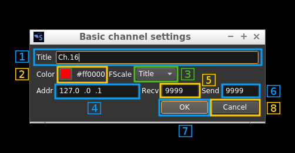

<h4>6.1: Window title</h4>

Changes the channel window title

<h4>6.2: Channel color</h4>

Changes the color of the window title bar and spectrum overlay. To change the color click on the color square to open a color chooser dialog. The hex rgb value is displayed next to the color square.

<h4>6.3: Frequency scale display type</h4>

When the mouse is over the channel window or over the central line in the spectrum a channel parameter is displayed on the frequency scale. This parameter can be:

  - Freq: channel absolute center frequency
  - Title: channel window title
  - AdSnd: UDP address and send port
  - AdRcv: UDP address and receive port
  
<h4>6.4,5,6: UDP address (4) receive port (5) and send port (6)</h4>

Some channels can exchange data over UDP. Depending on the channel the data is the following:

<table>
  <tr>
    <th>Channel</th>
    <th>Data sent</th>
    <th>Type</th>
    <th>Data received</th>
    <th>Type</th>
    <th>Address</th>
  </tr>
  <tr>
    <td>AM demod</td>
    <td>Audio</td>
    <td>Mono</td>
    <td>N/A</td>
    <td>N/A</td>
    <td>Remote</td>
  </tr>
  <tr>
    <td>BFM demod</td>
    <td>Audio</td>
    <td>Stereo</td>
    <td>N/A</td>
    <td>N/A</td>
    <td>Remote</td>
  </tr>  
  <tr>
    <td>DSD demod</td>
    <td>Audio</td>
    <td>Stereo</td>
    <td>N/A</td>
    <td>N/A</td>
    <td>Remote</td>
  </tr>  
  <tr>
    <td>NFM demod</td>
    <td>Audio</td>
    <td>Mono</td>
    <td>N/A</td>
    <td>N/A</td>
    <td>Remote</td>
  </tr>
  <tr>
    <td>SSB demod</td>
    <td>Audio</td>
    <td>Mono</td>
    <td>N/A</td>
    <td>N/A</td>
    <td>Remote</td>
  </tr>
  <tr>
    <td>WFM demod</td>
    <td>Audio</td>
    <td>Mono</td>
    <td>N/A</td>
    <td>N/A</td>
    <td>Remote</td>
  </tr>
  <tr>
    <td>UDP source</td>
    <td>Audio, I/Q</td>
    <td>Mono, Stereo</td>
    <td>Audio</td>
    <td>Mono</td>
    <td>Remote</td>
  </tr>
  <tr>
    <td>UDP sink</td>
    <td>N/A</td>
    <td>N/A</td>
    <td>Audio, I/Q</td>
    <td>Mono, Stereo</td>
    <td>Local</td>
  </tr>
</table>
  
Data type is S16LE 1 channel (Mono) or 2 channels (Stereo or I/Q)

<h4>6.7: Validate and exit dialog</h4>

Validates the data (saves it in the channel marker object) and exits the dialog

<h4>6.8: Cancel changes and exit dialog</h4>

Do not make any changes and exit dialog

<h3>7. Spectrum from device</h3>

This shows the spectrum in the passband returned from the sampling device possibly after decimation. The actual sample rate is shown in the device control at the left of the frequency display (2.3)

The spectrum display is cotrolled by the display control (4).
 
<h3>8. Status</h3>

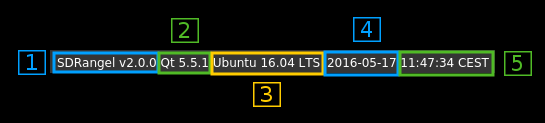

<h4>8.1. SDRangel version</h4>

Self explanatory

<h4>8.2. Qt version</h4>

Qt version with which this copy of SDRangel was compiled.

<h4>8.3. Architecture</h4>

Codename of the CPU architecture in which SDRangel is running.

<h4>8.4. Operating system</h4>

Pretty print of the operating system in which SDRangel is running.

<h4>8.5. Local date and time</h4>

Local time timestamp according to system clock
