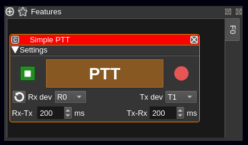
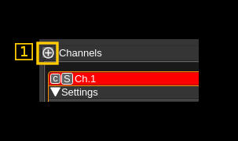
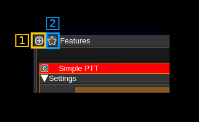
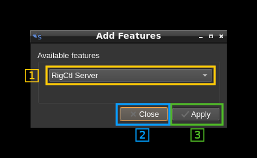
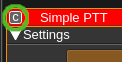

<h1>Main Window interface</h1>

<h2>Multi device support</h2>

Starting with version 2 SDRangel supports running several sampling devices simultaneously. Each concurrent device is associated to a slot with a set of tabbed windows in the UI. These tabs are marked R0, R1, R2...

The slots are arranged in a stacked fashion so that when a new device is added with the Acquisition -> Add device set menu a new slot is allocated in the last position and when a device is removed with the Acquisition -> Remove last device set menu the slot in the last position is deleted. Slot 0 (R0) receiver slot is created at initialization and cannot be deleted with the menu. The letter "R" in the tab names indicates that the slot is for a receiver (source) device while "T" designates a transmitter (sink) device.

The tabbed windows are:

  - Sampling devices (1)
  - Spectrum display control (2)
  - Channels (3)
  - Spectrum from device (4)

The combination of a sampling device and its associated channels is called a "device set".


The sampling devices tab (1) acts as a master and when one of its tabs is selected all other tabs are selected accordingly i.e. all R0s, all R1s, etc... in tabs (2), (3), (4) and (5)

In each slave tab group (2), (3), (4) and (5) an individual tab corresponding to one device can be selected without affecting the selection of the other tabs. This way you can sneak peek into another spectrum or channel group without affecting the display of other tabbed windows.

An additional dock widget supports the feature plugins. Plugins can be grouped in logical sets and graphically presented as tab groups (similarly to channels). For now there is only one "FO" group.



Details of the feature plugins dock widget are presented in section 8

<h2>Interface details</h2>


<h3>1. Main menu</h3>

The following items are presented hierarchically from left to right:

  - File:
    - _Exit_ (shortcut Ctl-Q): Exit the program
  - View:
    - _Fullscreen_ (Shortcut F11): Toggle full screen mode
  - Device sets:
    - _Add source device set_: adds a new source (receiver) type device set to the device set stack (last position)
    - _Add sink device set_: adds a new sink (transmitter) type device set to the device set stack (last position)
    - _Remove last device set_: removes the last device set from the device set stack except the first one
  - Feature sets:
    - _Add feature set_: adds a new feature set
    - _Remove last feature set_: removes the last feature set from the feature set stack except the first one
  - Window: presents the list of dockable windows. Check to make it visible. Uncheck to hide. These windows are:
    - _Sampling devices control_: control of which sampling devices is used and add channels
    - _Sampling devices_: the sampling devices UIs
    - _Spectrum display_: the main spectrum displays (output from the sampling devices)
    - _Presets_: the saved presets
    - _Commands_: the defined commands
    - _Channels_: the channels active for each device
    - _Features_: the feature plugins currently instantiated
  - Preferences:
    - _Audio_: opens a dialog to choose the audio output device (see 1.1 below for details)
    - _Logging_: opens a dialog to choose logging options (see 1.2 below for details)
    - _AMBE_: Opens a dialog to select AMBE3000 serial devices or AMBE server addresses to use for AMBE digital voice processing. If none is selected AMBE frames decoding will be done with mbelib if available else no audio will be produced for AMBE digital voice (see 1.3 below for details)
    - _My Position_: opens a dialog to enter your station ("My Position") coordinates in decimal degrees with north latitudes positive and east longitudes positive. This is used whenever positional data is to be displayed (APRS, DPRS, ...). For it now only works with D-Star $$CRC frames. See [DSD demod plugin](../plugins/channelrx/demoddsd/readme.md) for details on how to decode Digital Voice modes.
    - _Devices_: section to deal with devices settings
      - _User arguments_: opens a dialog to let the user give arguments specific to a device and its instance (sequence) in the system
  - Help:
    - _Loaded Plugins_: shows details about the loaded plugins (see 1.3 below for details)
    - _About_: current version and blah blah.

<h4>1.1. Preferences - Audio</h4>

See the audio management documentation [here](audio.md).

<h4>1.2. Preferences - Logging</h4>


Log message will appear as follows:

```
12.11.2017 15:03:37.864 (D) DownChannelizer::applyConfiguration in= 300000 , req= 375000 , out= 300000 , fc= 0
----------------------- --- ----------------------------------------------------------------------------------
(1)                     (2) (3)
```

  - 1: Timestamp in `yyyy-MM-dd HH:mm:ss.zzz` format
  - 2: Message level: `(D)`: debug, `(I)`: info, `(W)`: warning, `(C)`: critical, `(F)`: fatal
  - 3: Message text

<h5>1.2.1. Console log minimum message level</h5>

This sets the minimum message level for a message do be displayed on the console:

  - Debug: all messages with QtDebug level and above
  - Info: all messages with QtInfo level and above
  - Warning: all messages with QtWarning level and above
  - Error: all messages with QtCritical level and above. Includes QtFatal.

<h5>1.2.2. File log minimum message level</h5>

This sets the minimum message level for a message do be logged to file:

  - Debug: all messages with QtDebug level and above
  - Info: all messages with QtInfo level and above
  - Warning: all messages with QtWarning level and above
  - Error: all messages with QtCritical level and above. Includes QtFatal.

<h5>1.2.3. File log enable</h5>

Use the checkbox to enable (check) or disable (uncheck) the dual logging to file

<h5>1.2.4. Log file selection</h5>

Use this button to open a file dialog to choose or create a new log file. There is a 2s delay before a file change is effective.

<h5>1.2.5. Log file name</h5>

The full path of the log file appears here

<h5>1.2.6. Confirm changes</h5>

Use the "OK" button to validate all changes

<h5>1.2.7. Dismiss changes</h5>

Use the "Cancel" button to dismiss all changes

<h4>1.3 Preferences - AMBE</h4>

When clicking on the AMBE submenu a dialog opens to let you specify physical AMBE devices to decode AMBE frames produced by digital voice signals (using DSD decoder plugin).


<h5>1.3.1 AMBE server address and port or direct input</h5>

Use this freeflow text input box to specify either the address and port of an AMBE server in the form: &lt;IPv4 address&gt;:&lt;port&gt; or any directly attached physical device address like a COM port on Windows.

<h5>1.3.2 Import above address or device</h5>

Import the address or device specified in (1) into the list of used devices. The system will try to open the device or contact the server and will add it to the list only if successful.

<h5>1.3.3 Remove in use device or address</h5>

When a device or address is selected in the in use list (6) push this button to remove it from the list. The corresponding resources will be released.

<h5>1.3.4 Refresh in use list</h5>

Checks the list of devices or addresses currently in use and update the in use list (6).

<h5>1.3.5 Empty in use list</h5>

Removes all devices or addresses in use. The in use list (6) is cleared consequently. This removes all AMBE devices related resources attached to the current instance of the SDRangel program. Therefore consecutive AMBE frames decoding will be handled by the mbelib library if available or no audio will be output.

<h5>1.3.6 In use list</h5>

List of devices or addresses currently in use for AMBE frames decoding by this instance of the SDRangel program.

<h5>1.3.7 Import serial device</h5>

Imports a serial device scanned in the list of available AMBE 3000 serial devices (9) in the in use list. If this device is already in the in use list then nothing happens and this is reported in the status text (10)

<h5>1.3.8 Import all serial devices</h5>

Imports all serial devices scanned in the list of available AMBE 3000 serial devices (9) in the in use list. If any device is already in the in use list then it is not added twice.

<h5>1.3.9 List of available AMBE 3000 serial devices</h5>

This is the list of AMBE 3000 currently attached to the system directly. This list gets updated at every opening of the dialog.

<h5>1.3.10 Status text</h5>

A brief text reports the result of the current action

<h5>1.3.11 Close button</h5>

Use this button to dismiss the dialog

<h4>1.4 Prefernces - LimeRFE</h4>

Only if LimeSuite library is available this opens a dialog to control a LimeRFE device via USB. The details are provided [here](limerfeusbgui.md).

<h4>1.5 Preferences - Devices - User arguments</h4>

See the devuces user arguments management documentation [here](deviceuserargs.md).

<h4>1.6. Help - Loaded plugins display</h4>

When clicking on Help -> Loaded Plugins from the main menu bar a dialog box appears that shows information about the plugins loaded in SDRangel:


<h5>Name</h5>

Plugin display name. Tells briefly what this plugin is about.

<h5>Version</h5>

Starting with SDRangel version 2.0.0 this is the SDRangel version when the plugin was last updated.

<h5>GPL</h5>

Tells if the plugin is under GPL license.

<h5>Expansion</h5>

The plugin entry can be expanded or collapsed using the caret on the left. When expanded it shows more information about the copyright of the author and locations on the web where the plugin can be found. In all cases this is just here.

<h5>OK button</h5>

Click here when done to dismiss the dialog.

<h3>2: Sampling devices</h3>

This is where the plugin GUI specific to the device is displayed.


**On the top of the dockable widget you have the following controls:**

<h4>2.1: Change device</h4>

Use this push button to open the device selection dialog to change the sampling device. This dialog will open:


<h5>2.1.1: Device selection combo</h5>

Use this combo box to select the device. Only available devices will appear in the list. For devices having more than one channel (ex: LimeSDR) the channel number will appear next to the device sequence number inside the brackets. Ex: `LimeSDR[0:1] 0009060B00473419` designates the second Rx (Rx #1) of the first encountered LimeSDR which serial number is 0009060B00473419.

<h5>2.1.2: Device selection confirmation</h5>

Use the `OK` button to confirm your choice and exit the dialog

<h5>2.1.3: Device selection cancellation</h5>

Use the `Cancel` button to exit the dialog without any change

<h4>2.2: Reload currently selected device</h4>

This button activates a close/open sequence to recycle the device. It may be useful when the device is not streaming anymore or in an attempt to clear possible errors. Make sure the streaming is stopped first.

<h4>2.3: Current device identfier</h4>

The identifier as shown in cotrol (2.1.1) appears truncated to the first 40 characters.

**For every device there are the following common controls:**

<h4>2.4. Start or stop acquisition</h4>

<h5>2.4.1 left click</h5>

Left click to start or stop streaming

  - When a play icon (&#9654;) is displayed with a grey background the device is not operational
  - When a play icon (&#9654;) is displayed with a blue background the device is ready to start
  - When a stop icon (&#9632;) is displayed with a green background the device is currently running
  - When a play icon (&#9654;) is displayed with a red background there is an error and a popup displays the error message. An Error typically occurs when you try to start the same device in more than one tab.

<h5>2.4.2 right click</h5>

Right click to control device reverse API. This dialog opens:


<h6>2.4.2.1: Toggle reverse API feature</h6>

Use this checkbox to toggle on/off the reverse API feature. With reverse API engaged the changes in the device settings are forwarded to an API endpoint given by address (2.1.2.2), port (2.1.2.3) and device index (2.1.2.4) in the same format as the SDRangel REST API device settings endpoint. With the values of the screenshot the API URL is: `http://127.0.0.1:8888/sdrangel/deviceset/0/device/settings` The JSON payload follows the same format as the SDRangel REST API device settings. For example with HachRF Rx this would be something like:

```
{
  "deviceHwType": "HackRF",
  "hackRFInputSettings": {
    "LOppmTenths": 0,
    "bandwidth": 1750000,
    "biasT": 0,
    "centerFrequency": 435000000,
    "dcBlock": 0,
    "devSampleRate": 2400000,
    "fcPos": 2,
    "iqCorrection": 0,
    "linkTxFrequency": 0,
    "lnaExt": 0,
    "lnaGain": 16,
    "log2Decim": 0,
    "vgaGain": 16
  },
  "tx": 0
}
```
Note that the PATCH method is used. The full set of parameters is sent only when the reverse API is toggled on or a full settings update is done.

The start and stop actions are also forwarded with the `/sdrangel/deviceset/{deviceSetIndex}/device/run` API endpoint using POST (start) or DELETE (stop) methods.

More details on this feature can be found on the corresponding Wiki page.

<h6>2.4.2.2: API address</h6>

This is the IP address of the API endpoint

<h6>2.4.2.3: API port</h6>

This is the IP port of the API endpoint

<h6>2.4.2.4: Device index</h6>

This is the targeted device index

<h6>2.4.2.5: Cancel changes and exit dialog</h6>

Do not make any changes and exit dialog

<h6>2.4.2.6: Validate and exit dialog</h6>

Validates the data (saves it in the channel marker object) and exits the dialog

<h4>2.5: Device sampling rate</h4>

This is the sampling rate in kS/s of the I/Q stream extracted from the device after possible decimation. The main spectrum display corresponds to this sampling rate.

<h4>2.6: Center frequency</h4>

This is the current center frequency in kHz with dot separated thousands (MHz, GHz). On devices for which frequency can be directly controlled (i.e. all except File Source and Remote Input) you can use the thumbwheels to set the frequency. Thumbwheels move with the mouse wheel when hovering over a digit.

When left clicking on a digit a cursor is set on it and you can also use the arrows to move the corresponding thumbwheel.

When right clicking on a digit the digits on the right are all set to zero. This effectively does a ceil rounding at the current position.

<h4>Additional inputs</h4>

Most devices will also present an interface to control automatic DC removal and I/Q imbalance and also a control of the LO correction in ppm.

  - Example1: 
  - Example2: 

<h3>3. Spectrum display control</h3>


These are the controls of the main spectrum display in (7). The same controls are found in the plugins that feature a spectrum display:
  - Channel Analyzer
  - Broadcast FM demodulator
  - ChirpChat (LoRa) demodulator
  - File sink
  - FreeDV demodulator and modulator
  - Frequency tracker
  - SigMF file sink
  - SSB demodulator and modulator
  - UDP source and sink

<h3>3A.  Spectrum display control line 1</h3>


<h4>3A.1. FFT window selector</h4>

Use this combo box to select which window is applied to the FFT:
  - **Bart**: Bartlett
  - **B-H**: Blackmann-Harris
  - **FT**: Flat top
  - **Ham**: Hamming
  - **Han**: Hanning (default)
  - **Rec**: Rectangular (no window)
  - **Kai**: Kaiser with alpha = 2.15 (beta = 6.76) gives sidelobes &lt; -70dB

<h4>3A.2. FFT size</h4>

Select the size of the FFT window among these values:
  - 128
  - 256
  - 512
  - 1k = 1024 (default)
  - 2k = 2048
  - 4k = 4096

<h4>3A.3. FFT Overlap</h4>

FFT Overlap in number of samples over half of the FFT size. The percentage of overlap appears in the tooltip. Ranges from 0 (no overlap) to half the FFT size minus one (maximum overlap).

Example with a FFT of 1k (1024) and an overlap of 128 the overlap percentage is 128 &divide; 512 = 25%

<h4>3A.4. Averaging mode</h4>

Use this combo to select which averaging mode is applied:
  - **No**: no averaging. Disables averaging regardless of the number of averaged samples (4.6). This is the default option
  - **Mov**: moving average. This is a sliding average over the amount of samples specified next (4.6). There is one complete FFT line produced at every FFT sampling period
  - **Fix**: fixed average. Average is done over the amount of samples specified next (4.6) and a result is produced at the end of the corresponding period then the next block of averaged samples is processed. There is one complete FFT line produced every FFT sampling period multiplied by the number of averaged samples (4.6). The time scale on the waterfall display is updated accordingly.
  - **Max**: this is not an averaging but a max hold. It will retain the maximum value over the amount of samples specified next (4.6). Similarly to the fixed average a result is produced at the end of the corresponding period which results in slowing down the waterfall display. The point of this mode is to make outlying short bursts within the "averaging" period stand out. With averaging they would only cause a modest increase and could be missed out.

<h4>3A.5. Number of averaged samples</h4>

Each FFT bin (squared magnitude) is averaged or max'ed over a number of samples. This combo allows selecting the number of samples between these values: 1 (no averaging), 2, 5, 10, 20, 50, 100, 200, 500, 1k (1000) for all modes and in addition 2k, 5k, 10k, 20k, 50k, 1e5 (100000), 2e5, 5e5, 1M (1000000) for "fixed" and "max" modes. Averaging reduces the noise variance and can be used to better detect weak continuous signals. The fixed averaging mode allows long time monitoring on the waterfall. The max mode helps showing short bursts that may appear during the "averaging" period.

The resulting spectrum refresh period appears in the tooltip taking sample rate, FFT size (3A.2), average size (3A.5) and overlap (3A.3) into consideration. Averaging size adjustment is valid for fixed average and max modes only:

Period = ((((FFT_size &divide; 2) - overlap) &times; 2) &divide; sample_rate) &times; averaging_size

<h4>3A.6. Play/Pause spectrum</h4>

Use this button to freeze the spectrum update. Useful when making measurements (Paragraph 6).

<h3>3B.  Spectrum display control line 2</h3>


<h4>3B.1. Autoscale</h4>

Scales spectrum by setting reference level and range automatically based on maximum and minimum levels. Takes the average of FFT size &divide; 32 minima for the minimum and 10 dB over maximum for the maximum.

<h4>3B.2. Reference level</h4>

This is the level in dB at the top of the display range. You can select values between 0 and -110 in 1 dB steps

<h4>3B.3. Range</h4>

This is the range of display in dB. You can select values between 1 and 100 in 1 dB steps

<h4>3B.4. FPS capping</h4>

The refresh rate of the spectrum is capped by this value in FPS i.e the refresh period in seconds is 1 &divide; FPS. The default value is 20 and corresponds to general usage. You may use a lower value to limit GPU usage and power consumption. You may also use a higher value for an even more reactive display. "NL" corresponds to "No Limit". With "No Limit" the spectrum update will be triggered immediately when a new FFT is calculated. Note that actual refresh rate will be limited by other factors related to hardware and graphics drivers.

The refresh period is limited anyway by the FFT period which is the FFT size divided by the baseband sampling rate and multiplied by the fixed average or max size (3A.5) in case these features are engaged (3A.4). Setting a resulting FFT refresh time above the refresh rate will make sure that a short burst is not missed particularly when using the max mode.

Example with a FFT size of 1k (1024) and no overlap, a baseband rate of 48 kS/s and an averaging size of 5 the refresh period is:

(1024 &divide; 48000) &times; 5 &approx; 107 ms

Thus if the FPS capping is 20 (50 ms) the refresh period will be in fact 107 ms (&approx; 9 FPS) anyway.

<h4>3B.5. Logarithmic/linear scale</h4>

Use this toggle button to switch between spectrum logarithmic and linear scale display. The face of the button will change to represent either a logaritmic or linear curve.

When in linear mode the range control (4.4) has no effect because the actual range is between 0 and the reference level. The reference level in dB (4.3) still applies but is translated to a linear value e.g -40 dB is 1e-4. In linear mode the scale numbers are formatted using scientific notation so that they always occupy the same space.

<h4>3B.6. Spectrum server control</h4>

A websockets based server can be used to send spectrum data to clients. An example of such client can be found in the [SDRangelSpectrum](https://github.com/f4exb/sdrangelspectrum) project.

  - Left button: toggles server on/off
  - Right button: opens a secondary dialog that lets you choose the server listening (local) address and port.

The server only sends data. Control including FFT details is done via the REST API. FFT frames are formatted as follows (in bytes):

<table>
    <tr>
        <th>Offset</th>
        <th>Length</th>
        <th>Value</th>
    </tr>
    <tr>
        <td>0</td>
        <td>8</td>
        <td>Center frequency in Hz as 64 bit integer</td>
    </tr>
    <tr>
        <td>8</td>
        <td>8</td>
        <td>Effective FFT time in milliseconds as 64 bit integer</td>
    </tr>
    <tr>
        <td>16</td>
        <td>8</td>
        <td>Unix timestamp in milliseconds as 64 bit integer</td>
    </tr>
    <tr>
        <td>24</td>
        <td>4</td>
        <td>FFT size as 32 bit integer</td>
    </tr>
    <tr>
        <td>28</td>
        <td>4</td>
        <td>FFT bandwidth in Hz as 32 bit integer</td>
    </tr>
    <tr>
        <td>32</td>
        <td>4</td>
        <td>
            Indicators as 32 bit integer LSB to MSB:
            <ul>
                <li>bit 0: Linear (1) / log (0) spectrum indicator</li>
                <li>bit 1: SSB (1) / DSB (0) spectrum indicator</li>
                <li>bit 2: USB (1) / LSB (0) spectrum indicator</li>
            </ul>
        </td>
    </tr>
    <tr>
        <td>36</td>
        <td>N*4</td>
        <td>Vector of N = FFT size 32 bit floating point spectrum power values either log (dB) or linear</td>
    </tr>

</table>

<h4>3B.7. Spectrum markers dialog</h4>

Opens the [spectrum markers dialog](spectrummarkers.md)

<h3>3C.  Spectrum display control line 3</h3>


<h4>3C.1. Clear spectrum</h4>

This resets the maximum spectrum trace and phosphor remanence

<h4>3C.2. Phosphor display</h4>

Toggles the phosphor display on the spectrum

<h4>3C.3. Phosphor display stroke and max hold decay</h4>

This controls the decay rate of the stroke when phosphor display is engaged (4.C). The histogram pixel value is diminished by this value each time a new FFT is produced. A value of zero means no decay and thus phosphor history and max hold (red line) will be kept until the clear button (4.B) is pressed.

<h4>3C.4. Phosphor display stroke and max hold decay divisor</h4>

When phosphor display is engaged (4.C) and stroke decay is 1 (4.7) this divides the unit decay by this value by diminishing histogram pixel value by one each time a number of FFTs equal to this number have been produced. Thus the actual decay rate is 1 over this value. This allow setting a slower decay rate than one unit for each new FFT.

<h4>3C.5. Phosphor display stroke strength</h4>

This controls the stroke strength when phosphor display is engaged (4.C). The histogram value is incremented by this value at each new FFT until the maximum (red) is reached.

<h4>3C.6. Maximum hold trace</h4>

Toggles the maximum hold trace display (red trace) on the spectrum

<h4>3C.7. Current trace</h4>

Toggles the current trace display (yellow trace) on the spectrum

<h4>3C.8. Trace intensity</h4>

This controls the intensity of the maximum (4.D) and current (4.E) spectrum trace

<h4>3C.9. Waterfall/spectrum placement</h4>

Toggles the spectrum on top or on bottom versus waterfall

<h4>3C.10. Waterfall</h4>

Toggles the waterfall display

<h4>3C.11.Grid</h4>

Toggles the grid display

<h4>3C.12.Grid intensity</h4>

Controls the intensity of the grid display

<h3>5. Presets and commands</h3>

The presets and commands tree view are by default stacked in tabs. The following sections describe the presets section 5A) and commands (section 5B) views successively

<h3>4A. Presets</h3>

This is a tree view of the saved presets. Presets record the channels setup and a copy of the settings of each sample source that has been used when saving this preset. Thus you can use the same channel arrangement with various devices having their particular setup.


<h4>4A.1. Preset selection</h4>

You select a preset or a preset group by clicking on its line in the tree view. All actions (6) will be done relative to this preset or preset group.

<h4>4A.2. Group</h4>

You can organize your presets into groups. Groups can be collapsed or expanded by using the caret icon on the left.

<h4>4A.3. Center frequency</h4>

The center frequency used in this preset is displayed here.

<h4>4A.4. Rx/Tx indicator</h4>

"R" is displayed for a Rx device set and "T" for a Tx device set

<h4>4A.5. Preset name</h4>

You can give a name to your preset. Names need not to be unique.

<h4>4A.6. Preset control or actions</h4>

The controls are located as icons at the bottom of the window:


<h5>4A.6.1. New preset</h5>

Click on this icon to create a new preset with the current values in the selected sample device tab (Main window: 2).

<h5>4A.6.2. Update preset</h5>

Click on this icon to create a update the selected preset with the current values in the selected sample device tab (Main window: 2). Please note that this does not save the preset immediately on disk to save presets immediately you need to use the save button (4).

<h5>4A.6.3. Edit preset</h5>

Opens a new window where you can change the group name and description.

  - for group items you can rename the group or merge all group presets into an existing group by selecting this existing group
  - for preset items you can:
    - move the preset to another existing group by selecting this existing group
    - assign this preset to a new group by typing in this new group
    - change the description

<h5>4A.6.4. Save presets</h5>

Presets are saved to disk automatically at exit time you can however request to save them immediately using this icon.

<h5>4A.6.5. Export preset</h5>

Using the previous icon presets are saved globally in a system dependent place. Using this icon you can export a specific preset in a single file that can be imported on another machine possibly with a different O/S. The preset binary data (BLOB) is saved in Base-64 format.

<h5>4A.6.6. Import preset</h5>

This is the opposite of the previous operation. This will create a new preset in the selected group or the same group as the preset being selected.

<h5>4A.6.7. Delete preset</h5>

  - on a preset item: deletes the selected preset.
  - on a preset group: deletes the group and all its presets.

<h5>4A.6.8. Load preset</h5>

Applies the selected preset to the current device set (source and channel plugins).

<h3>4B. Commands</h3>

This is a tree view of the saved commands. Commands describe the path to an executable file, its arguments a possible link to a keystroke event that triggers the execution. Similarly to presets commands can be arranged into groups and have a description short text.

Typically an "executable file" is a script (Python, shell, whatever...) or can be a compiled program (c, c++, java, whatever...) that interacts with SDRangel using its web REST API. When called from within SDRangel they can act as "macros" allowing to perform actions automatically.

Of course any binary that resides in your system can be used that way like `/bin/ls` or `/bin/date` although these two are of anecdotal interest...


<h4>4B.1. Command selection</h4>

You select a command or a command group by clicking on its line in the tree view. All actions (6) will be done relative to this command or command group.

<h4>4B.2. Group</h4>

You can organize your commands into groups. Groups can be collapsed or expanded by using the caret icon on the left.

<h4>4B.3. Description</h4>

Short description of a command.

<h4>4B.4. Key binding indicator</h4>

  - `-`: no key binding
  - `P`: key press binding
  - `R`: key release binding

<h4>4B.5. Key binding sequence</h4>

This is a descriptive text of the key sequence that is used for the key binding.

<h4>4B.6. Command control or actions</h4>

The controls are located as icons at the bottom of the window:


<h5>4B.6.1. Create new command</h5>

Click on this icon to create a new command. This opens an edit dialog see the edit section (5B.6.3) for the details of the edit dialog.

<h5>4B.6.2. Duplicate command</h5>

Click on this icon to duplicate the currently selected command (inactive on groups). Later you can edit the details of the copy with the edit dialog (see 5B.6.3 next)

<h5>4B.6.3. Edit command or command group</h5>

<b>Command groups</b>

With this dialog you can rename a group using the text box or if you select an existing group with the combo this will merge the contents of the group with the existing group


<b>Commands</b>

You can edit the details of the command with this dialog.


<h6>4B.6.3.1. Edit group </h6>

You can select an existing group with the combo or create a new one for this command using the text edit box

<h6>4B.6.3.2. Edit description </h6>

You can edit the description using this text box. The description will appear in the tree view.

<h6>4B.6.3.3. Executable file selection </h6>

Clicking on this button will open a file dialog to select the executable file that will be run with this command. The file selection dialog has predefined file pattern selections:

  - `*` for All files
  - `*.py` for Python files
  - `*.sh` or `*.bat` for shell or batch files
  - `*.bin` or `*.exe` for binary files

<h6>4B.6.3.4. Executable file path </h6>

This is the full path of the selected executable file.

<h6>4B.6.3.5. Command line arguments</h6>

Use the text box to edit the arguments given to the executable file as in `program arguments`.

You can use special codes to insert information specific to the application context:

  - `%1`: the address of the web REST API
  - `%2`: the port of the web REST API
  - `%3`: the currently selected device set index

<h6>4B.6.3.6. Key binding</h6>

Use this checkbox to enable or disable the command execution binding to a key or combination of keys press or release event

<h6>4B.6.3.7. Key binding capture</h6>

Use this button to capture the key or key combination that will be used for the key binding. After pushing this button just type in the key or key combination.

<h6>4B.6.3.8. Key binding display</h6>

This shows the key or combination of keys used for the key binding.

<h6>4B.6.3.9. Release key binding</h6>

Use this checkbox to bind the key or combination of keys to the key release event. If unchecked the binding will be associated to the key press event.

<h6>4B.6.3.10. Confirm changes</h6>

Use the "OK" button to confirm the changes.

<h6>4B.6.3.11. Cancel changes</h6>

Use the "Cancel" button to cancel the changes.

<h5>4B.6.4. Run command or groups of commands</h5>

This will run the currently selected command. If the selection is a group it will run all commands of the group starting them in the displayed order. Please note that commands are run in independent processes and therefore all launched commands in the group will run concurrently.

<h5>4B.6.5. View last command run details</h5>

This dialog will show the results of the last run including the output (merged stdout and stderr).


<h6>4B.6.5.1. Process status</h6>

When the process is not running the stop icon (&#9632;) is displayed. The background color indicate different states:

  - no color (same as background): the process has never run during this session
  - red: the process ended with error
  - green: the process ended successfully. This does not mean that there was no programmatic error.

When the process is running the play icon (&#9654;) is displayed with an orange background.

<h6>4B.6.5.2. Refresh data</h6>

Pushing this button will update the data displayed with the latest status. Please note that the log is displayed only when the process is terminated.

<h6>4B.6.5.3. Start time</h6>

This is the timestamp of process start. It is filled with dots `...` if the process has never started during this session.

<h6>4B.6.5.4. End time</h6>

This is the timestamp of process end. It is filled with dots `...` if the process has never terminated during this session.

<h6>4B.6.5.3. PID</h6>

This is the process PID. It is 0 if the process has never run during this session.

<h6>4B.6.5.6. Process kill</h6>

Use this button to kill (send SIGKILL) the running process. It has no effect if the process is not running.

<h6>4B.6.5.7. Command line</h6>

This shows the actual command line that was used to start the process

<h6>4B.6.5.8. Error status</h6>

This is the translation of `QProcess::ProcessError`. Possible values are:

  - `...`: the process has never run during this session
  - `Failed to start`: the process could not start. For example the executable file has no execution rights actually
  - `Crashed`: the process ended with crash. This is the status when you killed the process
  - `Timed out`: the last waitFor...() function timed out.
  - `Write error`: an error occurred when attempting to write to the process. For example, the process may not be running, or it may have closed its input channel.
  - `Read error`: an error occurred when attempting to read from the process. For example, the process may not be running.
  - `Unknown error`: an unknown error occurred.

<h6>4B.6.5.9. Exit code</h6>

This is the program exit code. When the process crashes this is the signal by which the process end was caused. For example if you kill the process with button (6) it sends the process a SIGKILL (code 9) and therefore the value is 9.

<h6>4B.6.5.10. Exit status</h6>

There are only two possibilities: either the program exits normally but possibly with a non zero exit code or it ends with a crash.

<h6>4B.6.5.11. Process log</h6>

This is the log of the process (merged stdout and stderr). Please note that it is updated only on program termination.

<h6>4B.6.5.12. Exit</h6>

By pushing the "Close" button the process output window is closed.

<h5>4B.6.6. Save commands</h5>

This will save the commands immediately. The commands will be automatically saved when the application exits normally.

<h5>4B.6.7. Delete commands or group of commands</h5>

This will delete the currently selected command or if selection is a group this will delete all commands in the group.

<h5>4B.6.8. Activate keyboard bindings</h5>

Use this button to activate the keyboard bindings. Note that you need to have this button selected (its background should be lit in beige/orange) for the key bindings to be effective.

<h3>5. Channels</h3>

This area shows the control GUIs of the channels currently active for the device. When the preset is saved (as default at exit time or as a saved preset) the GUIs are ordered by increasing frequency. If presets share the same frequency they are ordered by their internal ID name. Thus new channel GUIs will appear ordered only when reloaded.

Details about the GUIs can be found in the channel plugins documentation which consists of a readme.md file in each of the channel plugins folder (done partially).

<h4>5.1: Channel dock top bar - Add channels</h4>

Channels are added by clicking on the circled "+" icon (1) on the top bar of the channels dockable widget:



This opens the following dialog:


<h5>5.1.1: Channel selection</h5>

Use this combo to select which channel type to add

<h5>5.1.2: Close dialog</h5>

Use this button to dismiss the dialog

<h5>5.1.3: Add channel</h5>

Add a new channel by clicking on the `Apply` button. You may click it several times to add more channels. The dialog can be dismissed with the `Close` button or the closing window icon `X` on the top bar.

<h4>5.2. Basic channel settings</h4>


With most channel types some common basic settings can be set with a popup dialog. This dialog is opened by clicking on the small grey square on the top left of the channel window. The settings are as follows:


<h5>5.1.1: Window title</h5>

Changes the channel window title

<h5>5.1.2: Channel color</h5>

Changes the color of the window title bar and spectrum overlay. To change the color click on the color square to open a color chooser dialog. The hex rgb value is displayed next to the color square.

<h5>5.1.3: Frequency scale display type</h5>

When the mouse is over the channel window or over the central line in the spectrum a channel parameter is displayed on the frequency scale. This parameter can be:

  - Freq: channel absolute center frequency
  - Title: channel window title
  - AdSnd: UDP address and send port
  - AdRcv: UDP address and receive port

<h5>5.1.4: Toggle reverse API feature</h5>

Use this checkbox to toggle on/off the reverse API feature. With reverse API engaged the changes in the channel settings are forwarded to an API endpoint given by address (5.1.5), port (5.1.6), device index (5.1.7) and channel index (5.1.8) in the same format as the SDRangel REST API channel settings endpoint. With the values of the screenshot the API URL is: `http://127.0.0.1:8888/sdrangel/deviceset/0/channel/0/settings` The JSON payload follows the same format as the SDRangel REST API channel settings. Using the same example this would be:

```
{
  "SSBDemodSettings": {
    "agc": 0,
    "agcClamping": 0,
    "agcPowerThreshold": -40,
    "agcThresholdGate": 4,
    "agcTimeLog2": 7,
    "audioBinaural": 0,
    "audioDeviceName": "System default device",
    "audioFlipChannels": 0,
    "audioMute": 0,
    "dsb": 0,
    "inputFrequencyOffset": 0,
    "lowCutoff": 300,
    "rfBandwidth": 3000,
    "rgbColor": -16711936,
    "spanLog2": 3,
    "title": "SSB Demodulator",
    "volume": 3
  },
  "channelType": "SSBDemod",
  "tx": 0
}
```
Note that the PATCH method is used. The full set of parameters is sent only when the reverse API is toggled on or a full settings update is done.

More details on this feature can be found on the corresponding Wiki page.

<h5>5.1.5: API address</h5>

This is the IP address of the API endpoint

<h5>5.1.6: API port</h5>

This is the IP port of the API endpoint

<h5>5.1.7: Device index</h5>

This is the targeted device index

<h5>5.1.8: Channel index</h5>

This is the targeted channel index

<h5>5.1.9: Cancel changes and exit dialog</h5>

Do not make any changes and exit dialog

<h5>5.1.10: Validate and exit dialog</h5>

Validates the data (saves it in the channel marker object) and exits the dialog

<h4>5.2 Device stream assignment</h4>


The bigger square next to the leftmost "c" square is the device stream assignment control. With single Rx (source device set) and single Tx devices (sink device set) this is inactive because the channel is simply connected to the single stream as shown by the "S" letter.

This is in place for future MIMO devices and channels support (v.5).

<h3>6. Spectrum from device</h3>

This shows the spectrum in the passband returned from the sampling device possibly after decimation. The actual sample rate is shown in the device control at the left of the frequency display (2.3)

The spectrum display is controlled by the display control (4).

<h4>Status line</h4>


A status line is displayed at the left of the top margin. It displays the following items from left to right:

  - if frequency zooming is active the zooming factor
  - `CF:` followed by the Center Frequency of the displayed spectrum possibly with multiplier suffix (G, M, k)
  - `SP:` followed by the frequency SPan of the displayed spectrum possibly with multiplier suffix (M, k)

<h4>Spectrum markers</h4>


Note that spectrum markers appear only when spectrum display is active (shoes data)

The spectrum markers can be set either with the mouse as explained next or with the [spectrum markers dialog](spectrummarkers.md) that can be opened with the markers button (3B.7).

Use Shift and mouse left click to set a new marker. There is a maximum of two markers with a different status:
  - The first marker will display frequency (2) and power (1) or time (5) on the scale side of the view. Frequency units are the same as displayed in the frequency scale.
  - The second marker will display frequency difference (3 or 6) and power difference (4) or time difference (7) from the first marker on the opposite side of the scales. Difference values may be suffixed with a multiplier character.

Base units are Hz for frequency difference and seconds for time. Power is expressed either in dB or plain value depending on the linear or log setting for the spectrum display.

Values may be suffixed by a multiplier character:
  - **p**: pico (times 1e-12)
  - **n**: nano (times 1e-9)
  - **u**: micro (times 1e-6)
  - **m**: milli (times 1e-3)
  - no character: no change (times one)
  - **k**: kilo (times 1e3)
  - **M**: mega (times 1e6)
  - **G**: giga (times 1e9)

Use mouse right click anywhere in the view to remove the last entered marker. Use shift and mouse right click to remove all markers.

<h4>Mouse scroll wheel</h4>


<h5>A: Channel moving</h5>

When the mouse is over the center line of a channel:

  - scrolling will move the channel by +/- 10 Hz at each scroll up/down respectively
  - combined with Ctrl it will move the channel by +/- 100 Hz
  - combined with Shift it will move the channel by +/- 1 kHz

<h5>B: Frequency zooming</h5>

When the mouse is in the spectrum or waterfall area but not over the center line of a channel it will zoom in/out along X (frequency) axis by a 0.5 step at each scroll up/down respectively between 1x (no zoom) and 10x. Note that in order to zoom on the center line of a channel you may move the mouse pointer in the top margin (center line moving is not active there but zooming is).

When frequency zooming is active use Alt + left click to move the center frequency to the clicked point.

<h5>C: Power zooming</h5>

When the mouse is inside the power scale (spectrum) the power range is decreased by 2 (zoom in) or increased by 2 (zoom in) at each wheel step forward or backward respectively. The behavior of the reference level depends on where in the scale is the mouse pointer:

  - in the top third: the reference level is maintained thus the reference level at the top stays the same
  - in the middle third: the reference level is decreased by 1 (zoom in) or increased by 1 (zoom out) at each wheel step forward or backward thus the level in the middle stays the same
  - in the bottom third: the reference level is decreased by 2 (zoom in) or increased by 2 (zoom out) at each wheel step forward or backward thus the level at the bottom stays the same

<h5>D: Time zooming</h5>

When the mouse is inside the time scale (waterfall) the overlap is increased by 1 (zoom in) or decreased by 1 (zoom out) at each wheel step forward or backward respectively. Overlap is bounded by 0 and half of the FFT size minus one.

<h3>7. Status</h3>


<h4>7.1. SDRangel version</h4>

This is the current tag or the latest tag followed by the number of commits since the latest tag followed by the git commit SHA1 (8 hex characters) preceded by 'g'. Ex: `v4.5.3-29-gf5f2349d`

<h4>7.2. Qt version</h4>

Qt version with which this copy of SDRangel was compiled.

<h4>7.3. Architecture</h4>

Codename of the CPU architecture in which SDRangel is running.

<h4>7.4. Operating system</h4>

Pretty print of the operating system in which SDRangel is running.

<h4>7.5. Local date and time</h4>

Local time timestamp according to system clock. Format: `yyyy-mm-dd HH:MM:ss TZ`

<h3>8. Features</h3>

Feature plugins implement pieces of functionality not directly related to the I/Q stream(s) DSP processing and not part of the core functionality. It can control and interact devices and channels to achieve this specialzed piece of functionality. Examples are PTT (Push To Talk) to switchover Rx/Tx device sets as you would do with a transciever or control via rigctl protocol.

This area shows the feature GUIs of the features currently instantiated (active). The top bar has the following controls:



<h4>8.1 Add feature</h4>

Click on this button to open a dialog to add features. The dialog function is similarl to the add channels dialog in section 5.1:



<h5>8.1.1: Feature selection</h5>

Use this combo to select which feature type to add

<h5>8.1.2: Close dialog</h5>

Use this button to dismiss the dialog

<h5>8.1.3: Add feature</h5>

Add a new feature by clicking on the `Apply` button. You may click it several times to add more feature instances. The dialog can be dismissed with the `Close` button or the closing window icon `X` on the top bar.

<h4>8.2: Basic features settings</h4>



At the left of the top bar of every feature GUI a "c" button opens a dialog to set some parameters common to all feature plugins:


<h5>8.2.1: Window title</h5>

Changes the channel window title

<h5>8.2.2: Feature color</h5>

Changes the color of the window title bar. To change the color click on the color square to open a color chooser dialog. The hex rgb value is displayed next to the color square.

<h5>8.2.3: Toggle reverse API feature</h5>

Use this checkbox to toggle on/off the reverse API feature. With reverse API engaged the changes in the feature settings are forwarded to an API endpoint given by address (8.2.4), port (8.2.5), feature set index (8.2.6) and feature index (8.2.7) in the same format as the SDRangel REST API feature settings endpoint. With the values of the screenshot the API URL is: `http://127.0.0.1:8888/sdrangel/featureeset/0/feature/0/settings` The JSON payload follows the same format as the SDRangel REST API feature settings. Using the same example this would be:

```
{
  "SimplePTTSettings": {
    "reverseAPIAddress": "127.0.0.1",
    "reverseAPIChannelIndex": 0,
    "reverseAPIDeviceIndex": 0,
    "reverseAPIPort": 8888,
    "rgbColor": -65536,
    "rx2TxDelayMs": 200,
    "rxDeviceSetIndex": 0,
    "title": "Simple PTT",
    "tx2RxDelayMs": 200,
    "txDeviceSetIndex": 1,
    "useReverseAPI": 0
  },
  "featureType": "SimplePTT"
}
```
Note that the PATCH method is used. The full set of parameters is sent with the PUT method only when the reverse API is toggled on or a full settings update is done.

<h5>8.2.4: API address</h5>

This is the IP address of the API endpoint

<h5>8.2.5: API port</h5>

This is the IP port of the API endpoint

<h5>8.2.6: Feature set index</h5>

This is the targeted feature set index

<h5>8.2.7: Feature index</h5>

This is the targeted feature index

<h5>8.2.8: Cancel changes and exit dialog</h5>

Do not make any changes and exit dialog

<h5>8.2.9: Validate and exit dialog</h5>

Validates the data and exits the dialog

<h4>8.3: Presets dialog</h4>

Feature sets (groups) can be saved to and retrieved from specialized feature presets


<h5>8.3.1: Feature selection</h5>

Move the cursor to select a feature. Features can be organized into groups at the top level (here "Test"). When selecting a group only Edit and Delete group are available

<h5>8.3.2: Add new preset</h5>

Save the current feature set in a new preset.

<h5>8.3.3: Update selected preset</h5>

Update the selected preset with the current feature set

<h5>8.3.4: Save presets</h5>

This button is inactive. All presets are saved at program exit or with the Presets save button.

<h5>8.3.5: Edit preset</h5>

Change preset name or the preset group to which this preset belongs. If selection is a group the group name can be changed.

<h5>8.3.6: Delete preset</h5>

Delete selected preset or selected group

<h5>8.3.7: Load preset</h5>

Load preset in the current feature set. The Features that were present before are dismissed.

<h5>8.3.8: Close dialog</h5>

This button dismisses the dialog.
