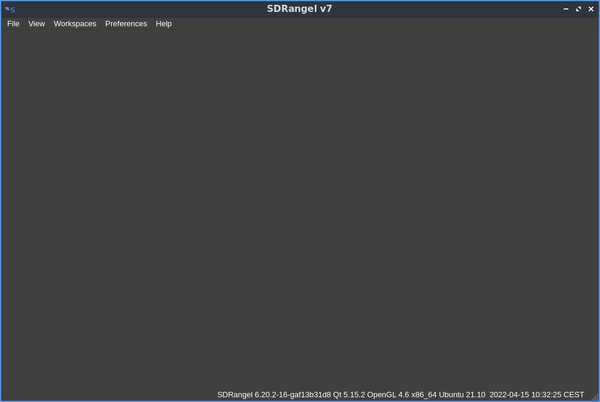
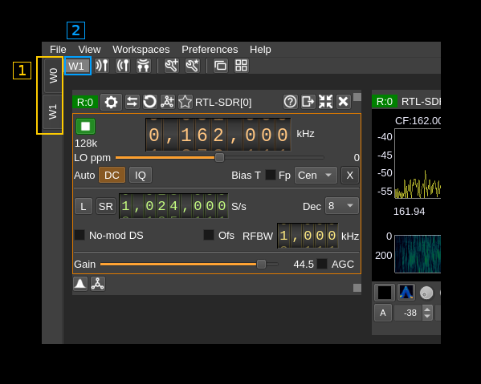
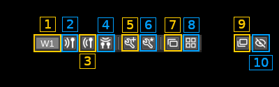
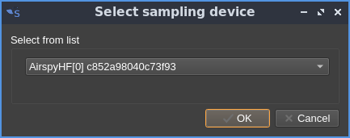
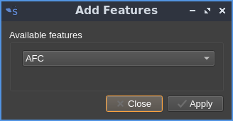
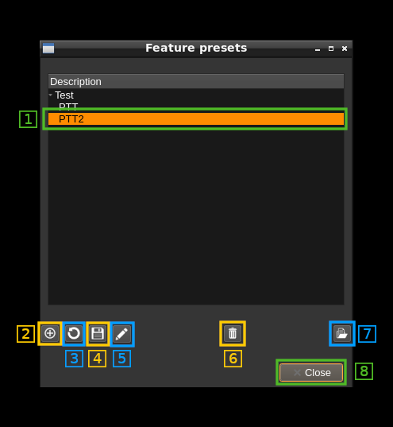
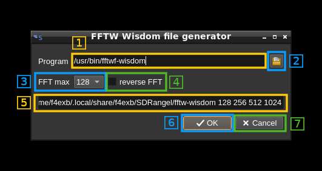
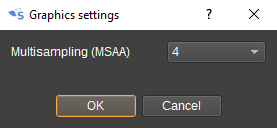

<h1>Main Window interface</h1>

When starting the user is presented with an empty window with a menu on the top bar.



<h2>Main menu</h2>

The menu items from left to right are:

  - File:
    - _Exit_ (shortcut Ctl-Q): Exit the program
  - View:
    - _Fullscreen_ (Shortcut F11): Toggle full screen mode
  - Workspaces:
    - _New_: create a new workspace. See "workspaces" paragraph for details
    - _View all_: show all workspaces
    - _Remove empty_: remove empty workspaces, Only workspaces without any windows can be removed.
  - Preferences:
    - _Configurations_: opens a dialog to manage instance configurations. See configurations dialog documentation [here](configurations.md)
    - _Audio_: opens a dialog to choose the audio output device. See the audio management documentation [here](audio.md)
    - _Graphics_: opens a dialog to choose graphics options.
    - _Logging_: opens a dialog to choose logging options. See "Logging" paragraph next for details
    - _FFT_: opens a dialog to run the `fftwf-wisdom` utility with a choice of direct and possibly reverse FFT sizes. It produces a so called wisdom file `fftw-wisdom` that speeds up FFT allocations. It is created at a default location and will be used at next invocations of SDRangel. See "FFT" paragraph next for details.
    - _My Position_: opens a dialog to enter your station ("My Position") coordinates in decimal degrees with north latitudes positive and east longitudes positive. This is used whenever positional data is to be displayed (APRS, DPRS, ...). For it now only works with D-Star $$CRC frames. See [DSD demod plugin](../plugins/channelrx/demoddsd/readme.md) for details on how to decode Digital Voice modes.
    - _Devices_: section to deal with devices settings
      - _User arguments_: opens a dialog to let the user give arguments specific to a device and its instance (sequence) in the system
    - _Commands_: opens a dialog to manage commands. See "Commands" paragraph next.
    - _Save all_: save all preferences
  - Help:
    - _Loaded Plugins_: shows details about the loaded plugins. See "Loaded plugins" paragraph below for details.
    - _About_: current version and blah blah.

<h2>1: Workspaces</h2>

The different component windows are arranged freely in the MDI (Multiple Document Interface) area of the workspace. Any number of workspaces can be added that will stack upon each other by default and can be put forward using the side tabs (1). The workspace index appears on the left of the workspace top bar (2):



The different component windows are:

  - [Device](device/readme.md) to interface and control a physical SDR hardware device connected to the system
  - [Main Spectrum](mainspectrum/readme.md) to show the spectrum of the baseband related to the device
  - [Channel](channel/readme.md) to control a channel plugin
  - [Feature](feature/readme.md) to control a feature plugin

The workspaces are attached to a docking area of the main window and can be undocked to be moved to another display in a multiple screen setup for example.

The workspace has a top bar with the following controls:



<h3>1.1: Workspace index</h3>

Shows the index of the workspaces in the list of workspaces as a "W" followed by the index.

<h3>1.2: Create new receiver</h3>

Creates a new receiver (source device set). A dialog opens to select which receiving device to use:



<h3>1.3: Create new transmitter</h3>

Creates a new transmitter (sink device set). A dialog opens to select which transmitting device to use similarly to (2) but with a choice of transmitting devices.

<h3>1.4: Create new MIMO device</h3>

Creates a new MIMO device (MIMO device set). A dialog opens to select which MIMO device to use similarly to (2) but with a choice of MIMO devices.

<h3>1.5: Create a new feature</h3>

Creates a new feature. A dialog opens to select which feature to use:



<h3>1.6: Feature presets</h3>

Opens a dialog to manage feature presets:



<h4>1.6.1: Feature selection</h4>

Move the cursor to select a feature. Features can be organized into groups at the top level (here "Test"). When selecting a group only Edit and Delete group are available

<h4>1.6.2: Add new preset</h4>

Save the current feature set in a new preset.

<h4>1.6.3: Update selected preset</h4>

Update the selected preset with the current feature set

<h4>1.6.4: Save presets</h4>

This button is inactive. All presets are saved at program exit or with the `Preferences`/ `Save All` main window menu.

<h4>1.6.5: Edit preset</h4>

Change preset name or the preset group to which this preset belongs. If selection is a group the group name can be changed.

<h4>1.6.6: Delete preset</h4>

Delete selected preset or selected group

<h4>1.6.7: Load preset</h4>

Load preset in the current feature set. The Features that were present before are dismissed.

<h4>1.6.8: Close dialog</h4>

This button dismisses the dialog.

<h3>1.7: Cascade windows</h3>

Arranges windows in the MDI area of the workspace as cascaded windows.

<h3>1.8: Tile windows</h3>

Arranges windows in the MDI area of the workspace as tiled windows.

<h3>1.9: Stack windows</h3>

Arranges windows in the MDO area of the workspace in a way similar to the arrangement in version 6:

  - Devices are stacked in numerical order top left.
  - Fixed height features are stacked in order underneath devices and resized to match width of devices
  - Channels are stacked in device then channel index order down the right and resized horizontally to match and then any available vertical space is shared being vertically expanding channels
  - Remaining space in the middle is shared between spectrums and expanding features

<h3>1.10: Auto stack windows</h3>

Applies the stacked arrangement above automatically when elements are added.

<h3>1.11: Dock/undock workspace</h3>

use this button to dock or undock the workspace from the main window docking area.

<h3>1.12: Hide workspace</h3>

Use this button to hide the workspace. Use the `Workspaces` / `View all` common on the main window the show all (hidden) workspaces.

<h2>2: Preferences</h2>

<h3>2.1: Logging</h3>


Log message will appear as follows:

```
12.11.2017 15:03:37.864 (D) DownChannelizer::applyConfiguration in= 300000 , req= 375000 , out= 300000 , fc= 0
----------------------- --- ----------------------------------------------------------------------------------
(1)                     (2) (3)
```

  - 1: Timestamp in `yyyy-MM-dd HH:mm:ss.zzz` format
  - 2: Message level: `(D)`: debug, `(I)`: info, `(W)`: warning, `(C)`: critical, `(F)`: fatal
  - 3: Message text

<h4>2.1.1: Console log minimum message level</h4>

This sets the minimum message level for a message do be displayed on the console:

  - Debug: all messages with QtDebug level and above
  - Info: all messages with QtInfo level and above
  - Warning: all messages with QtWarning level and above
  - Error: all messages with QtCritical level and above. Includes QtFatal.

<h4>2.1.2: File log minimum message level</h4>

This sets the minimum message level for a message do be logged to file:

  - Debug: all messages with QtDebug level and above
  - Info: all messages with QtInfo level and above
  - Warning: all messages with QtWarning level and above
  - Error: all messages with QtCritical level and above. Includes QtFatal.

<h4>2.1.3: File log enable</h4>

Use the checkbox to enable (check) or disable (uncheck) the dual logging to file

<h4>2.1.4: Log file selection</h4>

Use this button to open a file dialog to choose or create a new log file. There is a 2s delay before a file change is effective.

<h4>2.1.5: Log file name</h4>

The full path of the log file appears here

<h4>2.1.6: Confirm changes</h4>

Use the "OK" button to validate all changes

<h4>2.1.7: Dismiss changes</h4>

Use the "Cancel" button to dismiss all changes

<h3>2.2: FFT</h3>

When clicking on the FFT submenu a dialog opens for running the `fftwf-wisdom` utility with a choice of direct and possibly reverse FFT sizes. It produces a so called wisdom file `fftw-wisdom` that speeds up FFT allocations. It is created at a default location and will be used at next invocations of SDRangel.



<h4>2.2.1: FFTW Wisdom program</h4>

Path to the `fftwf-wisdom` program. It looks in the `PATH` variable and the "current" directory (that is the same directory where the `sdrangel` binary resides).

<h4>2.2.2: Select FFTW Wisdom program</h4>

Opens a file selection dialog to look for the `fftwf-wisdom` program.

<h4>2.2.3: FFT maximum size</h4>

Select the maximum FFT size for precomputation. Sizes are powers of two between 128 and 32k.

<h4>2.2.4: Reverse FFT</h4>

Select this checkbox to cover reverse FFTs

<h4>2.2.5: Command line</h4>

This is the command line that will invoke the `fftwf-wisdom` program with its options

<h4>2.2.6: OK: launch the FFTW wisdom program</h4>

When clicking the "OK" button the `fftwf-wisdom` program is launched in the background. A message pop-up appears with the PID of the process and the dialog exits. A new pop-up will appear with the output content when the program completes.

<h4>2.2.7: Cancel: dismiss the dialog without execution</h4>

When clicking the "Cancel" button the dialog is dismissed without execution of the `fftwf-wisdom` program.

<h3>2.3: Commands</h3>

This is a tree view of the saved commands. Commands describe the path to an executable file, its arguments a possible link to a keystroke event that triggers the execution. Similarly to presets commands can be arranged into groups and have a description short text.

Typically an "executable file" is a script (Python, shell, whatever...) or can be a compiled program (c, c++, java, whatever...) that interacts with SDRangel using its web REST API. When called from within SDRangel they can act as "macros" allowing to perform actions automatically.

Of course any binary that resides in your system can be used that way like `/bin/ls` or `/bin/date` although these two are of anecdotal interest...


<h4>2.3.1: Command selection</h4>

You select a command or a command group by clicking on its line in the tree view. All actions (6) will be done relative to this command or command group.

<h4>2.3.2: Group</h4>

You can organize your commands into groups. Groups can be collapsed or expanded by using the caret icon on the left.

<h4>2.3.3: Description</h4>

Short description of a command.

<h4>2.3.4: Key binding indicator</h4>

  - `-`: no key binding
  - `P`: key press binding
  - `R`: key release binding

<h4>2.3.5: Key binding sequence</h4>

This is a descriptive text of the key sequence that is used for the key binding.

<h4>2.3.6: Command control or actions</h4>

The controls are located as icons at the bottom of the window:


<h5>2.3.6.1: Create new command</h5>

Click on this icon to create a new command. This opens an edit dialog see the edit section (5B.6.3) for the details of the edit dialog.

<h5>2.3.6.2: Duplicate command</h5>

Click on this icon to duplicate the currently selected command (inactive on groups). Later you can edit the details of the copy with the edit dialog (see 5B.6.3 next)

<h5>2.3.6.3: Edit command or command group</h5>

<b>Command groups</b>

With this dialog you can rename a group using the text box or if you select an existing group with the combo this will merge the contents of the group with the existing group


<b>Commands</b>

You can edit the details of the command with this dialog.


<h6>2.3.6.3.1: Edit group </h6>

You can select an existing group with the combo or create a new one for this command using the text edit box

<h6>2.3.6.3.2: Edit description </h6>

You can edit the description using this text box. The description will appear in the tree view.

<h6>2.3.6.3.3: Executable file selection </h6>

Clicking on this button will open a file dialog to select the executable file that will be run with this command. The file selection dialog has predefined file pattern selections:

  - `*` for All files
  - `*.py` for Python files
  - `*.sh` or `*.bat` for shell or batch files
  - `*.bin` or `*.exe` for binary files

<h6>2.3.6.3.4: Executable file path </h6>

This is the full path of the selected executable file.

<h6>2.3.6.3.5: Command line arguments</h6>

Use the text box to edit the arguments given to the executable file as in `program arguments`.

You can use special codes to insert information specific to the application context:

  - `%1`: the address of the web REST API
  - `%2`: the port of the web REST API
  - `%3`: the currently selected device set index

<h6>2.3.6.3.6: Key binding</h6>

Use this checkbox to enable or disable the command execution binding to a key or combination of keys press or release event

<h5>2.3.6.3.7: Key binding capture</h5>

Use this button to capture the key or key combination that will be used for the key binding. After pushing this button just type in the key or key combination.

<h6>2.3.6.3.8: Key binding display</h6>

This shows the key or combination of keys used for the key binding.

<h6>2.3.6.3.9: Release key binding</h6>

Use this checkbox to bind the key or combination of keys to the key release event. If unchecked the binding will be associated to the key press event.

<h6>2.3.6.3.10: Confirm changes</h6>

Use the "OK" button to confirm the changes.

<h6>2.3.6.3.11: Cancel changes</h6>

Use the "Cancel" button to cancel the changes.

<h5>2.3.6.4: Run command or groups of commands</h5>

This will run the currently selected command. If the selection is a group it will run all commands of the group starting them in the displayed order. Please note that commands are run in independent processes and therefore all launched commands in the group will run concurrently.

<h5>2.3.6.5: View last command run details</h5>

This dialog will show the results of the last run including the output (merged stdout and stderr).


<h6>2.3.6.5.1: Process status</h6>

When the process is not running the stop icon (&#9632;) is displayed. The background color indicate different states:

  - no color (same as background): the process has never run during this session
  - red: the process ended with error
  - green: the process ended successfully. This does not mean that there was no programmatic error.

When the process is running the play icon (&#9654;) is displayed with an orange background.

<h6>2.3.6.5.2: Refresh data</h6>

Pushing this button will update the data displayed with the latest status. Please note that the log is displayed only when the process is terminated.

<h6>2.3.6.5.3: Start time</h6>

This is the timestamp of process start. It is filled with dots `...` if the process has never started during this session.

<h6>2.3.6.5.4: End time</h6>

This is the timestamp of process end. It is filled with dots `...` if the process has never terminated during this session.

<h6>2.3.6.5.3: PID</h6>

This is the process PID. It is 0 if the process has never run during this session.

<h6>2.3.6.5.6: Process kill</h6>

Use this button to kill (send SIGKILL) the running process. It has no effect if the process is not running.

<h6>2.3.6.5.7: Command line</h6>

This shows the actual command line that was used to start the process

<h6>2.3.6.5.8: Error status</h6>

This is the translation of `QProcess::ProcessError`. Possible values are:

  - `...`: the process has never run during this session
  - `Failed to start`: the process could not start. For example the executable file has no execution rights actually
  - `Crashed`: the process ended with crash. This is the status when you killed the process
  - `Timed out`: the last waitFor...() function timed out.
  - `Write error`: an error occurred when attempting to write to the process. For example, the process may not be running, or it may have closed its input channel.
  - `Read error`: an error occurred when attempting to read from the process. For example, the process may not be running.
  - `Unknown error`: an unknown error occurred.

<h6>2.3.6.5.9: Exit code</h6>

This is the program exit code. When the process crashes this is the signal by which the process end was caused. For example if you kill the process with button (6) it sends the process a SIGKILL (code 9) and therefore the value is 9.

<h6>2.3.6.5.10: Exit status</h6>

There are only two possibilities: either the program exits normally but possibly with a non zero exit code or it ends with a crash.

<h6>2.3.6.5.11: Process log</h6>

This is the log of the process (merged stdout and stderr). Please note that it is updated only on program termination.

<h6>2.3.6.5.12: Exit</h6>

By pushing the "Close" button the process output window is closed.

<h5>2.3.6.6: Save commands</h5>

This will save the commands immediately. The commands will be automatically saved when the application exits normally.

<h5>2.3.6.7: Delete commands or group of commands</h5>

This will delete the currently selected command or if selection is a group this will delete all commands in the group.

<h5>2.3.6.8: Activate keyboard bindings</h5>

Use this button to activate the keyboard bindings. Note that you need to have this button selected (its background should be lit in beige/orange) for the key bindings to be effective.

<h3>2.4: Graphics</h3>

When clicking on the Graphics submenu a dialog opens for setting graphics options.



<h4>2.4.1</h4>

Multisampling (MSAA) determines whether multisampling anti-aliasing is used to removed the jagged edges of lines when rendering 2D and 3D spectra.
The higher the number of samples chosen, the better quality the anti-aliasing will be, but higher values require more GPU processing and memory.

Changing this option will only take effect when spectrum windows are recreated (not just hidden then made visible again), so in some cases it
may be necessary to restart SDRangel to see the difference.

<h2>3: Help</h2>

<h3>3.1: Loaded plugins</h3>

When clicking on Help -> Loaded Plugins from the main menu bar a dialog box appears that shows information about the plugins loaded in SDRangel:


<h4>Name</h4>

Plugin display name. Tells briefly what this plugin is about.

<h4>Version</h4>

Starting with SDRangel version 2.0.0 this is the SDRangel version when the plugin was last updated.

<h4>GPL</h4>

Tells if the plugin is under GPL license.

<h4>Expansion</h4>

The plugin entry can be expanded or collapsed using the caret on the left. When expanded it shows more information about the copyright of the author and locations on the web where the plugin can be found. In all cases this is just here.

<h4>OK button</h4>

Click here when done to dismiss the dialog.

