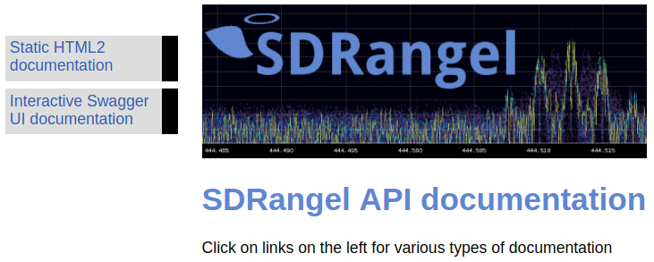

<h1>SDRangel Server</h1>

This folder holds the objects specific to the server (headless) version of SDRangel. The `MainCore` class is the headless equivalent of the `MainWindow` class in the GUI version and plays the same central role. Plugins are built specifically without GUI and are located in the `pluginssrv` folder. 

This document focuses on the functional description of SDRangel server. More details on the technical architecture can be found in the developer's documentation.

The main motivations are:
  - be able to run SDRangel on hardware with less CPU/GPU requirements in particular without OpenGL suport. 
  - be used in sophisticated remote transponders or repeaters in a headless server configuration. 
  - possibility to use Docker technology to host SDRangel server instances in a distributed environment.
  - using [SDRdaemon](https://github.com/f4exb/sdrdaemon) for the RF device interface even more distributed architectures can be supported to share workload in a cluster.   
  - using the Web REST API interface developers with web technology skills can implement their own GUI.

<h2>Plugins supported</h2>
  
  - Rx channels:
    - AM demodulator
    - BFM (Broadcast FM) demodulator
    - DSD (Digital Vouice) demodulator
    - NFM (Narrowband FM) demodulator
    - SSB demodulator
    - WFM (Wideband FM) demodulator
    - UDP source

  - Tx channels:
    - AM modulator
    - ATV modulator
    - NFM (Narrowband FM) modulator
    - SSB modulator
    - WFM (Wideband FM) modulator
    - UDP sink
    
  - Sample sources:
    - Airspy
    - Airspy HF
    - BladeRF input
    - FCD (Funcube Dongle) Pro
    - FCD Pro Plus
    - File source
    - HackRF input
    - LimeSDR input
    - Perseus (24 bit build only)
    - PlutoSDR input
    - RTL-SDR
    - SDRdaemon source
    - SDRplay RSP1
    - Test source
    
  - Sample sinks:
    - BladeRF output
    - File sink
    - HackRF output
    - LimeSDR output
    - PlutoSDR output
    - SDRdaemon sink

<h2>Command line options</h2>

  - **-h**: help
  - **-v**: displays version information
  - **-a**: Web REST API server interface IP address
  - **-p**: Web REST API server port
  
&#9758; the GUI version supports the exact same options.
  
<h2>Interface</h2>

You can control the SDRangel application (server or GUI) by the means of the REST API. For SDRangel server the REST API is the only interface as there is no GUI. The network interface on which the REST API server listens can be controlled with the `-a` option and its port with the `-p` option. By default the server listens on the loopback address `127.0.0.1` and port `8091`

<h3>Documentation</h3>

The API documentation is accessible online when the SDRangel application (GUI or server) is running at the address and port specified in the program options. The default is [http://127.0.0.1:8091](http://127.0.0.1:8091).

The documentation home page dispays two links on the left:

  - **Static HTML2 documentation**: classical HTML based documentation
  - **Interactive SwaggerUI documentation**: dynamic interactive documentation using the [SwaggerUI](https://swagger.io/tools/swagger-ui/) interface. It offers a way to visualize and interact with the running SDRangel application API’s resources.

<h3>Python examples</h3>

In the `swagger/sdrangel/examples/` directory you can check various examples of Python scripts interacting with an instance of SDRangel using the REST API.
